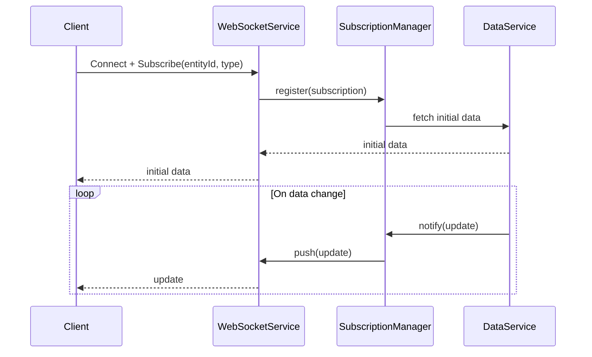
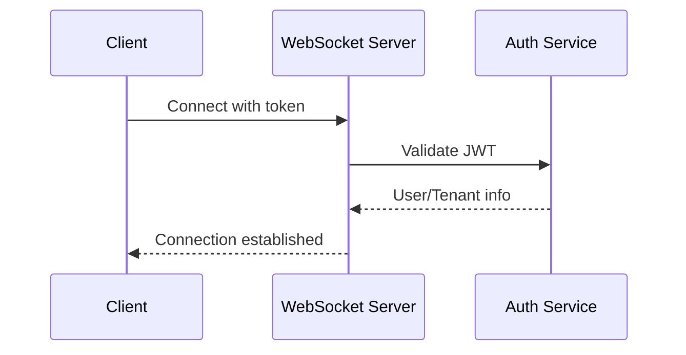
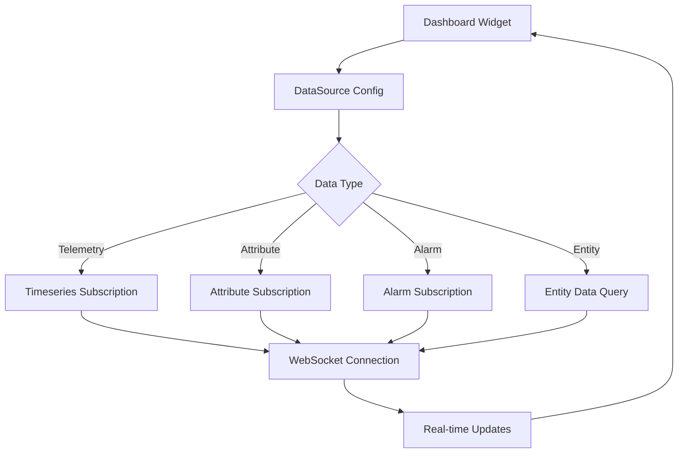
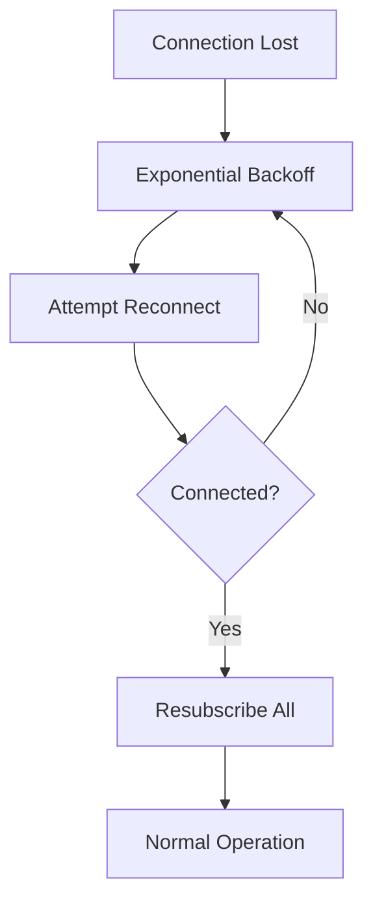

# WebSocket Subscriptions Specification

## Overview

This document describes the WebSocket subscription mechanism in ThingsBoard, which enables real-time data delivery to web and mobile clients.

---

## Key Components

### TelemetryWebSocketService

Handles WebSocket connections and subscriptions for telemetry and attribute updates.

| Method                        | Description                                      |
|-------------------------------|--------------------------------------------------|
| handleWebSocketMessage(...)   | Process incoming WebSocket message               |
| sendUpdate(...)               | Push update to subscribed clients                |

### Subscription Types

| Type              | Description                                      |
|-------------------|--------------------------------------------------|
| TIMESERIES        | Subscribe to telemetry updates                   |
| ATTRIBUTES        | Subscribe to attribute updates                   |
| ALARM             | Subscribe to alarm updates                       |
| ENTITY_DATA       | Subscribe to entity data queries                 |
| ENTITY_COUNT      | Subscribe to entity count queries                |

---

## Subscription Flow



---

## Subscription Message Format

**Subscribe:**

```json
{
  "cmds": [
    {
      "cmdId": 1,
      "entityType": "DEVICE",
      "entityId": "<uuid>",
      "keys": ["temperature", "humidity"],
      "type": "TIMESERIES"
    }
  ]
}
```

**Update:**

```json
{
  "subscriptionId": 1,
  "data": {
    "temperature": [[1704537600000, "22.5"]],
    "humidity": [[1704537600000, "60"]]
  }
}
```

---

## Authentication

- WebSocket connection authenticated via JWT token
- Token passed as query parameter or in initial message

---

## Connection Endpoint

### WebSocket URL

```text
ws://{host}:{port}/api/ws/plugins/telemetry?token={JWT_TOKEN}
wss://{host}:{port}/api/ws/plugins/telemetry?token={JWT_TOKEN}
```

### Connection Flow



---

## Command Types

### Telemetry Subscription

```json
{
  "tsSubCmds": [
    {
      "cmdId": 1,
      "entityType": "DEVICE",
      "entityId": "device-uuid",
      "keys": "temperature,humidity",
      "scope": "LATEST_TELEMETRY",
      "startTs": 0,
      "timeWindow": 3600000
    }
  ]
}
```

### Attribute Subscription

```json
{
  "attrSubCmds": [
    {
      "cmdId": 2,
      "entityType": "DEVICE",
      "entityId": "device-uuid",
      "keys": "active,config",
      "scope": "CLIENT_SCOPE"
    }
  ]
}
```

### Alarm Subscription

```json
{
  "alarmSubCmds": [
    {
      "cmdId": 3,
      "entityType": "DEVICE",
      "entityId": "device-uuid"
    }
  ]
}
```

### Entity Data Query Subscription

```json
{
  "entityDataCmds": [
    {
      "cmdId": 4,
      "query": {
        "entityFilter": {
          "type": "deviceType",
          "deviceType": "thermostat"
        },
        "latestValues": [
          {"type": "TIME_SERIES", "key": "temperature"}
        ],
        "pageLink": {"page": 0, "pageSize": 10}
      }
    }
  ]
}
```

### Unsubscribe

```json
{
  "tsSubCmds": [
    {
      "cmdId": 1,
      "entityType": "DEVICE",
      "entityId": "device-uuid",
      "unsubscribe": true
    }
  ]
}
```

---

## Response Messages

### Initial Data Response

```json
{
  "subscriptionId": 1,
  "errorCode": 0,
  "data": {
    "temperature": [[1704537600000, "22.5"]],
    "humidity": [[1704537600000, "60"]]
  }
}
```

### Telemetry Update

```json
{
  "subscriptionId": 1,
  "data": {
    "temperature": [[1704537610000, "23.0"]]
  }
}
```

### Attribute Update

```json
{
  "subscriptionId": 2,
  "data": {
    "config": [[0, "{\"interval\": 60}"]]
  }
}
```

### Alarm Update

```json
{
  "subscriptionId": 3,
  "alarm": {
    "id": "alarm-uuid",
    "type": "HighTemperature",
    "severity": "CRITICAL",
    "status": "ACTIVE_UNACK"
  }
}
```

### Entity Data Update

```json
{
  "cmdId": 4,
  "update": {
    "entityId": {"entityType": "DEVICE", "id": "uuid"},
    "latest": {
      "TIME_SERIES": {
        "temperature": {"ts": 1704537610000, "value": "26.0"}
      }
    }
  }
}
```

---

## Error Codes

| Code | Description                              |
|------|------------------------------------------|
| 0    | Success                                  |
| 1    | Entity not found                         |
| 2    | Unauthorized                             |
| 3    | Internal error                           |
| 4    | Too many subscriptions                   |
| 5    | Bad request                              |

---

## Attribute Scopes

| Scope           | Description                              |
|-----------------|------------------------------------------|
| CLIENT_SCOPE    | Client-side attributes                   |
| SHARED_SCOPE    | Shared attributes                        |
| SERVER_SCOPE    | Server-side attributes                   |

---

## Subscription Limits

| Configuration                  | Default | Description                    |
|--------------------------------|---------|--------------------------------|
| ws.max_subscriptions_per_tenant| 10000   | Max subscriptions per tenant   |
| ws.max_sessions_per_tenant     | 1000    | Max sessions per tenant        |
| ws.max_subscriptions_per_session| 100    | Max subscriptions per session  |
| ws.max_update_rate             | 100     | Max updates per second         |

---

## History Query

### Get Historical Telemetry

```json
{
  "historyCmds": [
    {
      "cmdId": 5,
      "entityType": "DEVICE",
      "entityId": "device-uuid",
      "keys": "temperature",
      "startTs": 1704451200000,
      "endTs": 1704537600000,
      "interval": 60000,
      "agg": "AVG",
      "limit": 100
    }
  ]
}
```

### Aggregation Types

| Aggregation | Description                              |
|-------------|------------------------------------------|
| NONE        | Raw values                               |
| AVG         | Average                                  |
| MIN         | Minimum                                  |
| MAX         | Maximum                                  |
| SUM         | Sum                                      |
| COUNT       | Count                                    |

---

## Dashboard Widget Integration

### Widget Subscription Pattern



---

## Connection Management

### Heartbeat

```json
{
  "ping": true
}
```

Response:

```json
{
  "pong": true
}
```

### Session Timeout

| Configuration       | Default | Description                    |
|---------------------|---------|--------------------------------|
| ws.idle_timeout     | 300000  | Idle timeout in ms             |
| ws.ping_interval    | 30000   | Ping interval in ms            |

---

## Reconnection Strategy



### Recommended Backoff

| Attempt | Delay        |
|---------|--------------|
| 1       | 1 second     |
| 2       | 2 seconds    |
| 3       | 4 seconds    |
| 4       | 8 seconds    |
| 5+      | 30 seconds   |

---

## Security Considerations

| Aspect              | Implementation                           |
|---------------------|------------------------------------------|
| Authentication      | JWT token validation                     |
| Authorization       | Entity access control                    |
| Rate Limiting       | Per-tenant subscription limits           |
| Encryption          | WSS (WebSocket Secure)                   |

---

## Best Practices

- Limit subscriptions per client to prevent overload
- Use entity data queries for complex filtering
- Unsubscribe when data is no longer needed
- Implement reconnection with exponential backoff
- Use WSS in production environments
- Batch subscription commands when possible
- Handle connection errors gracefully

---

## See Also

- [Timeseries & Attributes Requests](timeseries-and-attributes-requests.md)
- [Security and Authentication](security-auth.md)
- [Entity Query API](entity-query.md)
- [Dashboard Widgets](dashboard-widgets.md)
