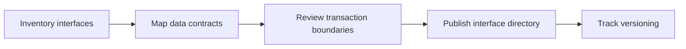

# Introduction

Describes interaction surfaces between controllers, services, and data layers, including expectations for validation, metadata, and transactional boundaries.

## 1. Purpose & Scope

Provide a catalog of backend interactions and the data exchanged at module boundaries.

## 2. Definitions
- Service Interface Catalog: Inventory of callable operations and outcomes.
- Data Contract Baseline: Structured description of inputs/outputs and metadata.

## 3. Requirements, Constraints & Guidelines
- REQ-001: Enumerate data contracts and required metadata (tenant, security context).
- REQ-002: Define versioning and backward compatibility expectations.
- GUD-001: Capture typical status outcomes and error surfaces.

## 4. Interfaces & Data Contracts
Compose interface entries with identity, purpose, inputs, outputs, preconditions, and side effects.

## 5. Acceptance Criteria
- AC-001: API consumers can identify required fields and responses.
- AC-002: Contract changes list affected services and migration notes.

## 6. Test Automation Strategy
- Contract linting; diff-based checks for version bumps.

## 7. Rationale & Context
Precise interfaces reduce integration errors and support automation.

## 8. Dependencies & External Integrations
- API documentation; schema registry; security models.

## 9. Examples & Edge Cases
- Edge: Optional metadata becomes mandatory → migration plan documented.

## 10. Validation Criteria
- Release readiness review includes contract verification steps.

## 11. Related Specifications / Further Reading
- [spec/spec-backend-service-implementation.md](spec/spec-backend-service-implementation.md)
