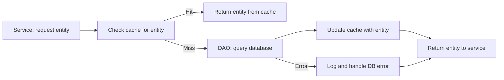
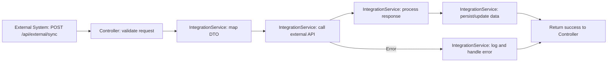
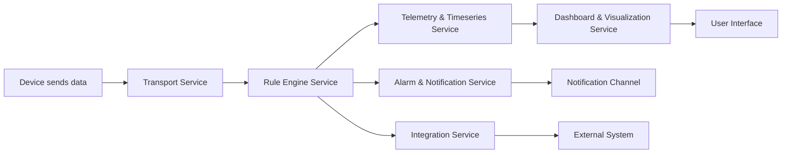
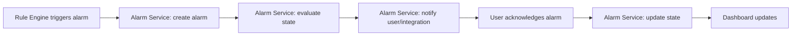

# Introduction

This document provides a comprehensive architecture blueprint for the ThingsBoard IoT platform, serving as a definitive reference for maintaining architectural consistency and guiding new development. It is based on analysis of the codebase, OpenSpec documentation, and established best practices.

## 1. Purpose & Scope

This blueprint defines the architectural patterns, core components, extension points, and governance processes for the ThingsBoard platform. It is intended for developers, architects, and maintainers working on the backend (Java/Spring), frontend (Angular), and integration layers. Assumes familiarity with IoT concepts and Java/TypeScript ecosystems.

## 2. Definitions

- **IoT**: Internet of Things
- **Rule Engine**: Event-driven processing engine for device data
- **Node**: Modular processing unit in the rule engine
- **DAO**: Data Access Object
- **TbMsg**: Message object in the rule engine
- **TbContext**: Execution context for rule nodes
- **DI**: Dependency Injection
- **API**: Application Programming Interface
- **UI**: User Interface
- **Protobuf**: Protocol Buffers (serialization)

## 3. Requirements, Constraints & Guidelines

- **REQ-001**: Use modular, interface-driven design for all services and nodes
- **REQ-002**: Enforce separation of concerns between UI, business logic, and data access
- **REQ-003**: All message flows in the rule engine must acknowledge success/failure
- **REQ-004**: Use async programming for high-throughput operations
- **SEC-001**: Centralize authentication and authorization in backend services
- **CON-001**: All configuration must be externalizable (env, files, UI)
- **GUD-001**: Document all extension points and custom node patterns
- **PAT-001**: Use Observer, Strategy, Factory, and Singleton patterns where appropriate

## 4. Interfaces & Data Contracts

- **Backend REST APIs**: Exposed via Spring controllers, documented in OpenAPI/Swagger
- **Rule Engine Node API**: `TbNode`, `TbContext`, `TbMsg`, `TbNodeConfiguration` (see OpenSpec)
- **Frontend API**: Angular services communicate with backend via HTTP/JSON
- **Protobuf Schemas**: Used for device communication (MQTT, CoAP, LwM2M, SNMP)

Example (TbNode interface):
```java
public interface TbNode {
    void init(TbContext ctx, TbNodeConfiguration configuration) throws TbNodeException;
    void onMsg(TbContext ctx, TbMsg msg) throws ExecutionException, InterruptedException, TbNodeException;
    default void destroy() {}
}
```

## 5. Acceptance Criteria

- **AC-001**: Given a new rule node, when it implements `TbNode` and is annotated with `@RuleNode`, then it is discoverable and configurable in the UI
- **AC-002**: The system shall reject unacknowledged messages in the rule engine
- **AC-003**: All REST endpoints must validate input and handle errors via `BaseController`
- **AC-004**: All configuration changes must be reloadable without restart

## 6. Test Automation Strategy

- **Test Levels**: Unit (JUnit, Jasmine), Integration (Spring, Angular), End-to-End (Cypress, Selenium)
- **Frameworks**: JUnit, Mockito, Spring Test, Jasmine, Karma
- **Test Data Management**: Use in-memory DBs and mock services for isolation
- **CI/CD Integration**: Automated tests in GitHub Actions and Jenkins pipelines
- **Coverage Requirements**: 80%+ code coverage for core modules
- **Performance Testing**: JMeter for backend, Lighthouse for UI

## 7. Rationale & Context

- Modular, event-driven architecture enables extensibility and scalability for IoT workloads
- Asynchronous flows and message queues support high-throughput device data
- Angular frontend provides a reactive, extensible UI for dashboards and management
- Protobuf enables efficient, cross-platform device communication

## 8. Dependencies & External Integrations

### External Systems
- **EXT-001**: SQL/NoSQL databases (PostgreSQL, Cassandra) - persistent storage
- **EXT-002**: MQTT, HTTP, CoAP, LwM2M, SNMP brokers - device connectivity

### Third-Party Services
- **SVC-001**: SMTP, SMS, Slack APIs - notification channels
- **SVC-002**: AI/ML model APIs (optional) - advanced rule nodes

### Infrastructure Dependencies
- **INF-001**: Docker, Kubernetes - deployment and orchestration
- **INF-002**: Prometheus, Grafana - monitoring and metrics

### Data Dependencies
- **DAT-001**: Protobuf schemas - device message formats

### Technology Platform Dependencies
- **PLT-001**: Java 17+, Spring Boot 3+, Angular 18+, Node.js 18+

### Compliance Dependencies
- **COM-001**: GDPR, security best practices for IoT data

## 9. Examples & Edge Cases

```java
// Example: Custom Rule Node
@RuleNode(type = ComponentType.ACTION, name = "Log Node", ...)
public class TbLogNode implements TbNode {
    public void onMsg(TbContext ctx, TbMsg msg) {
        log.info(msg.getData());
        ctx.tellSuccess(msg);
    }
}

// Edge case: Node fails to acknowledge message
public void onMsg(TbContext ctx, TbMsg msg) {
    // Missing ctx.tellSuccess or ctx.tellFailure will block the rule chain
}
```

## 10. Validation Criteria

- All new nodes must pass unit and integration tests
- All REST APIs must be covered by automated tests
- All configuration changes must be validated in CI
- All extension points must be documented in OpenSpec

## 11. Related Specifications / Further Reading

- [thingsboard-architecture.spec.md](thingsboard-architecture.spec.md)
- [application.spec.md](application.spec.md)
- [common.spec.md](common.spec.md)
- [dao.spec.md](dao.spec.md)
- [rule-engine.spec.md](rule-engine.spec.md)
- [ui-ngx.spec.md](ui-ngx.spec.md)
- [transport.spec.md](transport.spec.md)
- [rule-engine-nodes-apis.spec.md](rule-engine-nodes-apis.spec.md)
- [rule-engine-nodes-inventory.spec.md](rule-engine-nodes-inventory.spec.md)

---

# 12. Architectural Overview

ThingsBoard uses a hybrid microservices and modular monolith architecture. The backend is Java/Spring-based, organized into modules for application logic, data access, rule engine, transport, and shared utilities. The frontend is a modular Angular application. The rule engine is event-driven, using message queues and modular nodes for extensibility.

**Guiding Principles:**
- Separation of concerns (UI, business logic, data access)
- Extensibility via modular nodes and services
- Asynchronous, non-blocking processing
- Centralized error handling and validation
- Interface-driven design

**Boundaries:**
- Each module (application, dao, rule-engine, transport, ui-ngx) enforces clear API boundaries
- Rule engine nodes interact only via `TbContext` and `TbMsg`

**Hybrid Patterns:**
- Microservices for edge, monitoring, and integration
- Modular monolith for core server and rule engine

# 13. Architecture Visualization

- **High-level:**
  - Device → Transport (MQTT/HTTP/CoAP/etc.) → Rule Engine → DAO → Database
  - UI (Angular) → REST API (Spring) → Application Services
- **Component Interactions:**
  - Rule engine nodes communicate via message passing and context
  - UI modules interact via Angular services and RxJS
- **Data Flow:**
  - Device data ingested via transport, processed by rule engine, persisted by DAO, visualized in UI

# 14. Core Architectural Components

## Application Module
- **Purpose:** Main server logic, REST APIs, business services
- **Structure:** Controllers (extend `BaseController`), services, configuration
- **Interaction:** REST endpoints, service interfaces, DAOs
- **Evolution:** Add new controllers/services as needed, follow DI and interface-driven patterns

## Common Module
- **Purpose:** Shared utilities, data models, protocol definitions
- **Structure:** Entity classes, enums, utility classes, Protobuf schemas
- **Interaction:** Used by all modules
- **Evolution:** Add new models/utilities as needed, maintain backward compatibility

## DAO Module
- **Purpose:** Data access layer (SQL/NoSQL)
- **Structure:** DAO interfaces/impls, async DAOs, caches
- **Interaction:** Used by services, rule engine
- **Evolution:** Add new DAOs for new entities, use async patterns

## Rule Engine Module
- **Purpose:** Event-driven processing, modular rule nodes
- **Structure:** Node interfaces (`TbNode`), context (`TbContext`), message (`TbMsg`), node registry
- **Interaction:** Nodes communicate via context and message passing
- **Evolution:** Add new nodes by implementing `TbNode` and annotating with `@RuleNode`

## Transport Module
- **Purpose:** Device connectivity (MQTT, HTTP, CoAP, LwM2M, SNMP)
- **Structure:** Protocol modules, Protobuf schemas, session management
- **Interaction:** Devices connect via protocol, messages routed to rule engine
- **Evolution:** Add new protocol modules as needed

## UI-NGX Module
- **Purpose:** Angular web UI for dashboards, widgets, management
- **Structure:** Angular modules, components, services, RxJS state management
- **Interaction:** Communicates with backend via REST APIs
- **Evolution:** Add new components/services, follow Angular best practices

# 15. Architectural Layers and Dependencies

- **Layers:**
  - UI (Angular)
  - REST API (Spring Controllers)
  - Services (Business Logic)
  - DAO (Data Access)
  - Rule Engine (Event Processing)
  - Transport (Device Communication)
- **Dependency Rules:**
  - UI depends on REST API only
  - Services depend on DAOs and common
  - Rule engine depends on services and common
  - Transport depends on common and rule engine
- **Abstraction:**
  - Interfaces for all services and DAOs
  - Dependency injection for implementation selection
- **Circular Dependencies:**
  - Not allowed; enforced by module boundaries

# 16. Data Architecture

- **Domain Model:** Device, Asset, Tenant, User, Alarm, etc.
- **Entity Relationships:** Defined in common module, persisted via DAO
- **Data Access:** Async DAOs, caches for performance
- **Transformation:** Handled in rule engine nodes and services
- **Caching:** Entity/profile caches, invalidate on update
- **Validation:** Input validation in controllers/services, schema validation for device data

# 17. Cross-Cutting Concerns Implementation

- **Authentication & Authorization:**
  - Spring Security for backend, JWT for UI
  - Permission checks in services/controllers
- **Error Handling & Resilience:**
  - Centralized in `BaseController` (REST), try/catch in nodes/services
  - Retry and fallback in async flows
- **Logging & Monitoring:**
  - SLF4J/logback for backend, Angular logging for UI
  - Prometheus/Grafana for metrics
- **Validation:**
  - Input validation in REST, business rule validation in services
- **Configuration Management:**
  - Externalized via env, files, UI; supports feature flags and secrets

# 18. Service Communication Patterns

- **Boundaries:**
  - Microservices (edge, monitoring) communicate via REST/gRPC
  - Core modules interact via Java interfaces
- **Protocols:**
  - MQTT, HTTP, CoAP, LwM2M, SNMP for device comms
- **Sync/Async:**
  - Async message queues in rule engine, sync REST for UI/backend
- **API Versioning:**
  - REST APIs versioned via URL/path
- **Service Discovery:**
  - Static config or Kubernetes service discovery
- **Resilience:**
  - Retry, circuit breaker in async flows

# 19. Technology-Specific Architectural Patterns

## Java/Spring
- DI via Spring, modular Maven structure, async with ListenableFuture
- REST controllers, service interfaces, DAO pattern
- Protobuf for device comms

## Angular
- Modular NgModules, RxJS for state and async
- Service/component separation, DI via Angular
- Routing, guards, and lazy loading

# 20. Implementation Patterns

- **Interface Design:** Segregate by responsibility, use generics for common patterns
- **Service Implementation:** Singleton services, DI, async methods
- **Repository/DAO:** Async CRUD, cache, transaction management
- **Controller/API:** Input validation, error handling, versioning
- **Domain Model:** Immutable entities, value objects, event sourcing for rule engine

# 21. Testing Architecture

- **Unit:** JUnit (Java), Jasmine (Angular)
- **Integration:** Spring Test, in-memory DBs, mock services
- **E2E:** Cypress, Selenium for UI
- **Test Doubles:** Mockito, custom mocks
- **Test Data:** Factories, fixtures, in-memory stores
- **Tools:** GitHub Actions, Jenkins, SonarQube

# 22. Deployment Architecture

- **Topology:** Docker Compose, Kubernetes manifests for microservices
- **Adaptations:** Env-specific configs, feature flags
- **Runtime Resolution:** Spring profiles, DI
- **Containerization:** Dockerfiles per module, multi-stage builds
- **Cloud Integration:** Optional, via external services

# 23. Extension and Evolution Patterns

- **Feature Addition:**
  - Add new rule nodes by implementing `TbNode` and annotating with `@RuleNode`
  - Add new Angular modules/components for UI features
- **Modification:**
  - Use interface-driven refactoring, maintain backward compatibility
  - Deprecate via annotation and documentation
- **Integration:**
  - Use adapter/facade for new external systems
  - Anti-corruption layer for legacy integration

# 24. Architectural Pattern Examples

```java
// Layer separation: Service interface and implementation
public interface DeviceService { ... }
@Service
public class DeviceServiceImpl implements DeviceService { ... }

// Rule node: Custom log node
@RuleNode(type = ComponentType.ACTION, name = "Log Node", ...)
public class TbLogNode implements TbNode { ... }

// Angular: Service and component separation
@Injectable()
export class DeviceService { ... }
@Component({...})
export class DeviceListComponent { ... }
```

# 25. Architectural Decision Records

- **Style:** Modular monolith for core, microservices for edge/monitoring (scalability, maintainability)
- **Technology:** Java/Spring for backend (ecosystem, performance), Angular for UI (modularity, reactivity)
- **Implementation:** Async flows for throughput, Protobuf for device comms (efficiency)
- **Context:** IoT workloads require high throughput, extensibility, and reliability
- **Consequences:** Enables rapid extension, but requires strong governance and documentation

# 26. Architecture Governance

- **Consistency:** Enforced via code reviews, OpenSpec documentation, and automated tests
- **Automated Checks:** Linting, static analysis, test coverage in CI
- **Review Process:** PR reviews, architecture review meetings
- **Documentation:** All extension points and patterns documented in `/spec` and OpenSpec files

# 27. Blueprint for New Development

- **Workflow:**
  - Start with spec in `/spec` or OpenSpec
  - Implement new module/component following patterns above
  - Add tests and documentation
  - Submit PR for review
- **Templates:**
  - Use existing service, DAO, and node templates
  - Follow Angular CLI for UI modules
- **Pitfalls:**
  - Avoid circular dependencies, unacknowledged messages, and untested async flows
  - Monitor performance and test coverage

---

# 4. Backend Service Implementation (Expanded)

Backend services are implemented as stateless Spring beans, following interface-driven design and strict separation of concerns. Each service method is atomic and transactional where required. Error handling, logging, and monitoring are integrated throughout the lifecycle. Visual flowcharts illustrate the main service operations.

### 4.1 Service Operation Flowcharts

#### 4.1.1 Device Creation Flow

- **Controller Layer:** Receives HTTP POST request, validates input DTO, and delegates to service.
- **Service Layer:**
  - Validates business rules (e.g., unique device name, required fields).
  - Maps DTO to entity using MapStruct or manual mapping.
  - Calls DAO's save method within a `@Transactional` boundary.
  - Handles exceptions (e.g., duplicate key, validation failure) and logs errors.
  - Maps persisted entity back to DTO for response.
- **DAO Layer:**
  - Persists entity using JPA or custom SQL.
  - Returns persisted entity or throws exception.
- **Cache Layer:**
  - Invalidates or updates device cache on successful save.
- **Response:** Returns created device DTO or error to controller, which formats HTTP response.

#### 4.1.2 Device Retrieval Flow

- **Controller Layer:** Receives HTTP GET request with device ID, validates ID format, delegates to service.
- **Service Layer:**
  - Validates ID (UUID format, existence).
  - Checks cache for device; if not found, queries DAO.
  - Maps entity to DTO.
  - Handles not found or access denied errors, logs as needed.
- **DAO Layer:**
  - Queries DB for device by ID.
  - Returns entity or null/exception.
- **Cache Layer:**
  - Populates cache on successful retrieval.
- **Response:** Returns device DTO or error to controller, which formats HTTP response.

#### 4.1.3 Device Deletion Flow

- **Controller Layer:** Receives HTTP DELETE request with device ID, validates ID, delegates to service.
- **Service Layer:**
  - Validates ID and business rules (e.g., device not in use).
  - Calls DAO's delete method within a `@Transactional` boundary.
  - Handles exceptions (e.g., foreign key constraint), logs errors.
  - Invalidates device cache.
- **DAO Layer:**
  - Deletes entity by ID.
  - Returns success or throws exception.
- **Cache Layer:**
  - Invalidates cache entry for device.
- **Response:** Returns success or error to controller, which formats HTTP response.

### 4.2 Error Handling & Transaction Management

- All state-changing service methods are annotated with `@Transactional` to ensure atomicity and rollback on failure.
- Exceptions from DAO are caught and mapped to service-level exceptions (e.g., `DeviceNotFoundException`, `DuplicateDeviceException`).
- All errors are logged with context (operation, entity ID, user info).
- Custom exception hierarchy is used for clear error propagation.
- Transaction boundaries are defined at the service layer, not in controllers or DAOs.

### 4.3 Logging & Monitoring

- Use SLF4J for structured logging at all layers (controller, service, DAO).
- Log all state transitions, errors, and important business events (e.g., device created, deleted).
- Integrate with Prometheus/Grafana for metrics (e.g., request counts, error rates, latency).
- Use unique request IDs to correlate logs across services.
- Expose health and readiness endpoints for monitoring.

### 4.4 Test Automation

- **Unit Tests:**
  - Use JUnit 5 and Mockito for service and DAO logic.
  - Cover all business rules, error paths, and edge cases.
- **Integration Tests:**
  - Use Spring Test and Testcontainers for real DB and cache integration.
  - Validate end-to-end flows (controller → service → DAO → DB/cache).
- **Coverage:**
  - Maintain 90%+ code coverage for service logic.
  - Use mutation testing (e.g., PIT) to ensure test effectiveness.
- **CI/CD:**
  - Run all tests in GitHub Actions/Jenkins pipelines.
  - Enforce coverage and quality gates (SonarQube).

---

# 28. Advanced Architectural Implementation & Flowcharts (Expanded)

This section provides additional technical depth for implementing the core architectural components, including lifecycle, error handling, performance, observability, and visual flowcharts for key platform operations.

### 28.1 Platform Data Flow Overview
```mermaid
flowchart LR
    A[Device] --> B[Transport Module]
    B --> C[Rule Engine]
    C --> D[DAO]
    D --> E[Database]
    C --> F[External Integration]
    F --> G[Third-Party Service]
    D --> H[Cache]
    H --> I[Service Layer]
    I --> J[REST API]
    J --> K[UI (Angular)]
```

### 28.2 Rule Engine Node Lifecycle Flowchart
```mermaid
flowchart LR
    A[Node Instantiated] --> B[init(TbContext, TbNodeConfiguration)]
    B --> C[Validate and parse configuration]
    C --> D[Register with Node Registry]
    D --> E[Ready to process messages]
    E --> F[onMsg(TbContext, TbMsg)]
    F --> G[Process message logic]
    G --> H[ctx.tellSuccess or ctx.tellFailure]
    H --> I[Node continues or terminates]
    I --> J[destroy() on shutdown]
```

### 28.3 Data Access & Caching Flowchart


### 28.4 Integration Service Flowchart


### 29.1 Module Interaction Flowchart
```mermaid
flowchart LR
    A[UI (Angular)] --> B[REST API]
    B --> C[Service Layer]
    C --> D[DAO]
    D --> E[Database]
    C --> F[Rule Engine]
    F --> G[Node Registry]
    F --> H[Integration Service]
    H --> I[External System]
    D --> J[Cache]
    J --> C
```

### 30.2 Core Service Interaction Flowchart
```mermaid
flowchart LR
    A[Device] --> B[Transport Service]
    B --> C[Rule Engine Service]
    C --> D[Telemetry & Timeseries Service]
    C --> E[Alarm & Notification Service]
    C --> F[Integration Service]
    D --> G[Dashboard & Visualization Service]
    E --> H[User & Tenant Management Service]
    F --> I[External System]
    H --> J[API Gateway]
    G --> J
    J --> K[UI (Angular)]
```

### 30.4 Feature Flowchart: Device Data Processing


### 30.5 Feature Flowchart: Alarm Lifecycle


---
*Generated on 2026-01-06. Update this blueprint as the architecture evolves.*
