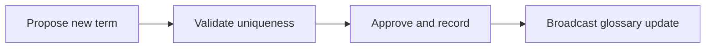

# Introduction

Maintains the canonical glossary for backend service terms to protect shared understanding across teams.

## 1. Purpose & Scope

Provide authoritative, unambiguous definitions for recurring backend terms used across specs and reviews.

## 2. Definitions
- Terminology Steward: Accountable owner for glossary integrity.
- Definition Catalog: Traceable list of approved terms.

## 3. Requirements, Constraints & Guidelines
- REQ-001: Each term includes concise meaning and usage context.
- REQ-002: Conflicts are resolved before publication.
- GUD-001: Propagate updates to dependent documents.

## 4. Interfaces & Data Contracts
Glossary references appear in onboarding materials, API docs, and UI copy.

## 5. Acceptance Criteria
- AC-001: One canonical definition per term.
- AC-002: Redundant or overlapping entries are merged.

## 6. Test Automation Strategy
- Duplicate header detection; linkable anchors per term.

## 7. Rationale & Context
Precise definitions reduce misinterpretation.

## 8. Dependencies & External Integrations
- Enterprise vocabulary lists; API naming conventions.

## 9. Examples & Edge Cases
- Edge: Term overlaps with data modeling jargon; usage context disambiguates.

## 10. Validation Criteria
- Quarterly audits; steward approvals logged.

## 11. Related Specifications / Further Reading
- [spec/spec-backend-service-implementation.md](spec/spec-backend-service-implementation.md)
