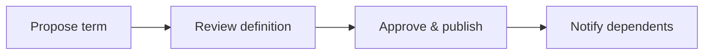
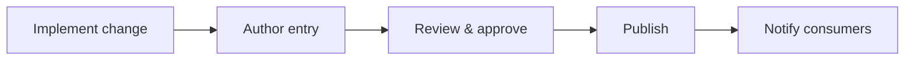
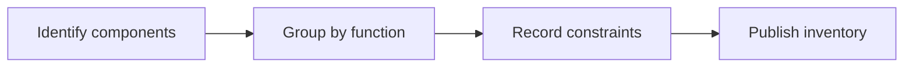
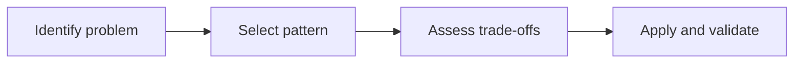

# Introduction

Defines backend-specific terms and acronyms for consistent usage across specifications.

## 1. Purpose & Scope

Serve as the authoritative glossary aligned with backend documentation.

## 2. Definitions
- Glossary Entry: Term with definition and usage notes.

## 3. Requirements, Constraints & Guidelines
- REQ-001: Single definition per term; conflicts resolved before publication.
- GUD-001: Include context and typical usage.

## 4. Interfaces & Data Contracts
N/A; referenced by other specs.

## 5. Acceptance Criteria
- AC-001: No duplicate or conflicting entries.

## 6. Test Automation Strategy
- Duplicate detection; link integrity for term anchors.

## 7. Rationale & Context
Consistent terminology improves clarity and reduces errors.

## 8. Dependencies & External Integrations
- Organization-wide vocabulary; API naming conventions.

## 9. Examples & Edge Cases
- Edge: Term used differently in UI vs backend → disambiguate in notes.

## 10. Validation Criteria
- Quarterly review; steward sign-off required.

## 11. Related Specifications / Further Reading
- [spec/spec-backend-service-implementation.md](spec/spec-backend-service-implementation.md)

*** Add File: /home/daniel/viaanix/thingsboard/ai-doc/spec/spec-process-backend-change-log.md
---
title: Backend Change Log Standards
version: 1.0
date_created: 2026-01-06
owner: ThingsBoard Architecture Team
tags: [backend, process, changelog]
---

# Introduction

Standardizes how backend changes are recorded and communicated.

## 1. Purpose & Scope

Provide a consistent format and lifecycle for changelog entries.

## 2. Definitions
- Entry: A single recorded change with context.

## 3. Requirements, Constraints & Guidelines
- REQ-001: Include version, date, summary, impact, and migration notes.
- GUD-001: Link to related issues and specs.

## 4. Interfaces & Data Contracts
N/A; documentation artifact.

## 5. Acceptance Criteria
- AC-001: Every release has a complete changelog.

## 6. Test Automation Strategy
- Consistency checks; missing entry detection.

## 7. Rationale & Context
Good changelogs reduce integration risk.

## 8. Dependencies & External Integrations
- Release tooling; notification channels.

## 9. Examples & Edge Cases
- Edge: Security patch under embargo → publish after lift with detail.

## 10. Validation Criteria
- Entries match released artifacts and tags.

## 11. Related Specifications / Further Reading
- [spec/spec-backend-service-implementation.md](spec/spec-backend-service-implementation.md)

*** Add File: /home/daniel/viaanix/thingsboard/ai-doc/spec/spec-infrastructure-backend-technology-stack.md
---
title: Backend Technology Stack Overview
version: 1.0
date_created: 2026-01-06
owner: ThingsBoard Architecture Team
tags: [backend, infrastructure, stack]
---

# Introduction

Summarizes platforms and tooling underpinning backend services without prescribing versions.

## 1. Purpose & Scope

Provide an at-a-glance inventory of runtime, build, security, and observability tooling.

## 2. Definitions
- Platform: Runtime or framework category.

## 3. Requirements, Constraints & Guidelines
- REQ-001: List core runtime, build, and operations components.
- GUD-001: Capture rationale where constraints apply.

## 4. Interfaces & Data Contracts
N/A; inventory with cross-links to specs.

## 5. Acceptance Criteria
- AC-001: Stack inventory complete and current.

## 6. Test Automation Strategy
- Inventory freshness checks; link validations.

## 7. Rationale & Context
Shared understanding of platform choices aids planning.

## 8. Dependencies & External Integrations
- CI/CD systems; security scanners; orchestrators.

## 9. Examples & Edge Cases
- Edge: Tool deprecation → migration plan noted.

## 10. Validation Criteria
- Regular reviews; deprecation tracked to closure.

## 11. Related Specifications / Further Reading
- [spec/spec-architecture-blueprint.md](spec/spec-architecture-blueprint.md)
- [spec/spec-backend-service-implementation.md](spec/spec-backend-service-implementation.md)

*** Add File: /home/daniel/viaanix/thingsboard/ai-doc/spec/spec-design-backend-architectural-design-patterns.md
---
title: Backend Architectural & Design Patterns
version: 1.0
date_created: 2026-01-06
owner: ThingsBoard Architecture Team
tags: [backend, design, patterns]
---

# Introduction

Catalog of recommended architectural and design patterns for backend services, described conceptually and visually.

## 1. Purpose & Scope

Encourage consistent pattern use and clarify trade-offs without code examples.

## 2. Definitions
- Pattern: Reusable solution structure for a recurring problem.

## 3. Requirements, Constraints & Guidelines
- REQ-001: Each pattern includes applicability, benefits, and trade-offs.
- GUD-001: Provide integration notes with other patterns.

## 4. Interfaces & Data Contracts
Patterns reference interfaces and flows where they apply.

## 5. Acceptance Criteria
- AC-001: Patterns include context and decision guidance.

## 6. Test Automation Strategy
- Pattern conformance checks in reviews.

## 7. Rationale & Context
Patterns streamline design and reduce defects.

## 8. Dependencies & External Integrations
- ADRs; interface catalogs; testing strategy.

## 9. Examples & Edge Cases
- Edge: Pattern misuse → add anti-pattern guidance.

## 10. Validation Criteria
- Pattern usage tracked; reviews confirm correct fit.

## 11. Related Specifications / Further Reading
- [spec/spec-backend-service-implementation.md](spec/spec-backend-service-implementation.md)
