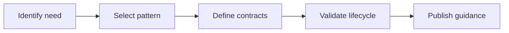

# Introduction

Captures advanced service patterns and extension mechanisms in a code-free manner, including async operations, event-driven integration, and pluggability.

## 1. Purpose & Scope

Guide teams on adopting advanced patterns while maintaining consistency and compatibility.

## 2. Definitions
- Async Operation: Non-blocking execution with deferred completion.
- Extension Point: Contract allowing custom logic integration.

## 3. Requirements, Constraints & Guidelines
- REQ-001: Async flows document backpressure and ordering semantics.
- REQ-002: Extension mechanisms define contracts and lifecycle.
- GUD-001: Prefer event-driven decoupling where appropriate.

## 4. Interfaces & Data Contracts
Define signals, metadata, and versioning for async and extension contracts.

## 5. Acceptance Criteria
- AC-001: Patterns list constraints, risks, and compatibility notes.
- AC-002: Extension points include clear enable/disable conditions.

## 6. Test Automation Strategy
- Scenario-driven tests validating pattern behavior and extension lifecycles.

## 7. Rationale & Context
Advanced patterns enable scale and flexibility without sacrificing consistency.

## 8. Dependencies & External Integrations
- Messaging backbones; plugin registries; feature flags.

## 9. Examples & Edge Cases
- Edge: Async reordering → define ordering policy and idempotency.

## 10. Validation Criteria
- Pattern checklists complete; lifecycle diagrams approved.

## 11. Related Specifications / Further Reading
- [spec/spec-backend-service-implementation.md](spec/spec-backend-service-implementation.md)
