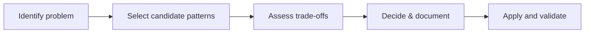

# Introduction

Catalog of recommended architectural and design patterns for backend services, described conceptually and visually.

## 1. Purpose & Scope

Encourage consistent pattern use and clarify trade-offs without code examples.

## 2. Definitions
- Pattern: Reusable solution structure for a recurring problem.
- Anti-pattern: Common but harmful solution that should be avoided.

## 3. Requirements, Constraints & Guidelines
- **REQ-001**: Each pattern includes applicability, benefits, trade-offs, and risks.
- **REQ-002**: Provide integration notes with related patterns.
- **CON-001**: Patterns must align with security and compliance requirements.
- **GUD-001**: Include operational considerations (observability, scaling, failure modes).

## 4. Interfaces & Data Contracts
Patterns reference interfaces and flows where they apply; no code examples.

## 5. Acceptance Criteria
- **AC-001**: Patterns include context, decision guidance, and operational notes.
- **AC-002**: Anti-pattern guidance present where misuse risk is high.

## 6. Test Automation Strategy
- Pattern conformance checks in design reviews; decision traceability.

## 7. Rationale & Context
Patterns streamline design, improve interoperability, and reduce defects.

## 8. Dependencies & External Integrations
- ADRs; interface catalogs; testing and observability strategies.

## 9. Examples & Edge Cases
- Edge: Conflicting patterns in the same subsystem → choose one and justify.

## 10. Validation Criteria
- Pattern usage tracked; reviews confirm correct fit and alignment to constraints.

## 11. Related Specifications / Further Reading
- [spec/spec-backend-service-implementation.md](spec/spec-backend-service-implementation.md)
