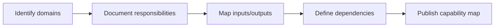
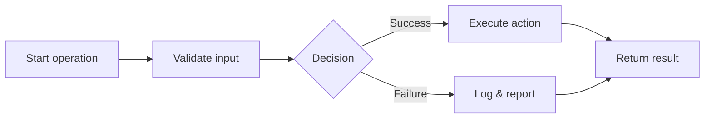
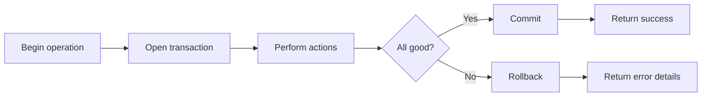
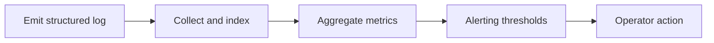
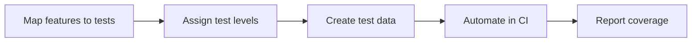

# Introduction

Outlines the primary backend service domains (device, user, asset, telemetry, notification, integration, rule engine, audit, monitoring) and their functional boundaries, without code examples.

## 1. Purpose & Scope

Summarize responsibilities, inputs/outputs, and quality attributes for each core service domain.

## 2. Definitions
- Service Domain: Functional area served by a cohesive set of operations.
- Capability Map: Overview of features per service domain.

## 3. Requirements, Constraints & Guidelines
- REQ-001: Each domain lists responsibilities and dependencies.
- REQ-002: Cross-domain interactions identified to prevent tight coupling.
- GUD-001: Prefer clear ownership and interfaces per domain.

## 4. Interfaces & Data Contracts
Each domain references interface entries and contracts in the central catalog.

## 5. Acceptance Criteria
- AC-001: Domains have clearly documented responsibilities and dependencies.
- AC-002: Capability map aligns with product features.

## 6. Test Automation Strategy
- Consistency checks across domain descriptions; link validation to interfaces.

## 7. Rationale & Context
Domain clarity reduces coupling and clarifies ownership.

## 8. Dependencies & External Integrations
- Product feature inventory; module ownership register.

## 9. Examples & Edge Cases
- Edge: Overlapping responsibilities between services → record decision and refactor plan.

## 10. Validation Criteria
- Governance review approves domain boundaries; duplication flags addressed.

## 11. Related Specifications / Further Reading
- [spec/spec-backend-service-implementation.md](spec/spec-backend-service-implementation.md)

*** Add File: /home/daniel/viaanix/thingsboard/ai-doc/spec/spec-design-backend-service-operation-flowcharts.md
---
title: Backend Service Operation Flowcharts
version: 1.0
date_created: 2026-01-06
owner: ThingsBoard Architecture Team
tags: [backend, design, flowcharts]
---

# Introduction

Provides canonical, code-free visualizations of common backend operations such as creation, retrieval, deletion, telemetry ingestion, notifications, and rule processing.

## 1. Purpose & Scope

Deliver consistent, validated flow diagrams used across reviews and onboarding.

## 2. Definitions
- Operation Flow: Visual lifecycle of a specific backend action.
- Decision Point: Conditional path affecting outcomes.

## 3. Requirements, Constraints & Guidelines
- REQ-001: Each operation includes start, validations, actions, decisions, and outcomes.
- REQ-002: Error/exception outcomes are modeled.
- GUD-001: Use a consistent legend and labels across flows.

## 4. Interfaces & Data Contracts
Flows reference involved interfaces (controller/service/DAO) and the data they exchange.

## 5. Acceptance Criteria
- AC-001: All core operations have published, reviewed flowcharts.
- AC-002: Diagrams link to corresponding interface entries.

## 6. Test Automation Strategy
- Mermaid syntax checks; link integrity to interface docs.

## 7. Rationale & Context
Visual flows reduce ambiguity and align teams.

## 8. Dependencies & External Integrations
- Interface catalog; error handling policies.

## 9. Examples & Edge Cases
- Edge: Missing error branch → add explicit failure path.

## 10. Validation Criteria
- Review board signs off; diagrams render without errors.

## 11. Related Specifications / Further Reading
- [spec/spec-backend-service-implementation.md](spec/spec-backend-service-implementation.md)

*** Add File: /home/daniel/viaanix/thingsboard/ai-doc/spec/spec-process-backend-error-handling-transactions.md
---
title: Backend Error Handling & Transaction Management
version: 1.0
date_created: 2026-01-06
owner: ThingsBoard Architecture Team
tags: [backend, process, reliability]
---

# Introduction

Defines how errors propagate and how transactional boundaries ensure atomic operations.

## 1. Purpose & Scope

Standardize error semantics and transaction handling across services.

## 2. Definitions
- Transaction Boundary: Atomic operation scope.
- Error Surface: The point at which an error is observable.

## 3. Requirements, Constraints & Guidelines
- REQ-001: State-changing operations operate within defined transactions.
- REQ-002: Errors include actionable context and consistent categorization.
- GUD-001: Employ retries only where idempotency is guaranteed.

## 4. Interfaces & Data Contracts
Document error categories and transaction policies as part of interface contracts.

## 5. Acceptance Criteria
- AC-001: All write operations define commit/rollback behavior.
- AC-002: Error formats are consistent and documented.

## 6. Test Automation Strategy
- Integration scenarios covering commit/rollback; error mapping checks.

## 7. Rationale & Context
Reliable transactions and transparent errors reduce operational risk.

## 8. Dependencies & External Integrations
- Persistence layer; retry/circuit breaker policies.

## 9. Examples & Edge Cases
- Edge: Partial failure path requires compensating action; documented policy.

## 10. Validation Criteria
- Transaction and error behavior validated against acceptance tests.

## 11. Related Specifications / Further Reading
- [spec/spec-backend-service-implementation.md](spec/spec-backend-service-implementation.md)

*** Add File: /home/daniel/viaanix/thingsboard/ai-doc/spec/spec-infrastructure-backend-logging-monitoring.md
---
title: Backend Logging & Monitoring
version: 1.0
date_created: 2026-01-06
owner: ThingsBoard Architecture Team
tags: [backend, infrastructure, observability]
---

# Introduction

Outlines standardized logging and monitoring practices for backend services.

## 1. Purpose & Scope

Ensure consistent, actionable logs and metrics across modules for operations and troubleshooting.

## 2. Definitions
- Structured Log: Log entry with consistent fields.
- Metric: Numeric time series reflecting system behavior.

## 3. Requirements, Constraints & Guidelines
- REQ-001: Log significant state changes and errors with correlation IDs.
- REQ-002: Expose health and readiness endpoints.
- GUD-001: Use consistent log structure for aggregation.

## 4. Interfaces & Data Contracts
Define log fields, metric names, and endpoint contracts for health/metrics.

## 5. Acceptance Criteria
- AC-001: Logs correlate across services; key metrics available.
- AC-002: Health/metrics endpoints respond reliably.

## 6. Test Automation Strategy
- Synthetic checks for endpoints; schema checks for log fields.

## 7. Rationale & Context
Observability accelerates MTTR and capacity planning.

## 8. Dependencies & External Integrations
- Log aggregation; metrics backends; dashboards.

## 9. Examples & Edge Cases
- Edge: Sensitive data in logs → redact and revalidate pipelines.

## 10. Validation Criteria
- Dashboards and alerts configured; endpoint uptime verified.

## 11. Related Specifications / Further Reading
- [spec/spec-backend-service-implementation.md](spec/spec-backend-service-implementation.md)

*** Add File: /home/daniel/viaanix/thingsboard/ai-doc/spec/spec-process-backend-test-automation.md
---
title: Backend Test Automation Strategy
version: 1.0
date_created: 2026-01-06
owner: ThingsBoard Architecture Team
tags: [backend, process, testing]
---

# Introduction

Defines testing layers and coverage expectations for backend services.

## 1. Purpose & Scope

Align test types (unit, integration, end-to-end) with service responsibilities and interfaces.

## 2. Definitions
- Test Level: Scope and isolation of a test.
- Coverage Threshold: Minimum acceptable coverage per layer.

## 3. Requirements, Constraints & Guidelines
- REQ-001: Unit and integration tests cover business logic and persistence paths.
- REQ-002: Critical flows include end-to-end validation.
- GUD-001: Use deterministic test data and cleanup.

## 4. Interfaces & Data Contracts
Tests reference interface contracts and data schemas to validate behavior.

## 5. Acceptance Criteria
- AC-001: Coverage targets met; critical paths tested.
- AC-002: CI publishes consistent test reports.

## 6. Test Automation Strategy
- As above, plus mutation testing for robustness (where applicable).

## 7. Rationale & Context
Automated tests maintain reliability and speed of change.

## 8. Dependencies & External Integrations
- CI/CD pipelines; test data stores; reporting tools.

## 9. Examples & Edge Cases
- Edge: Flaky tests detected → quarantine and stabilize under SLA.

## 10. Validation Criteria
- CI checks green; coverage dashboards within thresholds.

## 11. Related Specifications / Further Reading
- [spec/spec-backend-service-implementation.md](spec/spec-backend-service-implementation.md)
