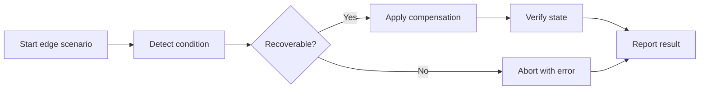
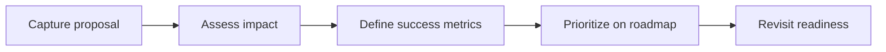
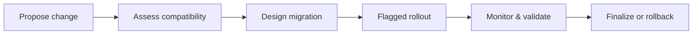
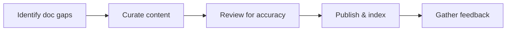

# Introduction

Presents visualizations for non-happy-path scenarios (duplicates, bulk operations, partial failures) without code examples.

## 1. Purpose & Scope

Standardize modeling of exceptional conditions and recovery behaviors.

## 2. Definitions
- Edge Case: Low-frequency scenario with high impact potential.
- Compensating Action: Steps taken to recover or mitigate failure.

## 3. Requirements, Constraints & Guidelines
- REQ-001: Diagram each critical edge case with outcomes and mitigations.
- REQ-002: Indicate observable signals for operators.
- GUD-001: Include rollback/compensation where relevant.

## 4. Interfaces & Data Contracts
Edge flows reference the same interfaces and contracts as their happy-path counterparts.

## 5. Acceptance Criteria
- AC-001: All identified edge cases have diagrams and mitigation notes.
- AC-002: Operator signals and actions are documented.

## 6. Test Automation Strategy
- Scenario tests focused on failure injection and recovery assertions.

## 7. Rationale & Context
Explicit modeling of edge cases reduces incident impact.

## 8. Dependencies & External Integrations
- Incident playbooks; monitoring alerts.

## 9. Examples & Edge Cases
- Edge: Bulk deletion partial failures → collect errors and summarize.

## 10. Validation Criteria
- Edge diagram set reviewed and approved; coverage tracked.

## 11. Related Specifications / Further Reading
- [spec/spec-backend-service-implementation.md](spec/spec-backend-service-implementation.md)

*** Add File: /home/daniel/viaanix/thingsboard/ai-doc/spec/spec-architecture-backend-future-enhancements.md
---
title: Backend Future Enhancements
version: 1.0
date_created: 2026-01-06
owner: ThingsBoard Architecture Team
tags: [backend, architecture, roadmap]
---

# Introduction

Captures forward-looking improvements and enabling work, focusing on architectural fit and readiness criteria.

## 1. Purpose & Scope

List potential enhancements with constraints, dependencies, and evaluation criteria.

## 2. Definitions
- Enhancement: Proposed change that extends capability or quality attributes.
- Readiness Criteria: Conditions required before implementation.

## 3. Requirements, Constraints & Guidelines
- REQ-001: Each enhancement describes value, risk, and impact.
- REQ-002: Dependencies and migration considerations documented.
- GUD-001: Align enhancements with measurable outcomes.

## 4. Interfaces & Data Contracts
Note interface or contract changes implied by enhancements.

## 5. Acceptance Criteria
- AC-001: Enhancements have clear evaluation metrics and risks.
- AC-002: No unvetted breaking changes are merged.

## 6. Test Automation Strategy
- Prototype validation plans; impact tests for changes.

## 7. Rationale & Context
Intentional evolution reduces rework and improves outcomes.

## 8. Dependencies & External Integrations
- Vendor SLAs; platform limits; compliance requirements.

## 9. Examples & Edge Cases
- Edge: Competing enhancements require sequencing → document decision.

## 10. Validation Criteria
- Governance sign-off; success metrics tracked post-delivery.

## 11. Related Specifications / Further Reading
- [spec/spec-backend-service-implementation.md](spec/spec-backend-service-implementation.md)

*** Add File: /home/daniel/viaanix/thingsboard/ai-doc/spec/spec-process-backend-migration-compatibility.md
---
title: Backend Migration & Backward Compatibility
version: 1.0
date_created: 2026-01-06
owner: ThingsBoard Architecture Team
tags: [backend, process, compatibility]
---

# Introduction

Defines how changes are rolled out safely with backward compatibility considerations.

## 1. Purpose & Scope

Plan migrations, deprecations, and rollbacks while minimizing user impact.

## 2. Definitions
- Deprecation: Announcement of forthcoming removal.
- Rollback: Reverting to a previous working version.

## 3. Requirements, Constraints & Guidelines
- REQ-001: Breaking changes require versioning and migration steps.
- REQ-002: Feature flags or phased rollouts for risky changes.
- GUD-001: Provide clear deprecation schedules and alternatives.

## 4. Interfaces & Data Contracts
Map changes to contract versions and compatibility guarantees.

## 5. Acceptance Criteria
- AC-001: All breaking changes have migration and rollback plans.
- AC-002: Deprecation timelines communicated and tracked.

## 6. Test Automation Strategy
- Compatibility tests across versions; rollback rehearse plans.

## 7. Rationale & Context
Structured migration reduces risk and preserves trust.

## 8. Dependencies & External Integrations
- Change logs; feature flag systems; monitoring.

## 9. Examples & Edge Cases
- Edge: Partial migration failure → rollback criteria activated.

## 10. Validation Criteria
- Migration success metrics achieved; zero critical regressions.

## 11. Related Specifications / Further Reading
- [spec/spec-backend-service-implementation.md](spec/spec-backend-service-implementation.md)

*** Add File: /home/daniel/viaanix/thingsboard/ai-doc/spec/spec-process-backend-developer-experience.md
---
title: Backend Documentation & Developer Experience
version: 1.0
date_created: 2026-01-06
owner: ThingsBoard Architecture Team
tags: [backend, process, developer-experience]
---

# Introduction

Improves developer efficiency by standardizing documentation artifacts, navigation, and examples-free guidance.

## 1. Purpose & Scope

Ensure public interfaces, flows, and patterns are discoverable and current.

## 2. Definitions
- Doc Portal: Central entry point to specs and references.
- DX Metric: Measure of developer friction or success.

## 3. Requirements, Constraints & Guidelines
- REQ-001: Public service interfaces documented and linked.
- REQ-002: Flowcharts present for core operations.
- GUD-001: Provide checklists and anti-patterns.

## 4. Interfaces & Data Contracts
Docs link to interface contracts and relevant flows.

## 5. Acceptance Criteria
- AC-001: All interfaces discoverable from the portal.
- AC-002: Flowcharts up to date and reviewed.

## 6. Test Automation Strategy
- Link and structure checks; freshness audits.

## 7. Rationale & Context
Good DX reduces onboarding time and defects.

## 8. Dependencies & External Integrations
- Search/index tools; doc hosting; feedback channels.

## 9. Examples & Edge Cases
- Edge: Stale links → automated link rot detection.

## 10. Validation Criteria
- DX metrics trend positive; reported gaps closed within SLA.

## 11. Related Specifications / Further Reading
- [spec/spec-backend-service-implementation.md](spec/spec-backend-service-implementation.md)
