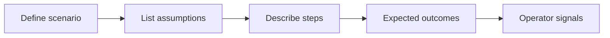
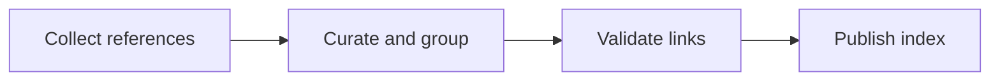

# Introduction

Describes canonical and boundary scenarios in narrative and diagrammatic form without embedding code snippets.

## 1. Purpose & Scope

Provide scenario clarity for typical and edge behaviors across services.

## 2. Definitions
- Canonical Scenario: Representative, typical operation path.
- Boundary Scenario: Edge condition approaching system limits or special rules.

## 3. Requirements, Constraints & Guidelines
- REQ-001: Each scenario lists assumptions and expected outcomes.
- REQ-002: Edge cases include mitigation or operator actions.
- GUD-001: Prefer visual aids and concise narrative over code.

## 4. Interfaces & Data Contracts
Scenarios reference affected interfaces and expected data characteristics.

## 5. Acceptance Criteria
- AC-001: Scenarios are actionable and unambiguous.
- AC-002: Edge case mitigations are documented.

## 6. Test Automation Strategy
- Scenario test mapping; failure injection for edge cases.

## 7. Rationale & Context
Scenario-led documentation reduces ambiguity and rework.

## 8. Dependencies & External Integrations
- Interface catalog; operational playbooks.

## 9. Examples & Edge Cases
- Example: Duplicate creation rejected with clear remediation guidance.

## 10. Validation Criteria
- Scenario catalog reviewed; links to tests present.

## 11. Related Specifications / Further Reading
- [spec/spec-backend-service-implementation.md](spec/spec-backend-service-implementation.md)

*** Add File: /home/daniel/viaanix/thingsboard/ai-doc/spec/spec-process-backend-related-specs.md
---
title: Backend Related Specifications & References
version: 1.0
date_created: 2026-01-06
owner: ThingsBoard Architecture Team
tags: [backend, process, references]
---

# Introduction

Centralizes links to specs and references relevant to backend services.

## 1. Purpose & Scope

Ensure discoverability of related materials and avoid duplication.

## 2. Definitions
- Reference Index: Organized list of curated links.

## 3. Requirements, Constraints & Guidelines
- REQ-001: Keep references current and validated.
- GUD-001: Group links by capability or audience.

## 4. Interfaces & Data Contracts
N/A; provides navigational structure only.

## 5. Acceptance Criteria
- AC-001: All links valid; duplicates removed.

## 6. Test Automation Strategy
- Link checks; freshness audits.

## 7. Rationale & Context
Central index reduces search time and fragmentation.

## 8. Dependencies & External Integrations
- Documentation repos; external portals.

## 9. Examples & Edge Cases
- Edge: Deprecated spec detected → mark and replace.

## 10. Validation Criteria
- Index reviewed each release; broken links zeroed.

## 11. Related Specifications / Further Reading
- [spec/spec-architecture-blueprint.md](spec/spec-architecture-blueprint.md)
- [spec/spec-backend-service-implementation.md](spec/spec-backend-service-implementation.md)
