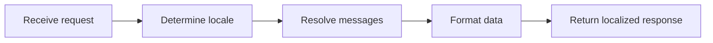
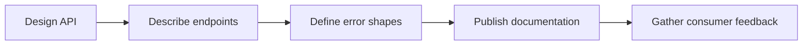

# Introduction

Guides locale-aware data handling and message externalization for backend services.

## 1. Purpose & Scope

Enable consistent localization of user-facing content and locale-sensitive data management.

## 2. Definitions
- Locale: Regional settings affecting formatting and language.
- Externalized Message: Translatable string stored outside code.

## 3. Requirements, Constraints & Guidelines
- REQ-001: Externalize user-facing messages for translation.
- REQ-002: Handle locale-aware formats (dates, numbers) consistently.
- GUD-001: Provide defaults and fallbacks.

## 4. Interfaces & Data Contracts
Specify where locale must be provided or derived and how messages are resolved.

## 5. Acceptance Criteria
- AC-001: Responses reflect requested locale with valid fallbacks.
- AC-002: Message catalogs complete for supported locales.

## 6. Test Automation Strategy
- Locale matrix tests; snapshot comparisons.

## 7. Rationale & Context
Consistent i18n avoids misunderstanding and improves UX.

## 8. Dependencies & External Integrations
- Translation pipelines; locale catalogs.

## 9. Examples & Edge Cases
- Edge: Unknown locale → fallback applied and logged.

## 10. Validation Criteria
- Locale coverage verified; no format regressions.

## 11. Related Specifications / Further Reading
- [spec/spec-backend-service-implementation.md](spec/spec-backend-service-implementation.md)

*** Add File: /home/daniel/viaanix/thingsboard/ai-doc/spec/spec-design-backend-accessibility-usability.md
---
title: Backend Accessibility & Usability
version: 1.0
date_created: 2026-01-06
owner: ThingsBoard Architecture Team
tags: [backend, design, accessibility]
---

# Introduction

Ensures backend APIs are self-describing and provide actionable feedback to consumers.

## 1. Purpose & Scope

Improve API clarity, discoverability, and error usability.

## 2. Definitions
- Self-Describing API: Interface with discoverable endpoints and schemas.
- Actionable Error: Message enabling quick consumer remediation.

## 3. Requirements, Constraints & Guidelines
- REQ-001: Provide discoverable endpoint and schema descriptions.
- REQ-002: Errors include remediation guidance.
- GUD-001: Document common patterns and anti-patterns.

## 4. Interfaces & Data Contracts
Define error shapes and links to documentation for consumers.

## 5. Acceptance Criteria
- AC-001: Consumers can onboard without external assistance.
- AC-002: Error responses include remediation instructions.

## 6. Test Automation Strategy
- Contract completeness checks; documentation link tests.

## 7. Rationale & Context
Usable APIs reduce support load and integration time.

## 8. Dependencies & External Integrations
- API gateways; documentation portals.

## 9. Examples & Edge Cases
- Edge: Ambiguous error → revise schema and docs.

## 10. Validation Criteria
- Consumer satisfaction metrics improve; fewer support tickets.

## 11. Related Specifications / Further Reading
- [spec/spec-backend-service-implementation.md](spec/spec-backend-service-implementation.md)
