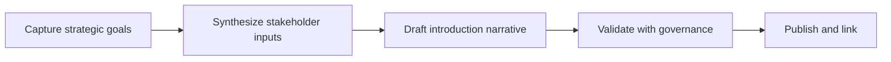

# Introduction

Establishes the overarching narrative for backend service implementations, summarizing goals, constraints, and stakeholders before readers dive into detailed patterns. Avoids code examples; emphasizes intent, structure, and governance.

## 1. Purpose & Scope

Clarify why backend services exist, the problems they address, and how this documentation guides consistent implementation decisions across teams.

## 2. Definitions
- Narrative Baseline: Shared statement that frames backend service capabilities.
- Stakeholder Alignment: Cross-team agreement on architectural intent.

## 3. Requirements, Constraints & Guidelines
- REQ-001: Maintain a single, canonical introduction aligned with the architecture blueprint.
- REQ-002: Update the narrative when scope or priorities materially change.
- GUD-001: Keep language tool-agnostic and role-inclusive.

## 4. Interfaces & Data Contracts
The introduction interfaces with stakeholder inputs (roadmaps, ADRs) and sets expectations for deeper sections (requirements, interfaces, testing, deployment).

## 5. Acceptance Criteria
- AC-001: The introduction states objectives, audience, and boundaries without code.
- AC-002: Stakeholders confirm alignment with current roadmap and ADRs.

## 6. Test Automation Strategy
- Linting for structure and links; automated checks for section presence.

## 7. Rationale & Context
Shared narrative prevents contradictory interpretations and accelerates onboarding.

## 8. Dependencies & External Integrations
- Roadmap summaries; architecture decision records; governance calendar.

## 9. Examples & Edge Cases
- Edge: New capability added but narrative unchanged → trigger governance review.

## 10. Validation Criteria
- Editorial review sign-off; link integrity checks clean; no code samples present.

## 11. Related Specifications / Further Reading
- [spec/spec-backend-service-implementation.md](spec/spec-backend-service-implementation.md)
