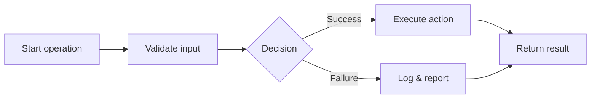

# Introduction

Provides canonical, code-free visualizations of common backend operations such as creation, retrieval, deletion, telemetry ingestion, notifications, and rule processing.

## 1. Purpose & Scope

Deliver consistent, validated flow diagrams used across reviews and onboarding.

## 2. Definitions
- Operation Flow: Visual lifecycle of a specific backend action.
- Decision Point: Conditional path affecting outcomes.

## 3. Requirements, Constraints & Guidelines
- REQ-001: Each operation includes start, validations, actions, decisions, and outcomes.
- REQ-002: Error/exception outcomes are modeled.
- GUD-001: Use a consistent legend and labels across flows.

## 4. Interfaces & Data Contracts
Flows reference involved interfaces (controller/service/DAO) and the data they exchange.

## 5. Acceptance Criteria
- AC-001: All core operations have published, reviewed flowcharts.
- AC-002: Diagrams link to corresponding interface entries.

## 6. Test Automation Strategy
- Mermaid syntax checks; link integrity to interface docs.

## 7. Rationale & Context
Visual flows reduce ambiguity and align teams.

## 8. Dependencies & External Integrations
- Interface catalog; error handling policies.

## 9. Examples & Edge Cases
- Edge: Missing error branch → add explicit failure path.

## 10. Validation Criteria
- Review board signs off; diagrams render without errors.

## 11. Related Specifications / Further Reading
- [spec/spec-backend-service-implementation.md](spec/spec-backend-service-implementation.md)
