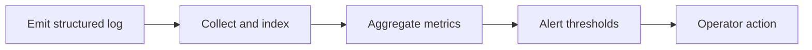

# Introduction

Outlines standardized logging and monitoring practices for backend services.

## 1. Purpose & Scope

Ensure consistent, actionable logs and metrics across modules for operations and troubleshooting.

## 2. Definitions
- Structured Log: Log entry with consistent fields.
- Metric: Numeric time series reflecting system behavior.

## 3. Requirements, Constraints & Guidelines
- REQ-001: Log significant state changes and errors with correlation IDs.
- REQ-002: Expose health and readiness endpoints.
- GUD-001: Use consistent log structure for aggregation.

## 4. Interfaces & Data Contracts
Define log fields, metric names, and endpoint contracts for health/metrics.

## 5. Acceptance Criteria
- AC-001: Logs correlate across services; key metrics available.
- AC-002: Health/metrics endpoints respond reliably.

## 6. Test Automation Strategy
- Synthetic checks for endpoints; schema checks for log fields.

## 7. Rationale & Context
Observability accelerates MTTR and capacity planning.

## 8. Dependencies & External Integrations
- Log aggregation; metrics backends; dashboards.

## 9. Examples & Edge Cases
- Edge: Sensitive data in logs → redact and revalidate pipelines.

## 10. Validation Criteria
- Dashboards and alerts configured; endpoint uptime verified.

## 11. Related Specifications / Further Reading
- [spec/spec-backend-service-implementation.md](spec/spec-backend-service-implementation.md)
