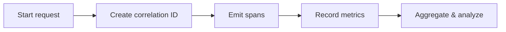

# Introduction

Details tracing, metrics, and logging correlations for end-to-end visibility.

## 1. Purpose & Scope

Enable rapid diagnosis and capacity insight via standardized telemetry.

## 2. Definitions
- Trace: Linked spans for a single request path.
- Correlation ID: Identifier tying logs/metrics/traces together.

## 3. Requirements, Constraints & Guidelines
- REQ-001: Emit traces for critical paths and propagate IDs.
- REQ-002: Publish key service-level metrics.
- GUD-001: Structure logs for correlation.

## 4. Interfaces & Data Contracts
Define span names, metric labels, and log fields.

## 5. Acceptance Criteria
- AC-001: Traces reconstruct end-to-end paths.
- AC-002: Metrics reflect SLOs and capacity needs.

## 6. Test Automation Strategy
- Synthetic traces; metrics presence checks.

## 7. Rationale & Context
Observability accelerates debugging and planning.

## 8. Dependencies & External Integrations
- Trace collectors; metrics stores; dashboards.

## 9. Examples & Edge Cases
- Edge: Missing correlation propagation → add gateway enrichment.

## 10. Validation Criteria
- Telemetry dashboards operational; correlation verified.

## 11. Related Specifications / Further Reading
- [spec/spec-backend-service-implementation.md](spec/spec-backend-service-implementation.md)
