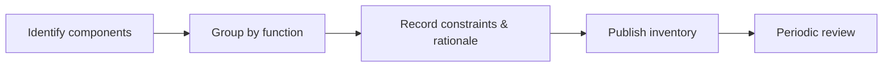

# Introduction

Summarizes platforms and tooling underpinning backend services without prescribing versions.

## 1. Purpose & Scope

Provide an at-a-glance inventory of runtime, build, security, and observability tooling.

## 2. Definitions
- Platform: Runtime or framework category.
- Component: Tool or service used by the platform.

## 3. Requirements, Constraints & Guidelines
- **REQ-001**: List core runtime, build, storage, messaging, and operations components.
- **REQ-002**: Include ownership and data classification for each component.
- **CON-001**: Document constraints (e.g., compliance, regional availability).
- **GUD-001**: Capture rationale where constraints apply.

## 4. Interfaces & Data Contracts
N/A; inventory with cross-links to interface catalogs and ADRs.

## 5. Acceptance Criteria
- **AC-001**: Stack inventory complete and current for all production services.
- **AC-002**: Each component lists owner, purpose, and constraints.

## 6. Test Automation Strategy
- Inventory freshness checks; link validations; ownership coverage reports.

## 7. Rationale & Context
Shared understanding of platform choices aids planning and compliance.

## 8. Dependencies & External Integrations
- CI/CD systems; security scanners; orchestrators; cloud platforms.

## 9. Examples & Edge Cases
- Edge: Tool deprecation → migration plan documented with target timeline.

## 10. Validation Criteria
- Quarterly reviews; deprecations tracked to closure; exception approvals logged.

## 11. Related Specifications / Further Reading
- [spec/spec-architecture-blueprint.md](spec/spec-architecture-blueprint.md)
- [spec/spec-backend-service-implementation.md](spec/spec-backend-service-implementation.md)
