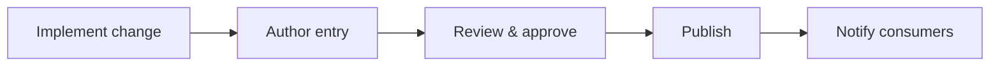

# Introduction

Standardizes how backend changes are recorded and communicated.

## 1. Purpose & Scope

Provide a consistent format and lifecycle for changelog entries.

## 2. Definitions
- Entry: A single recorded change with context.

## 3. Requirements, Constraints & Guidelines
- **REQ-001**: Include version, date, summary, impact, and migration notes.
- **REQ-002**: Categorize entries (Added, Changed, Deprecated, Removed, Fixed, Security).
- **CON-001**: Security details may be delayed under embargo but must be documented.
- **GUD-001**: Link to related issues, ADRs, and specs.

## 4. Interfaces & Data Contracts
N/A; documentation artifact.

## 5. Acceptance Criteria
- **AC-001**: Every release has a complete changelog entry set.
- **AC-002**: Each breaking change includes migration guidance.

## 6. Test Automation Strategy
- Consistency checks; missing entry detection; link validation in CI.

## 7. Rationale & Context
Good changelogs reduce integration risk and support auditability.

## 8. Dependencies & External Integrations
- Release tooling; notification channels; artifact repositories.

## 9. Examples & Edge Cases
- Edge: Security patch under embargo → publish after lift with detail.

## 10. Validation Criteria
- Entries match released artifacts and tags; reviewers sign-off.

## 11. Related Specifications / Further Reading
- [spec/spec-backend-service-implementation.md](spec/spec-backend-service-implementation.md)
