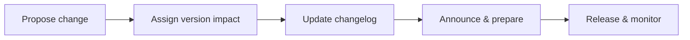

# Introduction

Defines processes for managing change and versioning backend interfaces.

## 1. Purpose & Scope

Ensure controlled evolution with clear communication and rollback capability.

## 2. Definitions
- Semantic Versioning: Numbering scheme conveying change impact.
- Changelog: Record of changes and migration notes.

## 3. Requirements, Constraints & Guidelines
- REQ-001: Interfaces follow semantic versioning.
- REQ-002: All changes recorded with migration guidance.
- GUD-001: Communicate breaking changes early.

## 4. Interfaces & Data Contracts
Version headers or paths; deprecation markers and support windows.

## 5. Acceptance Criteria
- AC-001: Changes are versioned and documented.
- AC-002: Rollback tags available and tested.

## 6. Test Automation Strategy
- Contract tests across versions; release smoke tests.

## 7. Rationale & Context
Predictable versioning enables safe integrations.

## 8. Dependencies & External Integrations
- Registry; release tooling; consumer notification channels.

## 9. Examples & Edge Cases
- Edge: Emergency hotfix → follow expedited but traceable process.

## 10. Validation Criteria
- All releases have matching changelog entries; tags verified.

## 11. Related Specifications / Further Reading
- [spec/spec-backend-service-implementation.md](spec/spec-backend-service-implementation.md)
