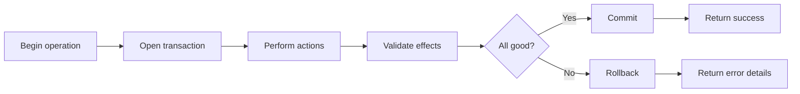

# Introduction

Defines how errors propagate and how transactional boundaries ensure atomic operations.

## 1. Purpose & Scope

Standardize error semantics and transaction handling across services.

## 2. Definitions
- Transaction Boundary: Atomic operation scope.
- Error Surface: The point at which an error is observable.

## 3. Requirements, Constraints & Guidelines
- REQ-001: State-changing operations operate within defined transactions.
- REQ-002: Errors include actionable context and consistent categorization.
- GUD-001: Employ retries only where idempotency is guaranteed.

## 4. Interfaces & Data Contracts
Document error categories and transaction policies as part of interface contracts.

## 5. Acceptance Criteria
- AC-001: All write operations define commit/rollback behavior.
- AC-002: Error formats are consistent and documented.

## 6. Test Automation Strategy
- Integration scenarios covering commit/rollback; error mapping checks.

## 7. Rationale & Context
Reliable transactions and transparent errors reduce operational risk.

## 8. Dependencies & External Integrations
- Persistence layer; retry/circuit breaker policies.

## 9. Examples & Edge Cases
- Edge: Partial failure path requires compensating action; documented policy.

## 10. Validation Criteria
- Transaction and error behavior validated against acceptance tests.

## 11. Related Specifications / Further Reading
- [spec/spec-backend-service-implementation.md](spec/spec-backend-service-implementation.md)
