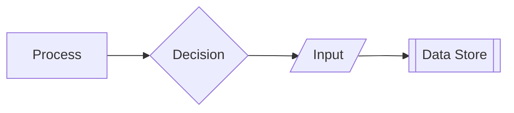

# Introduction

Defines visual conventions for diagrams across backend specs.

## 1. Purpose & Scope

Ensure consistent diagram interpretation and construction.

## 2. Definitions
- Legend: Mapping of shapes and styles to meanings.

## 3. Requirements, Constraints & Guidelines
- REQ-001: Use standard shapes and labels for processes, decisions, and I/O.
- REQ-002: Maintain consistency across all diagrams.
- GUD-001: Keep diagrams readable and minimal.

## 4. Interfaces & Data Contracts
N/A; applies to documentation visuals.

## 5. Acceptance Criteria
- AC-001: Diagrams across specs follow the legend.

## 6. Test Automation Strategy
- Visual linting where supported; manual reviews.

## 7. Rationale & Context
Consistency improves comprehension.

## 8. Dependencies & External Integrations
- Diagram tooling; doc linters.

## 9. Examples & Edge Cases
- Edge: Overcrowded diagrams → split into subflows.

## 10. Validation Criteria
- Spot checks confirm adherence during reviews.

## 11. Related Specifications / Further Reading
- [spec/spec-backend-service-implementation.md](spec/spec-backend-service-implementation.md)
