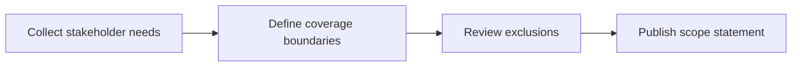

# Introduction

Defines which backend concerns are covered and which are excluded, ensuring contributors understand boundaries when designing and evolving services.

## 1. Purpose & Scope

List included layers (controllers, services, DAOs), lifecycle stages (create/read/update/delete, events, telemetry), and call out exclusions (UI concerns, cloud provider specifics) unless explicitly referenced.

## 2. Definitions
- Scope Envelope: Behaviors governed by this spec.
- Audience Matrix: Mapping of roles to documentation depth.

## 3. Requirements, Constraints & Guidelines
- REQ-001: Explicitly enumerate in-scope modules and operations.
- REQ-002: Document exclusions and their rationale.
- GUD-001: Keep scope synchronized with governance artifacts.

## 4. Interfaces & Data Contracts
Scope statements must reference interface catalogs and data contracts where applicable.

## 5. Acceptance Criteria
- AC-001: Coverage questions resolve by referencing this section.
- AC-002: New modules trigger review of scope entries.

## 6. Test Automation Strategy
- Diff-based checks to detect missing scope entries; terminology linting.

## 7. Rationale & Context
Clear scope prevents drift and reduces clarification cycles.

## 8. Dependencies & External Integrations
- Module inventory; release planning inputs.

## 9. Examples & Edge Cases
- Edge: External data pipeline mistakenly assumed in scope → documented exclusion.

## 10. Validation Criteria
- Governance approval captured; references to scope appear across section indices.

## 11. Related Specifications / Further Reading
- [spec/spec-backend-service-implementation.md](spec/spec-backend-service-implementation.md)
