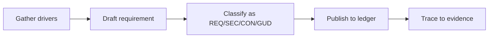

# Introduction

Aggregates enforceable rules and advisory patterns guiding backend service delivery to ensure consistent guardrails across teams.

## 1. Purpose & Scope

Centralize normative statements (requirements, constraints) and recommendations (guidelines) with traceability.

## 2. Definitions
- Requirement Ledger: Source of truth for normative rules.
- Constraint Boundary: Non-negotiable limitation (e.g., compliance).

## 3. Requirements, Constraints & Guidelines
- REQ-001: Every rule includes ownership, rationale, and traceability ID.
- SEC-001: Security mandates documented with justification.
- CON-001: Constraints list impact on availability, scale, or compliance.
- GUD-001: Guidelines include trade-offs and application contexts.

## 4. Interfaces & Data Contracts
Links to QA checklists, ADRs, and design reviews where evidence is collected.

## 5. Acceptance Criteria
- AC-001: Reviewers can map rules to evidence.
- AC-002: New constraints trigger notifications to affected teams.

## 6. Test Automation Strategy
- Schema checks for rule format; tag prefix linting.

## 7. Rationale & Context
Centralization prevents divergence and eases audits.

## 8. Dependencies & External Integrations
- Security policies; platform KPIs.

## 9. Examples & Edge Cases
- Edge: Async guideline conflicts with latency constraint → documented override process.

## 10. Validation Criteria
- Milestone reviews; dashboards surface unmet constraints.

## 11. Related Specifications / Further Reading
- [spec/spec-backend-service-implementation.md](spec/spec-backend-service-implementation.md)
