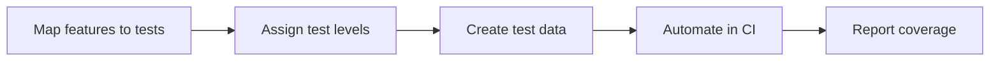

# Introduction

Defines testing layers and coverage expectations for backend services.

## 1. Purpose & Scope

Align test types (unit, integration, end-to-end) with service responsibilities and interfaces.

## 2. Definitions
- Test Level: Scope and isolation of a test.
- Coverage Threshold: Minimum acceptable coverage per layer.

## 3. Requirements, Constraints & Guidelines
- REQ-001: Unit and integration tests cover business logic and persistence paths.
- REQ-002: Critical flows include end-to-end validation.
- GUD-001: Use deterministic test data and cleanup.

## 4. Interfaces & Data Contracts
Tests reference interface contracts and data schemas to validate behavior.

## 5. Acceptance Criteria
- AC-001: Coverage targets met; critical paths tested.
- AC-002: CI publishes consistent test reports.

## 6. Test Automation Strategy
- As above, plus mutation testing for robustness where applicable.

## 7. Rationale & Context
Automated tests maintain reliability and speed of change.

## 8. Dependencies & External Integrations
- CI/CD pipelines; test data stores; reporting tools.

## 9. Examples & Edge Cases
- Edge: Flaky tests detected → quarantine and stabilize under SLA.

## 10. Validation Criteria
- CI checks green; coverage dashboards within thresholds.

## 11. Related Specifications / Further Reading
- [spec/spec-backend-service-implementation.md](spec/spec-backend-service-implementation.md)
