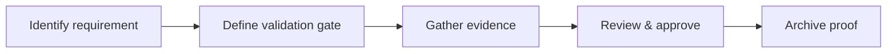

# Introduction

Defines the review and evidence requirements to confirm backend service specifications are satisfied.

## 1. Purpose & Scope

Establish clear, testable checks that map to requirements and flows.

## 2. Definitions
- Validation Gate: A checkpoint requiring objective evidence.
- Evidence Artifact: Document or report demonstrating compliance.

## 3. Requirements, Constraints & Guidelines
- REQ-001: Each requirement has one or more validation gates.
- REQ-002: Evidence artifacts are linkable and durable.
- GUD-001: Prefer automated validation where feasible.

## 4. Interfaces & Data Contracts
Validation maps to requirements, interfaces, and flowcharts for traceability.

## 5. Acceptance Criteria
- AC-001: All core requirements list validation gates and evidence.
- AC-002: Validation results are accessible and auditable.

## 6. Test Automation Strategy
- Automated checks verify presence of gates and evidence links.

## 7. Rationale & Context
Unambiguous validation accelerates reviews and audits.

## 8. Dependencies & External Integrations
- CI reports; monitoring dashboards; security scans.

## 9. Examples & Edge Cases
- Edge: Evidence link rot → archival policy requires durable storage.

## 10. Validation Criteria
- Zero missing gates; green status across required checks.

## 11. Related Specifications / Further Reading
- [spec/spec-backend-service-implementation.md](spec/spec-backend-service-implementation.md)
