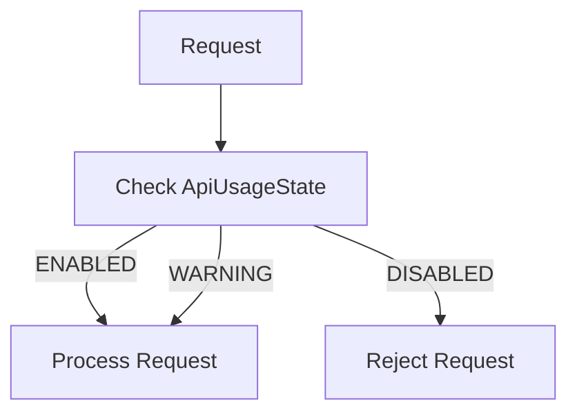

# API Usage State Specification

## Overview

This document describes the API usage tracking and rate limiting mechanisms in ThingsBoard, used to enforce quotas and monitor platform usage.

---

## Key Interfaces

### RuleEngineApiUsageStateService

Located at: `org/thingsboard/rule/engine/api/RuleEngineApiUsageStateService.java`

| Method                        | Description                                      |
|-------------------------------|--------------------------------------------------|
| getApiUsageState(tenantId)    | Get current API usage state for tenant           |
| checkRateLimits(...)          | Check if rate limits are exceeded                |

### ApiUsageState Entity

| Field         | Type      | Description                        |
|---------------|-----------|------------------------------------|
| tenantId      | TenantId  | Owning tenant                      |
| transportState | ApiUsageStateValue | Transport API state         |
| dbStorageState | ApiUsageStateValue | DB storage state            |
| reExecState   | ApiUsageStateValue | Rule engine execution state  |
| jsExecState   | ApiUsageStateValue | JS execution state           |
| smsExecState  | ApiUsageStateValue | SMS execution state          |
| emailExecState | ApiUsageStateValue | Email execution state       |
| alarmExecState | ApiUsageStateValue | Alarm execution state       |

### ApiUsageStateValue

| Value     | Description                        |
|-----------|------------------------------------|
| ENABLED   | Feature enabled, within limits     |
| WARNING   | Approaching limit                  |
| DISABLED  | Limit exceeded, feature disabled   |

---

## Rate Limiting Flow

---

## Configuration

| Property                        | Description                        |
|---------------------------------|------------------------------------|
| usage.limit.transport.messages  | Max transport messages per period  |
| usage.limit.db.storage          | Max DB storage (bytes)             |
| usage.limit.re.executions       | Max rule engine executions         |
| usage.limit.js.executions       | Max JS executions                  |

---

## Best Practices

- Monitor usage state for early warning
- Notify admins when WARNING state reached
- Design rule chains to minimize unnecessary executions

---

## See Also

- [TbContext & Services](tb-context-and-services.md)
- [Security and Authentication](security-auth.md)
