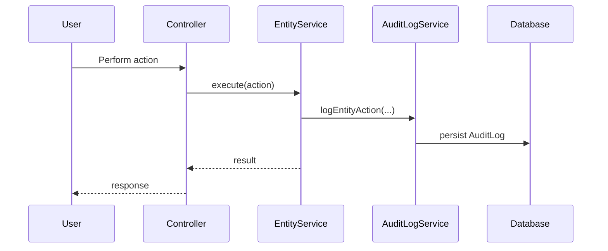
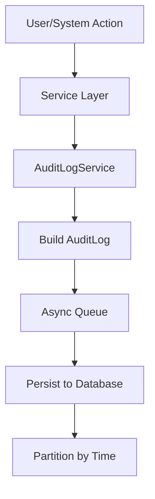
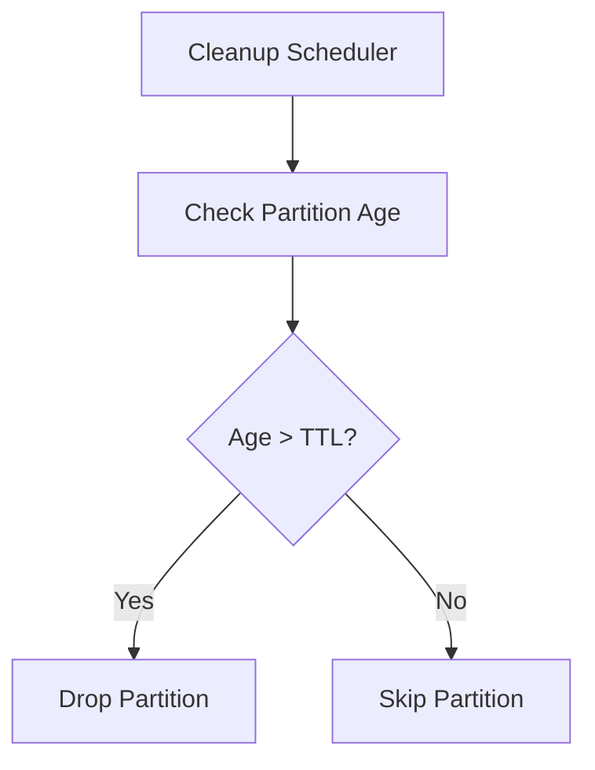
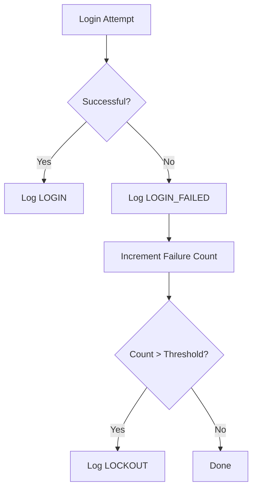
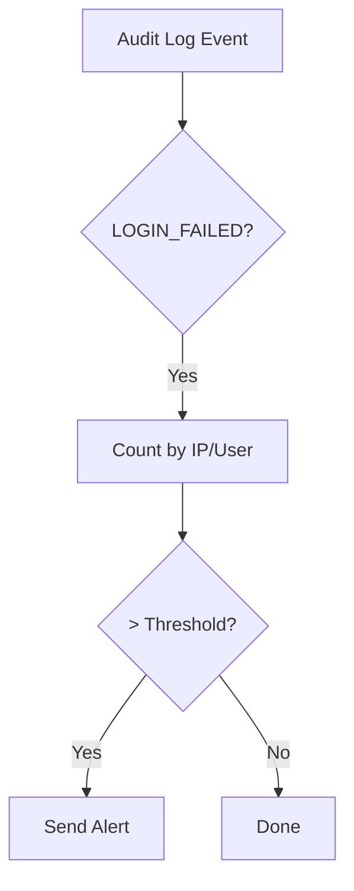

# Audit Logging Specification

## Overview

This document describes the audit logging system in ThingsBoard, which tracks user and system actions for compliance and troubleshooting.

---

## Key Components

### AuditLogService

| Method                        | Description                                      |
|-------------------------------|--------------------------------------------------|
| logEntityAction(...)          | Log an action on an entity                       |
| findAuditLogsByTenantId(...)  | Query audit logs for tenant                      |
| findAuditLogsByUserId(...)    | Query audit logs for user                        |
| findAuditLogsByEntityId(...)  | Query audit logs for entity                      |

---

## AuditLog Entity

| Field         | Type      | Description                        |
|---------------|-----------|------------------------------------|
| id            | AuditLogId | Unique identifier                 |
| tenantId      | TenantId  | Owning tenant                      |
| customerId    | CustomerId| Customer context (if applicable)   |
| userId        | UserId    | User who performed action          |
| entityId      | EntityId  | Target entity                      |
| entityName    | String    | Target entity name                 |
| actionType    | ActionType| Type of action                     |
| actionData    | JsonNode  | Action details                     |
| actionStatus  | ActionStatus | SUCCESS, FAILURE                |
| actionFailureDetails | String | Failure details (if any)      |
| createdTime   | long      | Timestamp                          |

---

## Action Types

| ActionType        | Description                                      |
|-------------------|--------------------------------------------------|
| ADDED             | Entity created                                   |
| DELETED           | Entity deleted                                   |
| UPDATED           | Entity updated                                   |
| ATTRIBUTES_UPDATED| Attributes modified                              |
| CREDENTIALS_UPDATED| Device credentials changed                      |
| ASSIGNED_TO_CUSTOMER| Entity assigned to customer                    |
| UNASSIGNED_FROM_CUSTOMER| Entity unassigned from customer            |
| LOGIN             | User login                                       |
| LOGOUT            | User logout                                      |
| RPC_CALL          | RPC invoked                                      |
| ALARM_ACK         | Alarm acknowledged                               |
| ALARM_CLEAR       | Alarm cleared                                    |

---

## Audit Log Flow



---

## Configuration

| Property                        | Description                        |
|---------------------------------|------------------------------------|
| audit-log.enabled               | Enable/disable audit logging       |
| audit-log.ttl                   | Retention period (days)            |
| audit-log.max-per-partition     | Max entries per partition          |

---

## Complete Action Types

### Entity Actions

| ActionType              | Description                          |
|-------------------------|--------------------------------------|
| ADDED                   | Entity created                       |
| DELETED                 | Entity deleted                       |
| UPDATED                 | Entity updated                       |
| ACTIVATED               | Entity activated                     |
| SUSPENDED               | Entity suspended                     |

### Attribute Actions

| ActionType              | Description                          |
|-------------------------|--------------------------------------|
| ATTRIBUTES_UPDATED      | Attributes modified                  |
| ATTRIBUTES_DELETED      | Attributes deleted                   |
| ATTRIBUTES_READ         | Attributes read (if enabled)         |

### Credential Actions

| ActionType              | Description                          |
|-------------------------|--------------------------------------|
| CREDENTIALS_UPDATED     | Credentials changed                  |
| CREDENTIALS_READ        | Credentials read (if enabled)        |

### Assignment Actions

| ActionType                  | Description                      |
|-----------------------------|----------------------------------|
| ASSIGNED_TO_CUSTOMER        | Entity assigned to customer      |
| UNASSIGNED_FROM_CUSTOMER    | Entity unassigned from customer  |
| ASSIGNED_TO_EDGE            | Entity assigned to edge          |
| UNASSIGNED_FROM_EDGE        | Entity unassigned from edge      |
| ASSIGNED_TO_TENANT          | Entity assigned to tenant        |
| ASSIGNED_FROM_TENANT        | Entity assigned from tenant      |

### Authentication Actions

| ActionType              | Description                          |
|-------------------------|--------------------------------------|
| LOGIN                   | User login successful                |
| LOGOUT                  | User logout                          |
| LOGIN_FAILED            | Login attempt failed                 |
| LOCKOUT                 | Account locked                       |

### Alarm Actions

| ActionType              | Description                          |
|-------------------------|--------------------------------------|
| ALARM_ACK               | Alarm acknowledged                   |
| ALARM_CLEAR             | Alarm cleared                        |
| ALARM_ASSIGNED          | Alarm assigned to user               |
| ALARM_UNASSIGNED        | Alarm unassigned                     |
| ALARM_DELETE            | Alarm deleted                        |

### RPC Actions

| ActionType              | Description                          |
|-------------------------|--------------------------------------|
| RPC_CALL                | RPC invoked                          |

### Rule Engine Actions

| ActionType              | Description                          |
|-------------------------|--------------------------------------|
| RULE_CHAIN_UPDATED      | Rule chain updated                   |
| RULE_NODE_UPDATED       | Rule node updated                    |

### Relation Actions

| ActionType              | Description                          |
|-------------------------|--------------------------------------|
| RELATION_ADD_OR_UPDATE  | Relation created or updated          |
| RELATION_DELETED        | Relation deleted                     |
| RELATIONS_DELETED       | All relations deleted                |

---

## Action Data Structure

### Entity Action Data

```json
{
  "entityType": "DEVICE",
  "entityId": "device-uuid",
  "entityName": "Sensor 1",
  "previousValue": {
    "name": "Sensor 1",
    "label": "Old Label"
  },
  "newValue": {
    "name": "Sensor 1",
    "label": "New Label"
  }
}
```

### Login Action Data

```json
{
  "clientAddress": "192.168.1.100",
  "browser": "Chrome 120",
  "os": "Windows 10",
  "device": "Desktop"
}
```

### RPC Action Data

```json
{
  "method": "setValue",
  "params": {"pin": 7, "value": 1},
  "response": {"success": true}
}
```

---

## Querying Audit Logs

### By Tenant

| Endpoint                                    | Method | Description                    |
|---------------------------------------------|--------|--------------------------------|
| /api/audit/logs                             | GET    | List tenant audit logs         |
| /api/audit/logs/count                       | GET    | Count tenant audit logs        |

### By Entity

| Endpoint                                    | Method | Description                    |
|---------------------------------------------|--------|--------------------------------|
| /api/audit/logs/entity/{entityType}/{entityId} | GET | Entity audit logs           |

### By User

| Endpoint                                    | Method | Description                    |
|---------------------------------------------|--------|--------------------------------|
| /api/audit/logs/user/{userId}               | GET    | User audit logs                |

### By Customer

| Endpoint                                    | Method | Description                    |
|---------------------------------------------|--------|--------------------------------|
| /api/audit/logs/customer/{customerId}       | GET    | Customer audit logs            |

---

## Query Parameters

| Parameter   | Description                              |
|-------------|------------------------------------------|
| pageSize    | Number of results per page               |
| page        | Page number (0-based)                    |
| startTime   | Filter by start timestamp                |
| endTime     | Filter by end timestamp                  |
| actionTypes | Comma-separated action types             |
| sortProperty| Field to sort by                         |
| sortOrder   | ASC or DESC                              |

### Example Query

```http
GET /api/audit/logs?pageSize=20&page=0&startTime=1704451200000&endTime=1704537600000&actionTypes=LOGIN,LOGOUT
```

---

## Audit Log Processing Flow



---

## Storage and Partitioning

### Time-Based Partitioning

| Configuration              | Description                          |
|----------------------------|--------------------------------------|
| audit-log.partition_type   | DAYS, MONTHS                         |
| audit-log.partition_size   | Size of each partition               |
| audit-log.cleanup.enabled  | Enable automatic cleanup             |
| audit-log.cleanup.cron     | Cleanup schedule                     |

### Retention Management



---

## Security Logging

### Login Monitoring



### Failed Login Alerting

Configure rule chain to monitor for failed logins:



---

## Exporting Audit Logs

### CSV Export

```http
GET /api/audit/logs/export?format=csv&startTime=1704451200000&endTime=1704537600000
```

### Integration with SIEM

Configure log forwarding to external SIEM systems:

| Integration | Method                               |
|-------------|--------------------------------------|
| Syslog      | Forward via rsyslog/syslog-ng        |
| Elasticsearch | Direct indexing via Logstash      |
| Splunk      | HTTP Event Collector                 |
| AWS CloudWatch | CloudWatch Logs agent             |

---

## Best Practices

- Enable audit logging in production
- Set appropriate retention period for compliance
- Monitor for failed login attempts
- Use audit logs for security investigations
- Export logs to SIEM for long-term analysis
- Configure alerts for suspicious patterns
- Regularly review audit log retention policies

---

## See Also

- [Security and Authentication](security-auth.md)
- [DAO & Entity Services Overview](dao-entity-services-overview.md)
- [Tenant Customer Model](tenant-customer-model.md)
