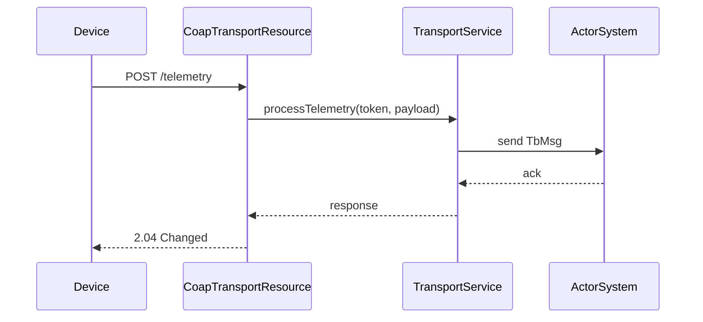
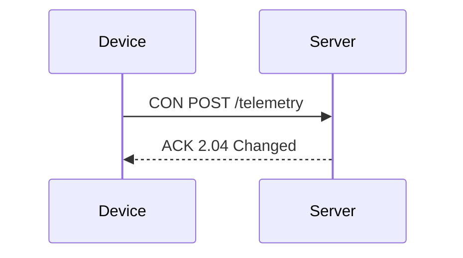
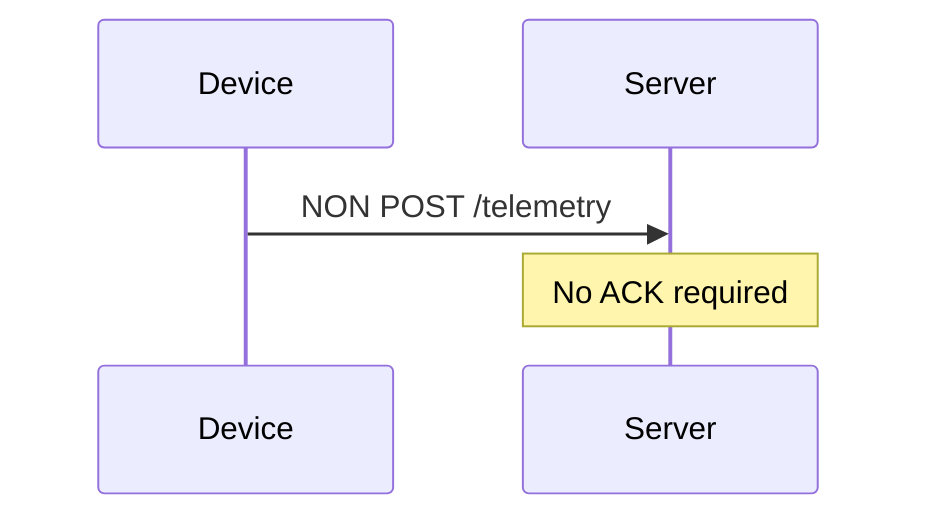
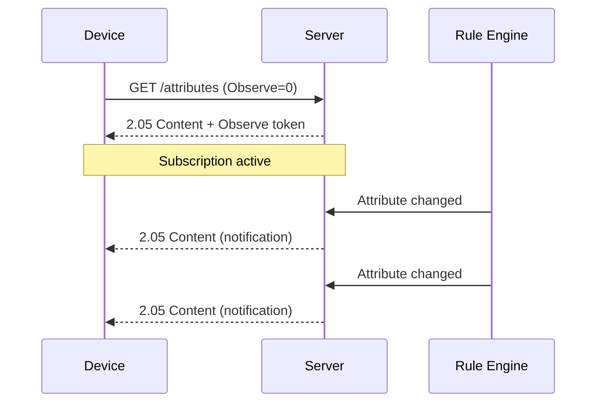
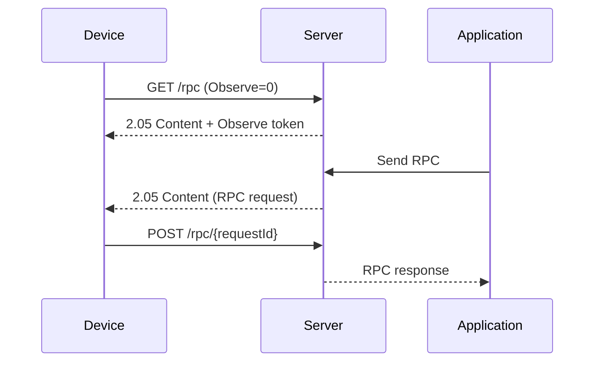
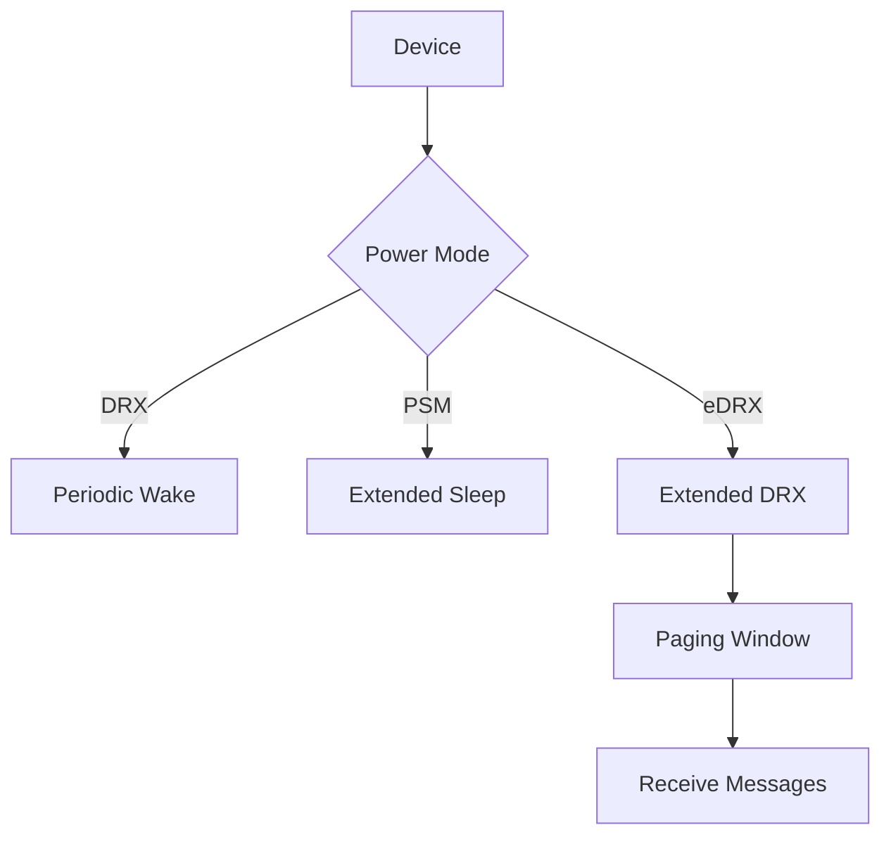
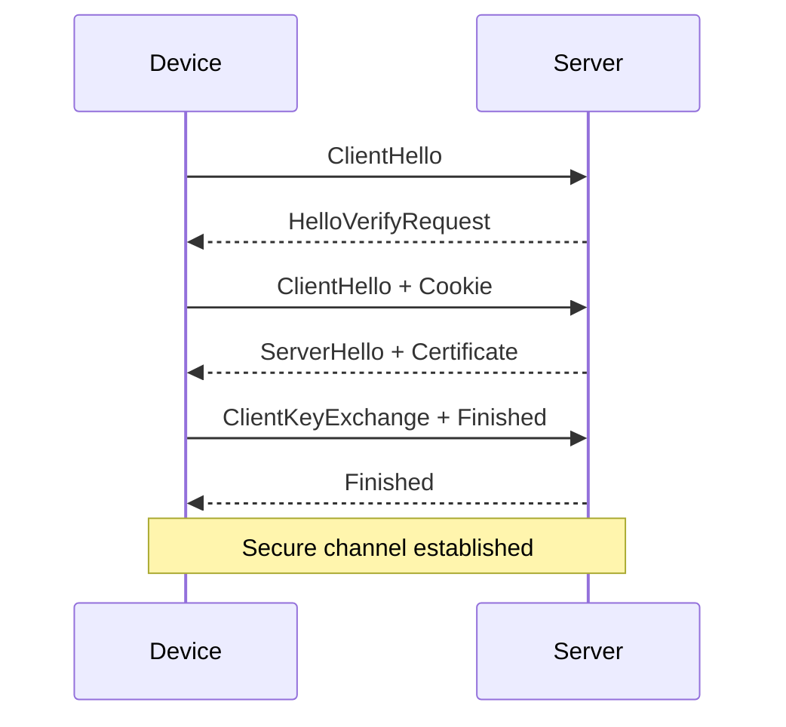
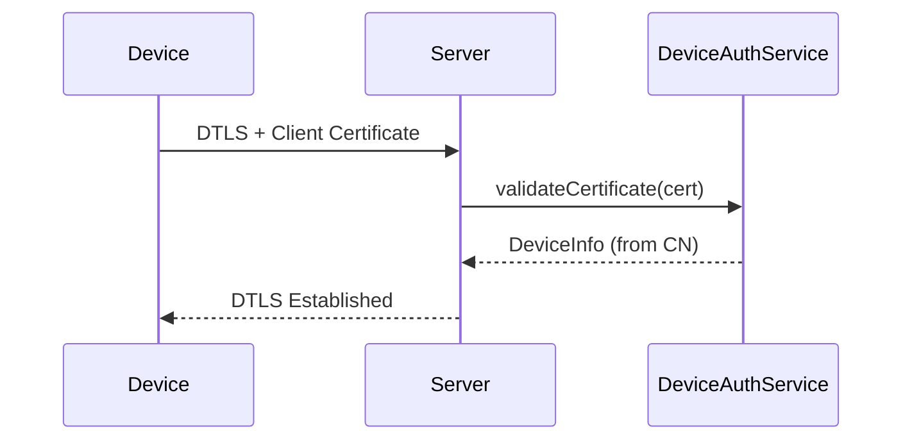
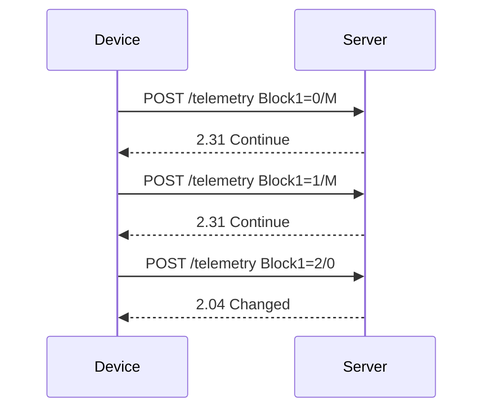
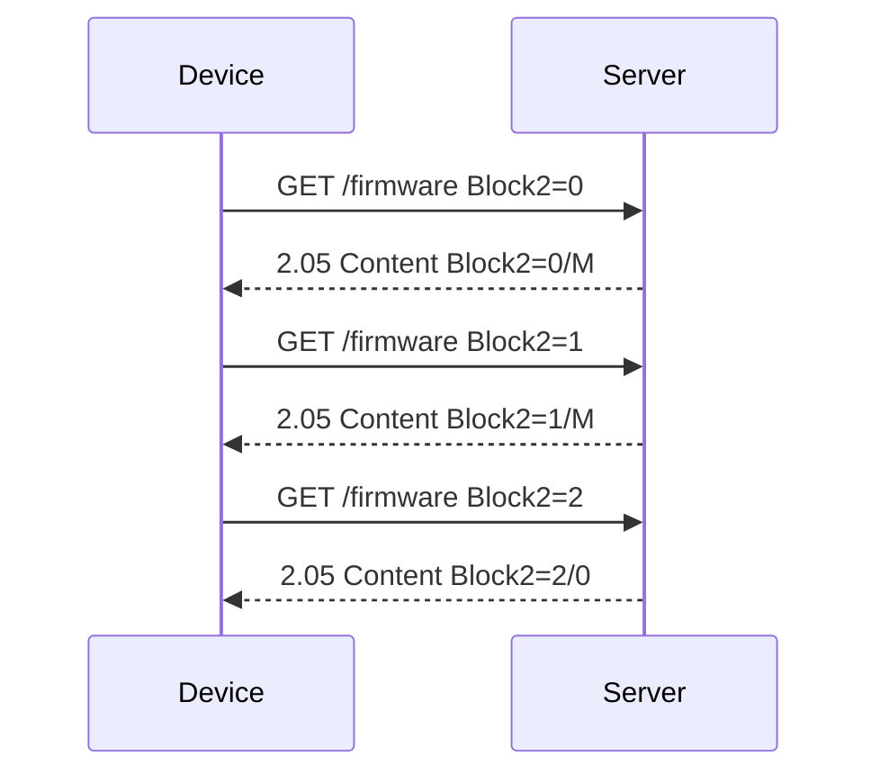

# CoAP Transport Flow Specification

## Overview

This document describes the CoAP transport layer in ThingsBoard, which enables lightweight device communication for constrained IoT devices.

---

## Key Components

### CoapTransportResource

Handles incoming CoAP requests from devices.

| Resource Path                | Method | Description                        |
|------------------------------|--------|------------------------------------|
| /api/v1/{deviceToken}/telemetry | POST | Submit device telemetry            |
| /api/v1/{deviceToken}/attributes | POST | Submit device attributes          |
| /api/v1/{deviceToken}/attributes | GET  | Request shared attributes          |
| /api/v1/{deviceToken}/rpc    | GET    | Observe for server-side RPC        |
| /api/v1/{deviceToken}/rpc/{requestId} | POST | Respond to server-side RPC  |

---

## Request Flow



---

## Authentication

- Device token in URI path
- Token validated against device credentials
- Invalid token returns 4.01 Unauthorized

---

## Payload Formats

- JSON (application/json)
- CBOR (application/cbor) for binary efficiency

---

## Error Handling

| CoAP Code | Meaning                        |
|-----------|--------------------------------|
| 2.04      | Changed (success)              |
| 4.00      | Bad request                    |
| 4.01      | Unauthorized                   |
| 5.00      | Internal server error          |

---

## Complete Resource Paths

### Telemetry Resources

| Resource Path                              | Method | Description                |
|--------------------------------------------|--------|----------------------------|
| /api/v1/{deviceToken}/telemetry            | POST   | Submit device telemetry    |

### Attribute Resources

| Resource Path                              | Method | Description                |
|--------------------------------------------|--------|----------------------------|
| /api/v1/{deviceToken}/attributes           | POST   | Publish client attributes  |
| /api/v1/{deviceToken}/attributes           | GET    | Request attributes         |
| /api/v1/{deviceToken}/attributes/updates   | GET    | Observe attribute updates  |

### RPC Resources

| Resource Path                              | Method | Description                |
|--------------------------------------------|--------|----------------------------|
| /api/v1/{deviceToken}/rpc                  | GET    | Observe server-side RPC    |
| /api/v1/{deviceToken}/rpc/{requestId}      | POST   | Respond to server RPC      |
| /api/v1/{deviceToken}/rpc                  | POST   | Client-side RPC request    |

### Device Management Resources

| Resource Path                              | Method | Description                |
|--------------------------------------------|--------|----------------------------|
| /api/v1/{deviceToken}/claim                | POST   | Claim device               |
| /api/v1/provision                          | POST   | Provision new device       |
| /api/v1/{deviceToken}/firmware             | GET    | Get firmware info          |
| /api/v1/{deviceToken}/firmware/chunk       | GET    | Download firmware chunk    |

---

## CoAP Message Types

| Type    | Description                                         |
|---------|-----------------------------------------------------|
| CON     | Confirmable - requires ACK                          |
| NON     | Non-confirmable - no ACK required                   |
| ACK     | Acknowledgment for CON messages                     |
| RST     | Reset - indicates message processing error          |

### Message Flow (Confirmable)



### Message Flow (Non-Confirmable)



---

## Observe Pattern (RFC 7641)

### Subscribe to Attribute Updates



### Subscribe to Server RPC



---

## Power Saving Modes

### Power Mode Configuration

| Mode  | Description                                         |
|-------|-----------------------------------------------------|
| DRX   | Discontinuous Reception - periodic wake-up          |
| PSM   | Power Saving Mode - extended sleep periods          |
| eDRX  | Extended DRX - longer sleep with paging windows     |

### eDRX Configuration

| Parameter              | Description                              |
|------------------------|------------------------------------------|
| edrxCycle              | eDRX cycle duration in milliseconds      |
| pagingTransmissionWindow | Paging window duration                 |



---

## DTLS Security

### DTLS Configuration

| Property                          | Description                          |
|-----------------------------------|--------------------------------------|
| transport.coap.dtls.enabled       | Enable DTLS                          |
| transport.coap.dtls.credentials.type | PEM or KEYSTORE                   |
| transport.coap.dtls.key_store     | Keystore path                        |
| transport.coap.dtls.key_password  | Key password                         |

### DTLS Handshake



### Client Certificate Authentication



---

## Block-Wise Transfer (RFC 7959)

### Large Payload Upload



### Firmware Download



---

## CBOR Payload Format

### Telemetry (CBOR)

Binary CBOR encoding of:

```json
{"temperature": 22.5, "humidity": 60}
```

CBOR advantages:

- 30-50% smaller than JSON
- Faster parsing on constrained devices
- Native binary data support

---

## Rate Limiting

| Limit Type         | Scope    | Description                              |
|--------------------|----------|------------------------------------------|
| requests.limit     | Device   | Max CoAP requests per device per second  |
| requests.limit     | Tenant   | Max CoAP requests per tenant per second  |

---

## Configuration Properties

| Property                          | Default | Description                          |
|-----------------------------------|---------|--------------------------------------|
| transport.coap.bind_address       | 0.0.0.0 | CoAP server bind address             |
| transport.coap.bind_port          | 5683    | CoAP server port                     |
| transport.coap.dtls.bind_port     | 5684    | DTLS server port                     |
| transport.coap.timeout            | 10000   | Request timeout in ms               |

---

## Best Practices

- Use DTLS for security
- Prefer CBOR for constrained devices
- Use observe for RPC and attribute updates
- Configure appropriate power saving modes for battery devices
- Use block-wise transfer for large payloads
- Implement retransmission for CON messages
- Consider NON messages for non-critical telemetry

---

## See Also

- [MQTT Transport Flow](mqtt-transport-flow.md)
- [HTTP Transport Flow](http-transport-flow.md)
- [Transport to Rule Engine Flow](transport-to-rule-engine-flow.md)
- [Device Asset Profiles](device-asset-profiles.md)
