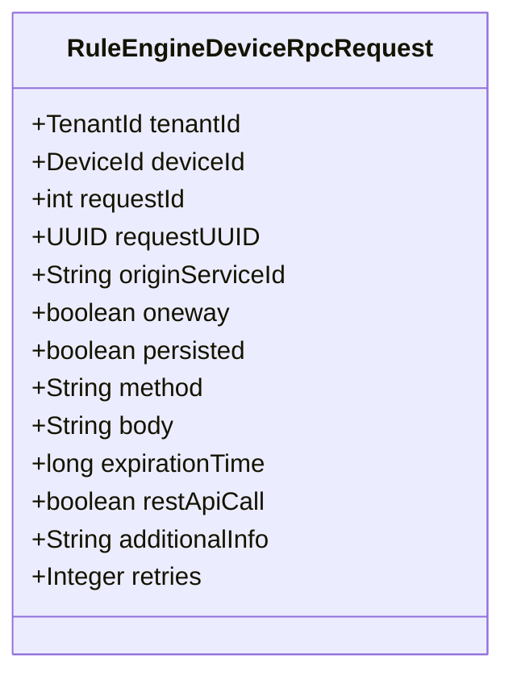
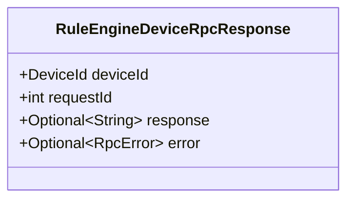
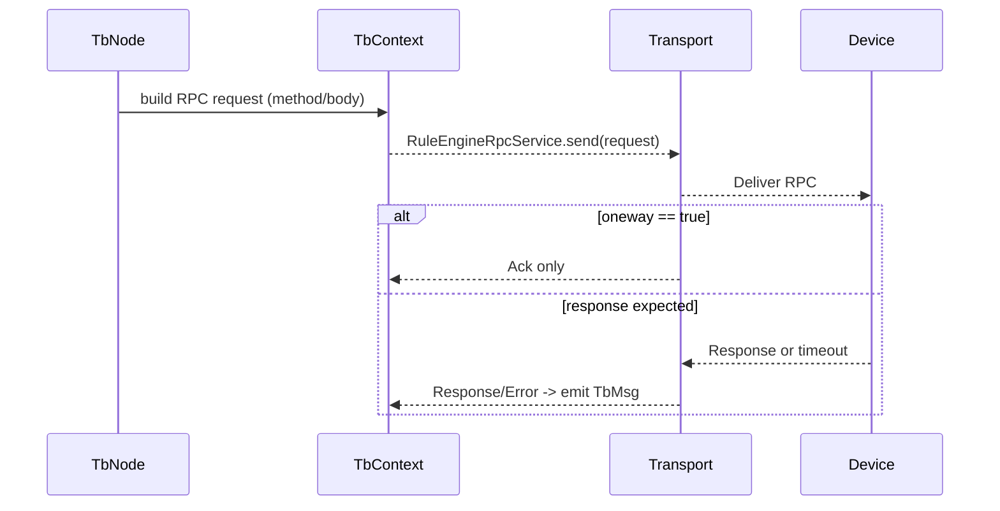
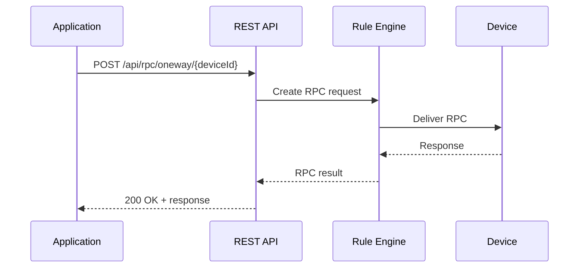
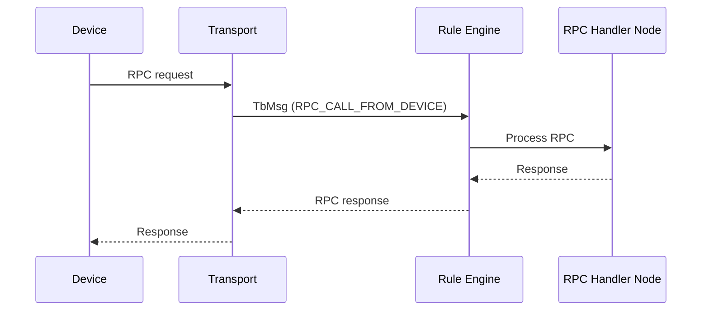
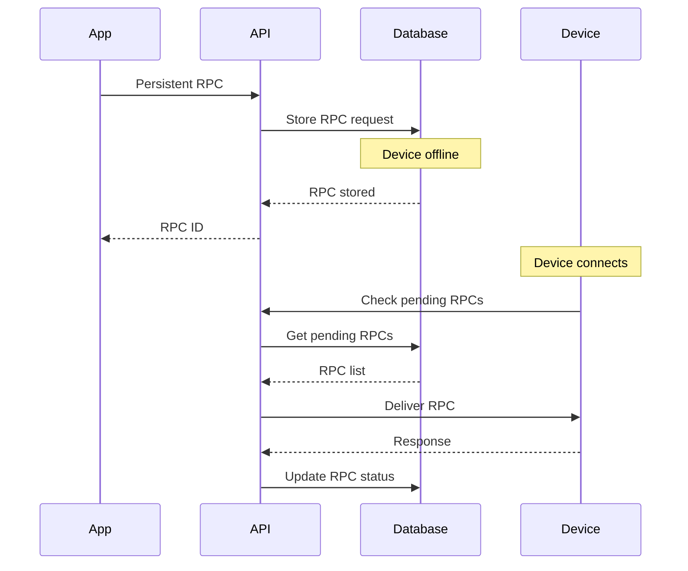

# ThingsBoard Device RPC via Rule Engine

## Language & Context

- Language: Java (server-side)
- Domain: Device RPC request/response DTOs used by the Rule Engine and Transport.

Key source files:

- org/thingsboard/rule/engine/api/RuleEngineDeviceRpcRequest.java
- org/thingsboard/rule/engine/api/RuleEngineDeviceRpcResponse.java

## RPC Request DTO

`RuleEngineDeviceRpcRequest` (immutable, Lombok `@Data @Builder`) encapsulates an outbound RPC invocation from the platform to a device.

Fields (selected):

- `tenantId`, `deviceId`: routing context
- `requestId` (int) and `requestUUID` (UUID): correlation identifiers
- `originServiceId`: service that originated the RPC (for clustered deployments)
- `oneway`: fire-and-forget semantics (no response expected)
- `persisted`: whether to persist and retry according to policies
- `method`, `body`: RPC method name and payload
- `expirationTime`: epoch millis deadline
- `restApiCall`: whether originated from REST
- `additionalInfo`: free-form JSON string for custom context
- `retries`: optional retry budget



## RPC Response DTO

`RuleEngineDeviceRpcResponse` (immutable, Lombok `@Data @Builder`) represents a device response or error.

Fields:

- `deviceId`, `requestId`
- `response`: `Optional<String>` payload
- `error`: `Optional<RpcError>` when failed or timed out



## Typical Flow



## Best Practices

- Set `expirationTime` and `retries` in alignment with transport capabilities.
- Avoid large `body` payloads; consider schema and compression if needed.
- For idempotency, prefer `requestUUID` for cross-service correlation.
- Use persisted RPCs for unreliable connectivity; monitor retry queues.

---

## RPC Types

### Server-Side RPC (Platform → Device)

Platform initiates RPC to device. Device responds.



### Client-Side RPC (Device → Platform)

Device initiates RPC to platform (processed by rule chain).



---

## RPC API Endpoints

### REST API Endpoints

| Endpoint                                    | Method | Description                    |
|---------------------------------------------|--------|--------------------------------|
| /api/rpc/oneway/{deviceId}                  | POST   | One-way RPC (no response)      |
| /api/rpc/twoway/{deviceId}                  | POST   | Two-way RPC (wait response)    |
| /api/plugins/rpc/oneway/{deviceId}          | POST   | Legacy one-way RPC             |
| /api/plugins/rpc/twoway/{deviceId}          | POST   | Legacy two-way RPC             |

### RPC Request Body

```json
{
  "method": "setValue",
  "params": {
    "pin": 7,
    "value": 1
  },
  "timeout": 5000,
  "expirationTime": 1704537600000,
  "persistent": false,
  "retries": 3,
  "additionalInfo": {"source": "dashboard"}
}
```

---

## Persistent RPC

### Configuration

| Property                          | Default | Description                      |
|-----------------------------------|---------|----------------------------------|
| rpc.max_persistent_rpcs_per_device | 10     | Max pending persistent RPCs      |
| rpc.persistent_rpc_timeout        | 300000  | Default timeout in ms            |

### Persistent RPC Flow



### RPC Status

| Status     | Description                                      |
|------------|--------------------------------------------------|
| QUEUED     | RPC waiting for device                           |
| SENT       | RPC sent to device                               |
| DELIVERED  | Device acknowledged receipt                      |
| SUCCESSFUL | Device responded successfully                    |
| TIMEOUT    | RPC expired before response                      |
| FAILED     | RPC failed with error                            |

---

## Rule Chain RPC Nodes

### RPC Call Request Node

Sends RPC to device from rule chain.

| Configuration       | Description                              |
|---------------------|------------------------------------------|
| timeout             | Request timeout in seconds               |
| method              | RPC method name (can use patterns)       |
| body                | RPC body (can use patterns)              |
| persistent          | Enable persistent RPC                    |

### RPC Call Reply Node

Responds to client-side RPC.

| Configuration       | Description                              |
|---------------------|------------------------------------------|
| requestIdMetaDataAttribute | Metadata key for request ID       |
| serviceIdMetaDataAttribute | Metadata key for service ID       |

---

## RPC via MQTT

### Topics

| Topic                              | Direction | Description                 |
|------------------------------------|-----------|-----------------------------|
| v1/devices/me/rpc/request/{id}     | S→D       | Server sends RPC request    |
| v1/devices/me/rpc/response/{id}    | D→S       | Device sends RPC response   |
| v1/devices/me/rpc/request/+        | Subscribe | Device subscribes for RPC   |

### Device Implementation

```text
1. Subscribe to v1/devices/me/rpc/request/+
2. Receive RPC: {"method": "getValue", "params": {}}
3. Process request
4. Publish response to v1/devices/me/rpc/response/{id}
```

---

## RPC via HTTP

### Server-Side RPC (Long Polling)

```http
GET /api/v1/{token}/rpc?timeout=20000
```

Device receives pending RPC when available.

### Response to RPC

```http
POST /api/v1/{token}/rpc/{requestId}
Content-Type: application/json

{"result": "success"}
```

---

## RPC Error Types

| Error                | Description                              |
|----------------------|------------------------------------------|
| NO_ACTIVE_CONNECTION | Device not connected                     |
| TIMEOUT              | Response timeout exceeded                |
| NOT_FOUND            | Device or RPC not found                  |
| INTERNAL_ERROR       | Server-side processing error             |

---

## RPC Metadata

### Request Metadata Keys

| Key                   | Description                              |
|-----------------------|------------------------------------------|
| requestId             | RPC request identifier                   |
| requestUUID           | UUID for cross-service correlation       |
| originatorType        | DEVICE, TENANT, CUSTOMER                 |
| rpcMethod             | RPC method name                          |
| rpcParams             | RPC parameters (JSON string)             |

### Response Metadata Keys

| Key                   | Description                              |
|-----------------------|------------------------------------------|
| requestId             | Original request identifier              |
| error                 | Error type if failed                     |

---

## Common Pitfalls

- Forgetting to check `oneway` and awaiting a response that will never arrive.
- Unbounded retry loops without `expirationTime` degrade system health.
- Not handling device offline scenarios with persistent RPC.
- Ignoring RPC timeout configuration for slow devices.
- Missing subscription to RPC topics on device side.

---

## References

- [org/thingsboard/rule/engine/api/RuleEngineDeviceRpcRequest.java](thingsboard/rule-engine/rule-engine-api/)
- [org/thingsboard/rule/engine/api/RuleEngineDeviceRpcResponse.java](thingsboard/rule-engine/rule-engine-api/)
- [MQTT Transport Flow](mqtt-transport-flow.md)
- [HTTP Transport Flow](http-transport-flow.md)
