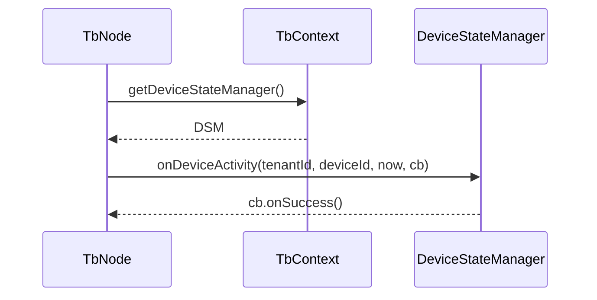
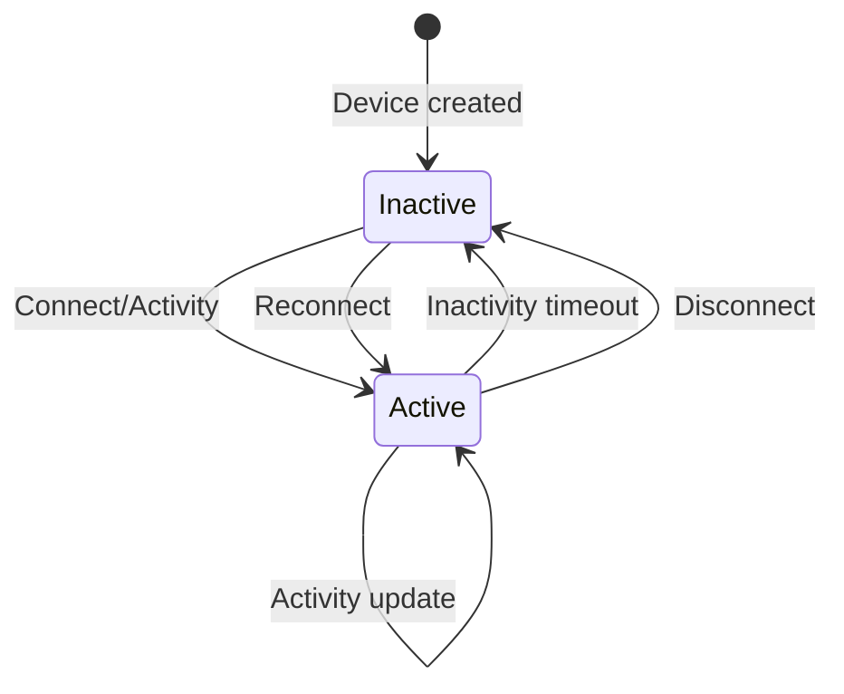
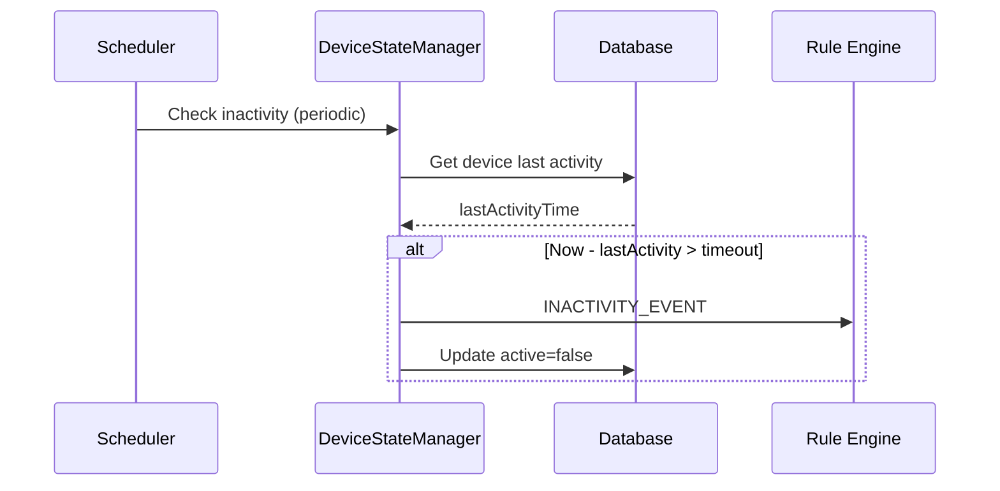
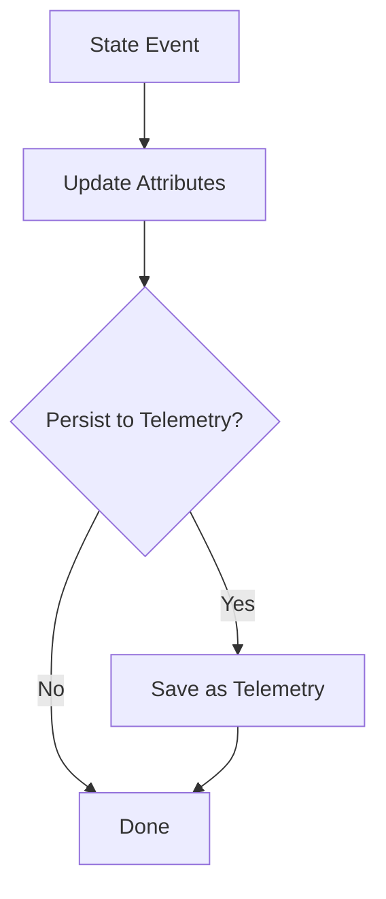
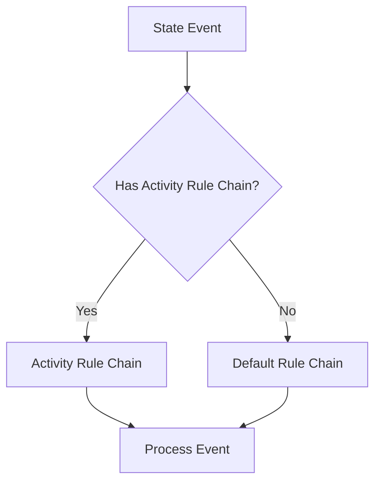
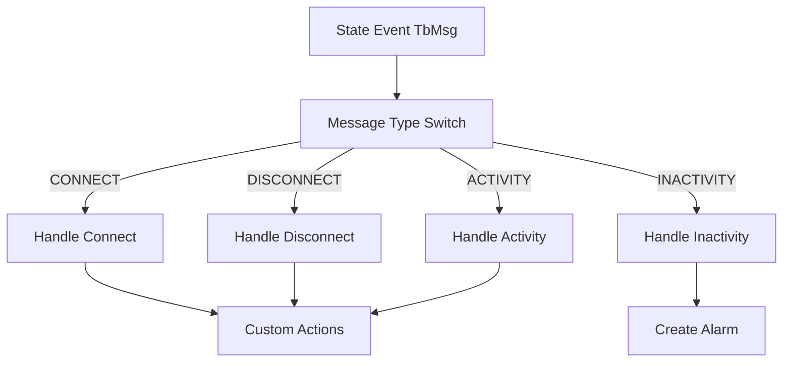
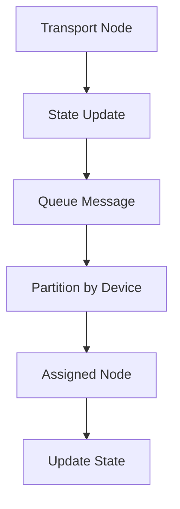

# Device State Management in Rule Engine

## Language & Context

- Language: Java (server-side)
- Domain: Tracking device connectivity and activity signals; interacting from TbNodes.

Key source files:

- org/thingsboard/rule/engine/api/DeviceStateManager.java
- org/thingsboard/rule/engine/api/TbContext.java (`getDeviceStateManager()`, `getDeviceStateNodeRateLimitConfig()`)

## Purpose

Device State Management centralizes updates related to device lifecycle signals (connect, activity, disconnect, inactivity) so that nodes and transports can report changes consistently and efficiently.

## API Surface

`DeviceStateManager` exposes:

- `onDeviceConnect(tenantId, deviceId, connectTime, callback)`
- `onDeviceActivity(tenantId, deviceId, activityTime, callback)`
- `onDeviceDisconnect(tenantId, deviceId, disconnectTime, callback)`
- `onDeviceInactivity(tenantId, deviceId, inactivityTime, callback)`
- `onDeviceInactivityTimeoutUpdate(tenantId, deviceId, inactivityTimeout, callback)`

Callbacks use `TbCallback` to signal success/failure asynchronously.



## Rate Limiting

`TbContext.getDeviceStateNodeRateLimitConfig()` returns configuration used by some nodes to throttle state updates (e.g., avoid flooding activity pings). Typical format is an implementation-specific rate-limit string; consult your deployment’s configuration.

Best practices:

- Debounce frequent signals in-node using `schedule(...)` or batching.
- Respect cluster-wide rate-limit config surfaced via context.

## Patterns of Use

- From transport handlers: update `onDeviceConnect`, then periodic `onDeviceActivity`.
- From rule nodes handling telemetry bursts: coalesce multiple readings to a single activity update.
- On device profile changes: call `onDeviceInactivityTimeoutUpdate` to align thresholds.

---

## Device State Attributes

### Server Attributes

| Attribute          | Type    | Description                              |
|--------------------|---------|------------------------------------------|
| active             | Boolean | Device currently active                  |
| lastConnectTime    | Long    | Last connection timestamp (ms)           |
| lastDisconnectTime | Long    | Last disconnection timestamp (ms)        |
| lastActivityTime   | Long    | Last telemetry/attribute timestamp (ms)  |
| inactivityAlarmTime| Long    | When inactivity alarm was raised (ms)    |

---

## State Lifecycle



---

## Inactivity Detection

### Configuration

| Property                              | Default | Description                      |
|---------------------------------------|---------|----------------------------------|
| state.defaultInactivityTimeoutInSec   | 600     | Default inactivity timeout       |
| state.persistToTelemetry              | false   | Save state changes as telemetry  |
| state.initFetchPackSize               | 50000   | Batch size for state init        |

### Inactivity Check Flow



---

## State Events

### Event Types

| Event Type           | Description                              |
|----------------------|------------------------------------------|
| CONNECT_EVENT        | Device connected to platform             |
| DISCONNECT_EVENT     | Device disconnected from platform        |
| ACTIVITY_EVENT       | Device sent telemetry or attributes      |
| INACTIVITY_EVENT     | Device exceeded inactivity timeout       |

### Event TbMsg Structure

```java
TbMsg.newMsg(
    SessionMsgType.ACTIVITY_EVENT.name(),
    deviceId,
    metadata,
    TbMsgDataType.JSON,
    "{}"
);
```

---

## State Storage

### Attributes vs Telemetry

| Storage    | Use Case                                      |
|------------|-----------------------------------------------|
| Attributes | Current state (active, lastConnectTime)       |
| Telemetry  | Historical state changes (if persistToTelemetry=true) |

### State Persistence Flow



---

## Rule Chain Integration

### Device Profile Activity Rule Chain

Device profile can specify a dedicated rule chain for state events.



### State Event Processing



---

## Cluster Considerations

### State Synchronization



### Partition Assignment

- State updates routed to device's assigned partition
- Consistent hashing ensures same device always handled by same node
- Failover transfers state responsibility to new node

---

## API Endpoints

| Endpoint                                    | Method | Description                    |
|---------------------------------------------|--------|--------------------------------|
| /api/device/{deviceId}/state                | GET    | Get device state               |
| /api/device/{deviceId}/state/active         | GET    | Check if device active         |

---

## Common Pitfalls

- Synchronous/blocking callbacks in `onMsg`; always use async `TbCallback` and route result upon completion if needed.
- Emitting activity updates per message without any throttling can overload storage.
- Not configuring appropriate inactivity timeouts for device types.
- Ignoring state events in rule chain leads to missed alerts.

---

## References

- [org/thingsboard/rule/engine/api/DeviceStateManager.java](thingsboard/rule-engine/rule-engine-api/)
- [org/thingsboard/rule/engine/api/TbContext.java](thingsboard/rule-engine/rule-engine-api/)
- [Device Asset Profiles](device-asset-profiles.md)
- [Alarm Service](alarm-service.md)
