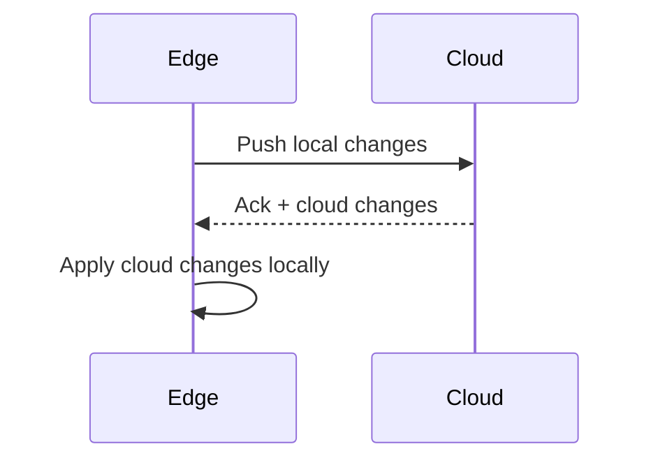

# Edge Integration Specification

## Overview

This document describes the Edge integration and synchronization model in ThingsBoard, enabling distributed deployments with local processing and cloud connectivity.

---

## Key Concepts

### Edge

- Edge instances run locally at remote sites
- Synchronize data and configuration with cloud
- Support offline operation and local rule processing

### Edge Sync

- Bi-directional synchronization of entities, telemetry, and attributes
- Conflict resolution based on timestamps
- Supports partial sync and delta updates

---

## Key Interfaces

### EdgeService

| Method                  | Description                                      |
|-------------------------|--------------------------------------------------|
| findEdgeById(...)       | Retrieve edge by id                              |
| saveEdge(edge)          | Create or update edge                            |
| deleteEdge(...)         | Remove edge                                      |
| assignEdgeToCustomer(...) | Assign edge to customer                        |

### EdgeEventService

| Method                  | Description                                      |
|-------------------------|--------------------------------------------------|
| saveAsync(EdgeEvent)    | Persist edge event for sync                      |
| findEdgeEvents(...)     | Query edge events                                |

---

## Sync Flow

---

## Entity Types Synced

- Devices, Assets, Customers, Dashboards
- Rule Chains, Widgets
- Attributes, Telemetry, Alarms

---

## Configuration

| Property                | Description                                      |
|-------------------------|--------------------------------------------------|
| edge.enabled            | Enable edge features                             |
| edge.sync.interval      | Sync interval (ms)                               |
| edge.offline.buffer     | Offline event buffer size                        |

---

## Best Practices

- Size offline buffer for expected disconnection periods
- Monitor sync lag and failures
- Use conflict resolution policies appropriate for your use case
- Test edge failover and recovery scenarios

---

## See Also

- [Relations and Edge Sync](relations-and-edge-sync.md)
- [DAO & Entity Services Overview](dao-entity-services-overview.md)
