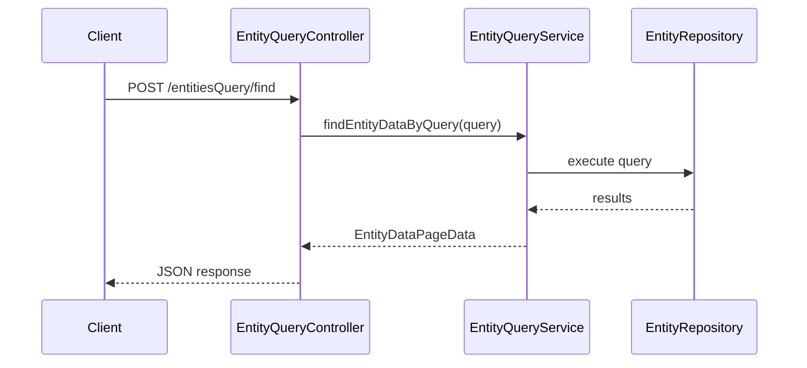

# Entity Query API Specification

## Overview

This document describes the entity query API in ThingsBoard, which provides flexible filtering, sorting, and pagination for entities and their data.

---

## Key Components

### EntityQueryController

| Endpoint                        | Method | Description                        |
|---------------------------------|--------|------------------------------------|
| /api/entitiesQuery/find         | POST   | Find entities matching query       |
| /api/entitiesQuery/count        | POST   | Count entities matching query      |
| /api/entitiesQuery/findByQuery  | POST   | Find entities with data            |

### EntityQueryService

| Method                        | Description                                      |
|-------------------------------|--------------------------------------------------|
| findEntityDataByQuery(...)    | Execute entity data query                        |
| countEntitiesByQuery(...)     | Count entities matching query                    |
| findAlarmDataByQuery(...)     | Execute alarm data query                         |

---

## Query Structure

| Field         | Type      | Description                        |
|---------------|-----------|------------------------------------|
| entityFilter  | EntityFilter | Filter by entity type, id, name, etc. |
| keyFilters    | List      | Filter by attribute/telemetry values |
| entityFields  | List      | Entity fields to return            |
| latestValues  | List      | Latest attribute/telemetry keys    |
| pageLink      | PageLink  | Pagination and sorting             |

---

## Entity Filter Types

| Type              | Description                                      |
|-------------------|--------------------------------------------------|
| singleEntity      | Match a single entity by id                      |
| entityList        | Match a list of entity ids                       |
| entityName        | Match by entity name pattern                     |
| entityType        | Match all entities of a type                     |
| assetType         | Match assets by type                             |
| deviceType        | Match devices by type                            |
| relationsQuery    | Match by entity relations                        |
| assetSearchQuery  | Search assets by criteria                        |
| deviceSearchQuery | Search devices by criteria                       |

---

## Key Filter Structure

| Field         | Type      | Description                        |
|---------------|-----------|------------------------------------|
| key           | EntityKey | Key to filter on                   |
| valueType     | String    | STRING, NUMERIC, BOOLEAN, DATE_TIME|
| predicate     | Object    | Comparison predicate               |

---

## Query Flow



---

## Best Practices

- Use specific filters to reduce result set
- Limit page size for large datasets
- Use key filters for attribute/telemetry filtering
- Prefer server-side pagination over client-side

---

## Complete Query Structure

### EntityDataQuery

```json
{
  "entityFilter": {
    "type": "deviceType",
    "deviceType": "thermostat"
  },
  "keyFilters": [
    {
      "key": {"type": "ATTRIBUTE", "key": "active"},
      "valueType": "BOOLEAN",
      "predicate": {
        "operation": "EQUAL",
        "value": {"defaultValue": true}
      }
    }
  ],
  "entityFields": [
    {"type": "ENTITY_FIELD", "key": "name"},
    {"type": "ENTITY_FIELD", "key": "createdTime"}
  ],
  "latestValues": [
    {"type": "ATTRIBUTE", "key": "temperature"},
    {"type": "TIME_SERIES", "key": "humidity"}
  ],
  "pageLink": {
    "page": 0,
    "pageSize": 20,
    "sortOrder": {"key": {"type": "ENTITY_FIELD", "key": "name"}, "direction": "ASC"}
  }
}
```

---

## Entity Filter Types Detail

### Single Entity

```json
{
  "type": "singleEntity",
  "singleEntity": {
    "entityType": "DEVICE",
    "id": "a1b2c3d4-e5f6-7890-abcd-ef1234567890"
  }
}
```

### Entity List

```json
{
  "type": "entityList",
  "entityType": "DEVICE",
  "entityList": [
    "id1-uuid",
    "id2-uuid"
  ]
}
```

### Entity Name Pattern

```json
{
  "type": "entityName",
  "entityType": "DEVICE",
  "entityNameFilter": "Sensor*"
}
```

### Device Type

```json
{
  "type": "deviceType",
  "deviceType": "thermostat",
  "deviceNameFilter": "Room*"
}
```

### Relations Query

```json
{
  "type": "relationsQuery",
  "rootEntity": {
    "entityType": "ASSET",
    "id": "building-uuid"
  },
  "direction": "FROM",
  "filters": [
    {"relationType": "Contains", "entityTypes": ["DEVICE"]}
  ],
  "maxLevel": 2
}
```

### Asset Search Query

```json
{
  "type": "assetSearchQuery",
  "rootEntity": {
    "entityType": "TENANT",
    "id": "tenant-uuid"
  },
  "direction": "FROM",
  "assetTypes": ["building", "room"]
}
```

---

## Key Filter Predicates

### Comparison Operations

| Operation        | Applicable Types                        |
|------------------|----------------------------------------|
| EQUAL            | All types                              |
| NOT_EQUAL        | All types                              |
| GREATER          | NUMERIC, DATE_TIME                     |
| LESS             | NUMERIC, DATE_TIME                     |
| GREATER_OR_EQUAL | NUMERIC, DATE_TIME                     |
| LESS_OR_EQUAL    | NUMERIC, DATE_TIME                     |
| STARTS_WITH      | STRING                                 |
| ENDS_WITH        | STRING                                 |
| CONTAINS         | STRING                                 |
| NOT_CONTAINS     | STRING                                 |
| IN               | STRING (comma-separated values)        |
| NOT_IN           | STRING (comma-separated values)        |

### Predicate Example

```json
{
  "key": {"type": "TIME_SERIES", "key": "temperature"},
  "valueType": "NUMERIC",
  "predicate": {
    "operation": "GREATER",
    "value": {"defaultValue": 25.0}
  }
}
```

### Complex Predicate

```json
{
  "type": "COMPLEX",
  "operation": "AND",
  "predicates": [
    {
      "type": "SIMPLE",
      "operation": "GREATER",
      "value": {"defaultValue": 20}
    },
    {
      "type": "SIMPLE",
      "operation": "LESS",
      "value": {"defaultValue": 30}
    }
  ]
}
```

---

## Entity Key Types

| Type          | Description                              |
|---------------|------------------------------------------|
| ENTITY_FIELD  | Built-in entity field (name, type, etc.) |
| ATTRIBUTE     | Entity attribute (any scope)             |
| CLIENT_ATTRIBUTE | Client-side attribute                 |
| SHARED_ATTRIBUTE | Shared attribute                      |
| SERVER_ATTRIBUTE | Server-side attribute                 |
| TIME_SERIES   | Latest telemetry value                   |

---

## PageLink Structure

```json
{
  "page": 0,
  "pageSize": 20,
  "textSearch": "sensor",
  "sortOrder": {
    "key": {"type": "ENTITY_FIELD", "key": "createdTime"},
    "direction": "DESC"
  }
}
```

### Sort Direction

| Direction | Description                              |
|-----------|------------------------------------------|
| ASC       | Ascending order                          |
| DESC      | Descending order                         |

---

## Time Series Query

### Get Timeseries with Aggregation

```json
{
  "entityFilter": {
    "type": "singleEntity",
    "singleEntity": {"entityType": "DEVICE", "id": "device-uuid"}
  },
  "keys": ["temperature", "humidity"],
  "startTs": 1704451200000,
  "endTs": 1704537600000,
  "interval": 3600000,
  "agg": "AVG",
  "limit": 100
}
```

### Aggregation Types

| Aggregation | Description                              |
|-------------|------------------------------------------|
| NONE        | Raw values                               |
| MIN         | Minimum value in interval                |
| MAX         | Maximum value in interval                |
| AVG         | Average value in interval                |
| SUM         | Sum of values in interval                |
| COUNT       | Count of values in interval              |

---

## Alarm Query

### AlarmDataQuery Structure

```json
{
  "entityFilter": {
    "type": "deviceType",
    "deviceType": "thermostat"
  },
  "alarmFields": [
    {"type": "ALARM_FIELD", "key": "type"},
    {"type": "ALARM_FIELD", "key": "severity"}
  ],
  "keyFilters": [
    {
      "key": {"type": "ALARM_FIELD", "key": "severity"},
      "valueType": "STRING",
      "predicate": {
        "operation": "EQUAL",
        "value": {"defaultValue": "CRITICAL"}
      }
    }
  ],
  "pageLink": {"page": 0, "pageSize": 20}
}
```

### Alarm Fields

| Field          | Description                              |
|----------------|------------------------------------------|
| type           | Alarm type                               |
| severity       | CRITICAL, MAJOR, MINOR, WARNING, INDETERMINATE |
| status         | Alarm status                             |
| startTs        | Alarm start timestamp                    |
| endTs          | Alarm end timestamp                      |
| ackTs          | Acknowledgment timestamp                 |
| clearTs        | Clear timestamp                          |
| assignee       | Assigned user                            |

---

## Response Structure

### EntityDataPageData

```json
{
  "data": [
    {
      "entityId": {"entityType": "DEVICE", "id": "uuid"},
      "latest": {
        "ENTITY_FIELD": {
          "name": {"ts": 0, "value": "Sensor 1"}
        },
        "ATTRIBUTE": {
          "temperature": {"ts": 1704537600000, "value": "25.5"}
        }
      },
      "timeseries": {}
    }
  ],
  "totalPages": 5,
  "totalElements": 100,
  "hasNext": true
}
```

---

## WebSocket Query Subscription

### Subscribe to Query Updates

```json
{
  "entityDataCmds": [
    {
      "cmdId": 1,
      "query": {
        "entityFilter": {"type": "deviceType", "deviceType": "thermostat"},
        "latestValues": [{"type": "TIME_SERIES", "key": "temperature"}],
        "pageLink": {"page": 0, "pageSize": 10}
      }
    }
  ]
}
```

### Subscription Update

```json
{
  "cmdId": 1,
  "update": {
    "entityId": {"entityType": "DEVICE", "id": "uuid"},
    "latest": {
      "TIME_SERIES": {
        "temperature": {"ts": 1704537610000, "value": "26.0"}
      }
    }
  }
}
```

---

## Performance Considerations

| Recommendation                      | Reason                               |
|-------------------------------------|--------------------------------------|
| Use specific entity filters         | Reduces query scope                  |
| Limit pageSize to 100 or less       | Avoids large result sets             |
| Use indexed fields for sorting      | Improves sort performance            |
| Avoid fetching all attributes       | Request only needed keys             |
| Use timeseries aggregation          | Reduces data transfer                |

---

## API Endpoints

| Endpoint                            | Method | Description                    |
|-------------------------------------|--------|--------------------------------|
| /api/entitiesQuery/find             | POST   | Find entities                  |
| /api/entitiesQuery/count            | POST   | Count entities                 |
| /api/entitiesQuery/findByQuery      | POST   | Find with data                 |
| /api/alarmsQuery/find               | POST   | Find alarms                    |
| /api/alarmsQuery/count              | POST   | Count alarms                   |

---

## See Also

- [DAO & Entity Services Overview](dao-entity-services-overview.md)
- [WebSocket Subscriptions](websocket-subscriptions.md)
- [Timeseries and Attributes Requests](timeseries-and-attributes-requests.md)
