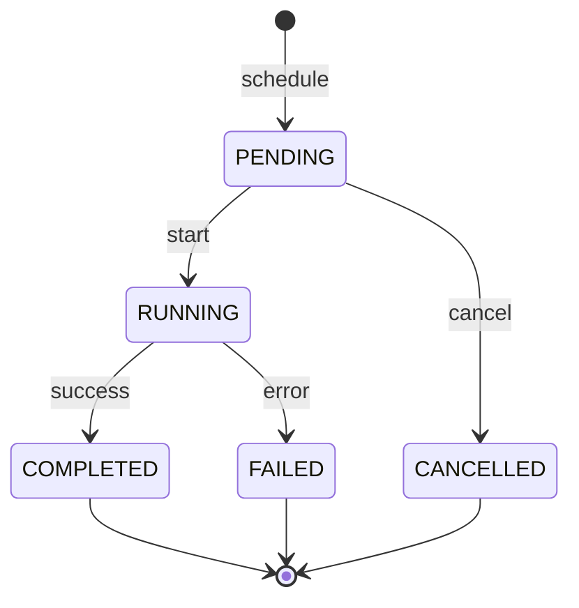
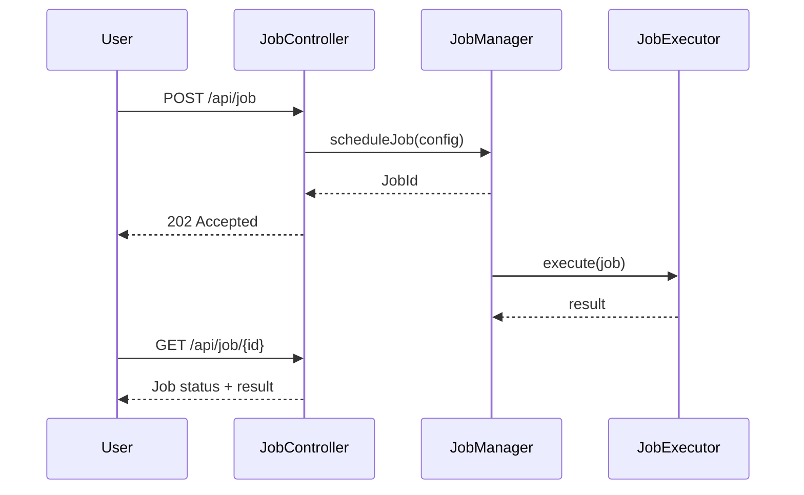

# Job Manager Specification

## Overview

This document describes the job manager in ThingsBoard, which handles scheduling and execution of background jobs and recurring tasks.

---

## Key Interfaces

### JobManager

Located at: `org/thingsboard/rule/engine/api/JobManager.java`

| Method                        | Description                                      |
|-------------------------------|--------------------------------------------------|
| scheduleJob(...)              | Schedule a new job                               |
| cancelJob(jobId)              | Cancel a scheduled job                           |
| getJobStatus(jobId)           | Get current job status                           |
| listJobs(...)                 | List jobs for tenant                             |

### Job Entity

| Field         | Type      | Description                        |
|---------------|-----------|------------------------------------|
| id            | JobId     | Unique identifier                  |
| tenantId      | TenantId  | Owning tenant                      |
| type          | JobType   | Type of job                        |
| status        | JobStatus | PENDING, RUNNING, COMPLETED, FAILED|
| config        | JsonNode  | Job-specific configuration         |
| createdTime   | long      | Creation timestamp                 |
| startTime     | long      | Execution start time               |
| endTime       | long      | Execution end time                 |
| result        | JsonNode  | Job result or error                |

---

## Job Types

| Type              | Description                                      |
|-------------------|--------------------------------------------------|
| EXPORT            | Data export job                                  |
| IMPORT            | Data import job                                  |
| CLEANUP           | Data cleanup job                                 |
| REPORT            | Report generation                                |
| BULK_UPDATE       | Bulk entity update                               |

---

## Job Lifecycle

---

## Job Flow

---

## Configuration

| Property                        | Description                        |
|---------------------------------|------------------------------------|
| job.executor.pool-size          | Thread pool size for job execution |
| job.max-concurrent-per-tenant   | Max concurrent jobs per tenant     |
| job.result-ttl                  | Result retention period            |

---

## Best Practices

- Use jobs for long-running operations
- Poll for status instead of blocking
- Implement idempotent job handlers
- Clean up completed jobs periodically

---

## See Also

- [TbContext & Services](tb-context-and-services.md)
- [Queue and Partitioning](queue-and-partitioning.md)
