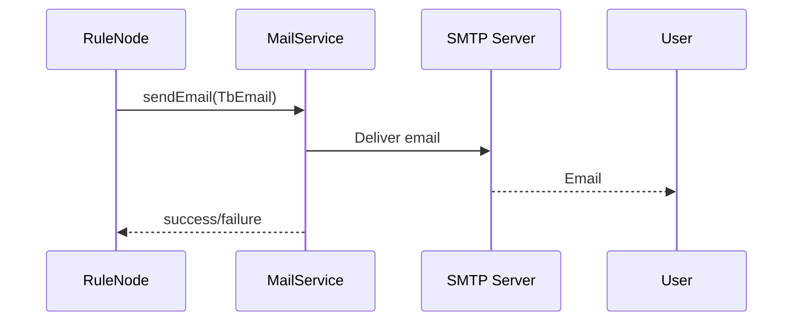

# Mail Service Specification

## Overview

This document describes the mail service in ThingsBoard, which handles sending emails for notifications, alerts, password resets, and other system communications.

---

## Key Interfaces

### MailService

Located at: `org/thingsboard/rule/engine/api/MailService.java`

| Method                        | Description                                      |
|-------------------------------|--------------------------------------------------|
| sendEmail(TbEmail)            | Send an email using TbEmail object               |
| sendTestMail(...)             | Send test email to verify configuration          |
| sendActivationEmail(...)      | Send user activation email                       |
| sendPasswordResetEmail(...)   | Send password reset email                        |
| sendAccountLockoutEmail(...)  | Send account lockout notification                |

### TbEmail

| Field         | Type      | Description                        |
|---------------|-----------|------------------------------------|
| from          | String    | Sender address                     |
| to            | String    | Recipient address                  |
| cc            | String    | CC addresses                       |
| bcc           | String    | BCC addresses                      |
| subject       | String    | Email subject                      |
| body          | String    | Email body (HTML or plain text)    |
| html          | boolean   | Whether body is HTML               |
| images        | Map       | Inline images (cid → data)         |

---

## Configuration

| Property                        | Description                        |
|---------------------------------|------------------------------------|
| mail.host                       | SMTP server host                   |
| mail.port                       | SMTP server port                   |
| mail.username                   | SMTP username                      |
| mail.password                   | SMTP password                      |
| mail.protocol                   | Protocol (smtp, smtps)             |
| mail.from                       | Default sender address             |
| mail.smtp.starttls.enable       | Enable STARTTLS                    |
| mail.smtp.auth                  | Enable SMTP authentication         |

---

## Mail Flow

---

## Integration with Rule Engine

- `TbSendEmailNode` uses MailService via TbContext
- Email templates can use dynamic placeholders
- Rate limiting prevents abuse

---

## Best Practices

- Use templates for consistent formatting
- Validate email addresses before sending
- Monitor delivery failures
- Use HTML with plain text fallback

---

## See Also

- [Notification Service](notification-service.md)
- [TbContext & Services](tb-context-and-services.md)
