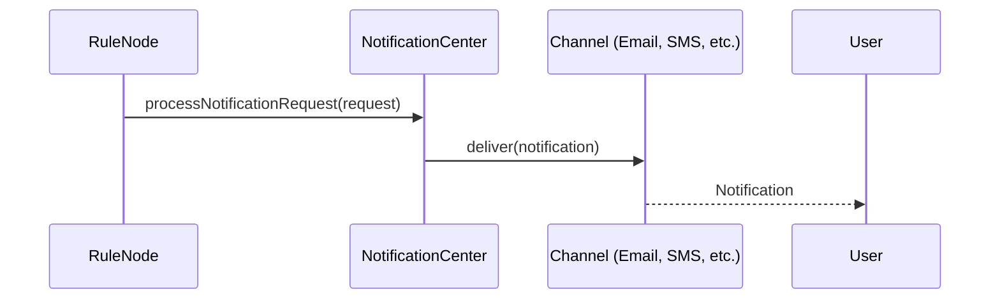
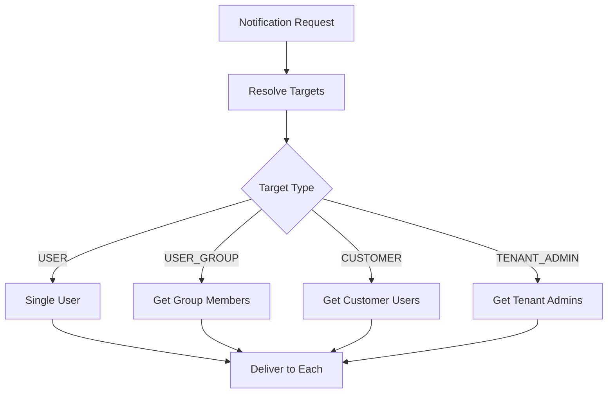
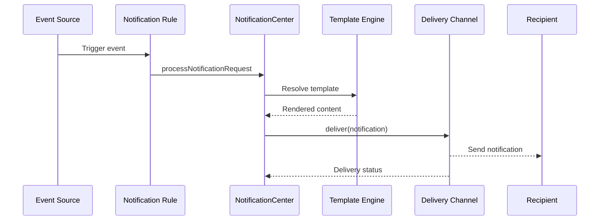
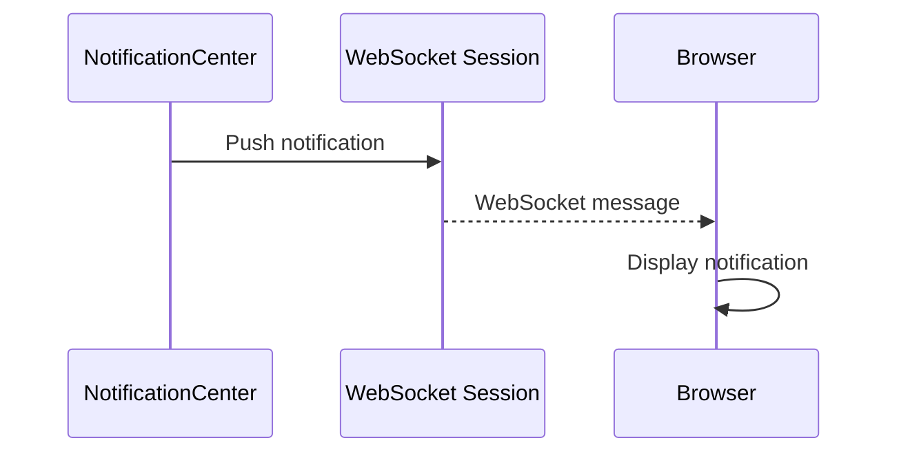
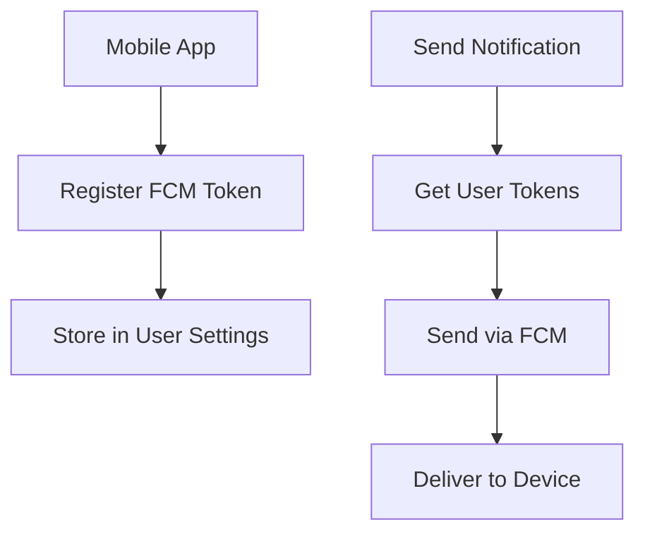

# Notification Service Specification

## Overview

This document describes the notification service in ThingsBoard, which handles sending notifications to users via various channels (web, mobile, email, SMS, Slack, etc.).

---

## Key Interfaces

### NotificationCenter

Located at: `org/thingsboard/rule/engine/api/NotificationCenter.java`

| Method                        | Description                                      |
|-------------------------------|--------------------------------------------------|
| processNotificationRequest(...)| Process and deliver a notification request      |
| sendNotification(...)         | Send notification to specified targets           |

### NotificationService

| Method                        | Description                                      |
|-------------------------------|--------------------------------------------------|
| findNotificationById(...)     | Retrieve notification by id                      |
| saveNotification(...)         | Create or update notification                    |
| deleteNotification(...)       | Remove notification                              |

---

## Notification Channels

| Channel   | Description                                      |
|-----------|--------------------------------------------------|
| WEB       | In-app notification (WebSocket push)             |
| MOBILE    | Mobile push notification (Firebase, APNs)        |
| EMAIL     | Email notification                               |
| SMS       | SMS notification                                 |
| SLACK     | Slack message                                    |

---

## Notification Flow



---

## Notification Request

| Field         | Type      | Description                        |
|---------------|-----------|------------------------------------|
| tenantId      | TenantId  | Owning tenant                      |
| targets       | List      | Target users/groups                |
| templateId    | UUID      | Notification template              |
| channel       | Channel   | Delivery channel                   |
| info          | JsonNode  | Dynamic content for template       |

---

## Best Practices

- Use templates for consistent messaging
- Rate-limit notifications to avoid spam
- Monitor delivery status and failures

---

## Notification Templates

### Template Structure

| Field              | Type      | Description                        |
|--------------------|-----------|------------------------------------|
| id                 | UUID      | Template identifier                |
| tenantId           | TenantId  | Owning tenant                      |
| name               | String    | Template name                      |
| notificationType   | String    | Template category                  |
| configuration      | Object    | Channel-specific configs           |

### Template Variables

Templates support dynamic variable substitution using `${variableName}` syntax.

| Variable Type       | Example                             |
|---------------------|-------------------------------------|
| Entity fields       | `${deviceName}`, `${alarmType}`     |
| Metadata            | `${metadata.key}`                   |
| Custom data         | `${info.customField}`               |
| System              | `${recipientTitle}`, `${tenantName}`|

### Example Template

```json
{
  "name": "Device Offline Alert",
  "notificationType": "DEVICE_ACTIVITY",
  "configuration": {
    "EMAIL": {
      "subject": "Device ${deviceName} is offline",
      "body": "Device ${deviceName} has been inactive since ${lastActivityTime}"
    },
    "WEB": {
      "subject": "Device Offline",
      "body": "${deviceName} is offline"
    }
  }
}
```

---

## Notification Targets

### Target Types

| Type          | Description                              |
|---------------|------------------------------------------|
| USER          | Specific user by ID                      |
| USER_GROUP    | All users in a group                     |
| CUSTOMER      | All users of a customer                  |
| TENANT_ADMIN  | All tenant administrators                |
| SYSTEM_ADMIN  | System administrators                    |
| PLATFORM_USERS| All platform users                       |
| AFFECTED_USER | User affected by the event               |
| ORIGINATOR_ENTITY_OWNER | Owner of originator entity    |

### Target Resolution



---

## Channel Configuration

### Email Channel

| Property          | Description                              |
|-------------------|------------------------------------------|
| subject           | Email subject line                       |
| body              | Email body (HTML supported)              |
| from              | Sender address (optional)                |

### SMS Channel

| Property          | Description                              |
|-------------------|------------------------------------------|
| body              | SMS message text                         |
| useSystemSmsSettings | Use system SMS provider              |

### Slack Channel

| Property          | Description                              |
|-------------------|------------------------------------------|
| conversationId    | Slack channel or DM ID                   |
| message           | Slack message (markdown supported)       |

### Mobile Push Channel

| Property          | Description                              |
|-------------------|------------------------------------------|
| title             | Push notification title                  |
| body              | Push notification body                   |
| data              | Additional data payload                  |

---

## Notification Rules

### Rule Structure

| Field              | Type      | Description                        |
|--------------------|-----------|------------------------------------|
| id                 | UUID      | Rule identifier                    |
| tenantId           | TenantId  | Owning tenant                      |
| name               | String    | Rule name                          |
| enabled            | Boolean   | Rule active status                 |
| triggerType        | String    | Event that triggers notification   |
| triggerConfig      | Object    | Trigger-specific configuration     |
| recipientsConfig   | Object    | Target recipients                  |
| templateId         | UUID      | Notification template              |

### Trigger Types

| Trigger Type           | Description                          |
|------------------------|--------------------------------------|
| ALARM                  | Alarm created, updated, or cleared   |
| DEVICE_ACTIVITY        | Device connect, disconnect, inactive |
| ENTITY_ACTION          | Entity created, updated, deleted     |
| ALARM_COMMENT          | Comment added to alarm               |
| ALARM_ASSIGNMENT       | Alarm assigned to user               |
| RULE_ENGINE_LIFECYCLE  | Rule chain/node state change         |
| RATE_LIMITS            | Rate limit exceeded                  |

---

## Notification Processing Flow



---

## Notification Status

| Status      | Description                              |
|-------------|------------------------------------------|
| PENDING     | Notification queued for delivery         |
| SENT        | Notification sent to channel             |
| DELIVERED   | Delivery confirmed                       |
| READ        | User read notification (web only)        |
| FAILED      | Delivery failed                          |

---

## Web Notification (WebSocket)

### WebSocket Push



### Notification Read API

| Endpoint                                    | Method | Description                    |
|---------------------------------------------|--------|--------------------------------|
| /api/notifications                          | GET    | Get user notifications         |
| /api/notifications/unread/count             | GET    | Get unread count               |
| /api/notifications/{id}/read                | POST   | Mark as read                   |
| /api/notifications/read                     | POST   | Mark all as read               |

---

## Mobile Push (Firebase)

### Firebase Configuration

| Property                          | Description                          |
|-----------------------------------|--------------------------------------|
| firebase.credentials.file         | Firebase credentials JSON path       |
| firebase.enabled                  | Enable Firebase push                 |

### Push Token Management



---

## Rate Limiting

| Configuration              | Description                              |
|----------------------------|------------------------------------------|
| notifications.rateLimit    | Max notifications per user per time window |
| notifications.rateLimitPeriod | Rate limit time window (seconds)      |

---

## API Endpoints

| Endpoint                                    | Method | Description                    |
|---------------------------------------------|--------|--------------------------------|
| /api/notification                           | POST   | Create notification            |
| /api/notification/{id}                      | GET    | Get notification by ID         |
| /api/notification/{id}                      | DELETE | Delete notification            |
| /api/notification/template                  | POST   | Create/update template         |
| /api/notification/template/{id}             | GET    | Get template by ID             |
| /api/notification/rule                      | POST   | Create/update rule             |
| /api/notification/rule/{id}                 | GET    | Get rule by ID                 |

---

## See Also

- [Rule Engine Services (RPC, Telemetry, Notifications)](rule-engine-services-rpc-telemetry-notifications.md)
- [TbContext & Services](tb-context-and-services.md)
- [Mail Service](mail-service.md)
- [SMS Service](sms-service.md)
