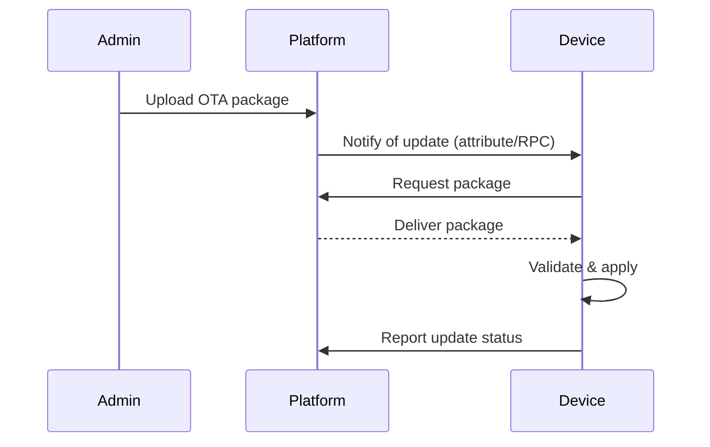
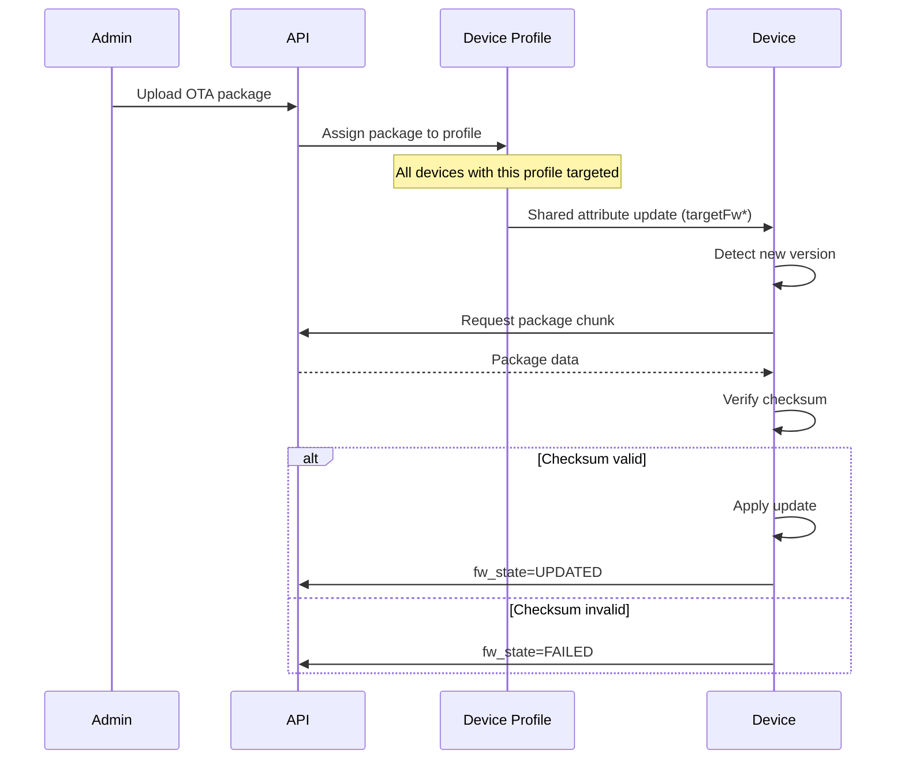
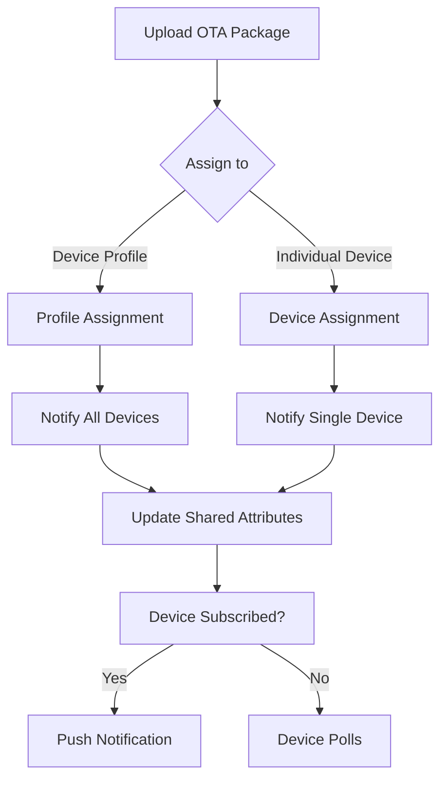
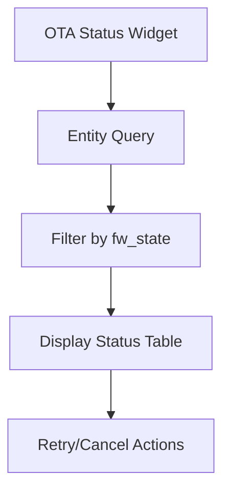

# OTA Updates Specification

## Overview

This document describes the OTA (Over-The-Air) update mechanism in ThingsBoard for firmware and software updates to devices.

---

## Key Components

### OtaPackageService

| Method                        | Description                                      |
|-------------------------------|--------------------------------------------------|
| findOtaPackageById(...)       | Retrieve OTA package by id                       |
| saveOtaPackage(...)           | Create or update OTA package                     |
| deleteOtaPackage(...)         | Remove OTA package                               |
| findOtaPackageByDeviceProfileIdAndType(...) | Find package for device profile   |

### OtaPackage Entity

| Field         | Type      | Description                        |
|---------------|-----------|------------------------------------|
| id            | OtaPackageId | Unique identifier               |
| tenantId      | TenantId  | Owning tenant                      |
| deviceProfileId | DeviceProfileId | Target device profile        |
| type          | OtaPackageType | FIRMWARE or SOFTWARE           |
| title         | String    | Package title                      |
| version       | String    | Version string                     |
| url           | String    | Download URL (if external)         |
| data          | byte[]    | Package data (if stored locally)   |
| checksum      | String    | Checksum for validation            |
| checksumAlgorithm | String | Algorithm (MD5, SHA256, etc.)    |

---

## OTA Update Flow



---

## Device Attributes

| Attribute         | Scope   | Description                        |
|-------------------|---------|------------------------------------|
| fw_version        | Client  | Current firmware version           |
| fw_title          | Client  | Current firmware title             |
| fw_state          | Client  | Update state (DOWNLOADING, VERIFIED, UPDATED, FAILED) |
| targetFwVersion   | Shared  | Target firmware version            |
| targetFwUrl       | Shared  | Download URL                       |
| targetFwChecksum  | Shared  | Checksum for validation            |

---

## Best Practices

- Use checksums to validate package integrity
- Support incremental/delta updates where possible
- Monitor update progress and failures
- Roll back on failure if supported

---

## OTA Package Types

| Type      | Description                              |
|-----------|------------------------------------------|
| FIRMWARE  | Device firmware update                   |
| SOFTWARE  | Application software update              |

---

## Checksum Algorithms

| Algorithm | Description                              |
|-----------|------------------------------------------|
| MD5       | MD5 hash (128 bits)                      |
| SHA256    | SHA-256 hash (256 bits)                  |
| SHA384    | SHA-384 hash (384 bits)                  |
| SHA512    | SHA-512 hash (512 bits)                  |
| CRC32     | CRC-32 checksum                          |

---

## Update States

| State        | Description                              |
|--------------|------------------------------------------|
| DOWNLOADING  | Device is downloading the package        |
| DOWNLOADED   | Package downloaded successfully          |
| VERIFIED     | Package checksum verified                |
| UPDATING     | Update in progress                       |
| UPDATED      | Update completed successfully            |
| FAILED       | Update failed                            |

---

## Device Update Flow (Detailed)



---

## Firmware Download via HTTP

### Endpoint

```http
GET /api/v1/{deviceToken}/firmware?title={title}&version={version}
GET /api/v1/{deviceToken}/firmware?title={title}&version={version}&chunk={chunkIndex}&size={chunkSize}
```

### Chunked Download

| Parameter | Description                              |
|-----------|------------------------------------------|
| title     | Firmware title                           |
| version   | Firmware version                         |
| chunk     | Chunk index (0-based)                    |
| size      | Chunk size in bytes                      |

### Response Headers

| Header         | Description                              |
|----------------|------------------------------------------|
| Content-Length | Total package size or chunk size         |
| X-Chunk-Index  | Current chunk index                      |
| X-Chunks-Count | Total number of chunks                   |

---

## Firmware Download via MQTT

### Topics

| Topic                              | Description                 |
|------------------------------------|-----------------------------|
| v2/fw/request/{requestId}/chunk/{chunkIndex} | Request firmware chunk |
| v2/fw/response/{requestId}/chunk/{chunkIndex} | Receive firmware chunk |

### Request Format

```json
{
  "chunkSize": 16384
}
```

---

## Firmware Download via CoAP

### Resources

| Resource                              | Method | Description            |
|---------------------------------------|--------|------------------------|
| /api/v1/{token}/firmware              | GET    | Request firmware info  |
| /api/v1/{token}/firmware/chunk        | GET    | Request firmware chunk |

Uses block-wise transfer (RFC 7959) for large packages.

---

## Complete Attribute Set

### Client Attributes (Device Reports)

| Attribute       | Type    | Description                    |
|-----------------|---------|--------------------------------|
| fw_title        | String  | Current firmware title         |
| fw_version      | String  | Current firmware version       |
| fw_state        | String  | Update state                   |
| fw_error        | String  | Error message if failed        |
| sw_title        | String  | Current software title         |
| sw_version      | String  | Current software version       |
| sw_state        | String  | Software update state          |
| sw_error        | String  | Software error if failed       |

### Shared Attributes (Platform Sets)

| Attribute          | Type    | Description                    |
|--------------------|---------|--------------------------------|
| fw_title           | String  | Target firmware title          |
| fw_version         | String  | Target firmware version        |
| fw_size            | Long    | Firmware size in bytes         |
| fw_checksum        | String  | Firmware checksum              |
| fw_checksum_algorithm | String | Checksum algorithm          |
| fw_url             | String  | External download URL          |
| sw_title           | String  | Target software title          |
| sw_version         | String  | Target software version        |
| sw_size            | Long    | Software size in bytes         |
| sw_checksum        | String  | Software checksum              |
| sw_checksum_algorithm | String | Checksum algorithm          |
| sw_url             | String  | External download URL          |

---

## Update Trigger Flow



---

## API Endpoints

### OTA Package Management

| Endpoint                                    | Method | Description                    |
|---------------------------------------------|--------|--------------------------------|
| /api/otaPackage                             | POST   | Create OTA package             |
| /api/otaPackage/{id}                        | GET    | Get OTA package                |
| /api/otaPackage/{id}                        | DELETE | Delete OTA package             |
| /api/otaPackages                            | GET    | List OTA packages              |
| /api/otaPackage/{id}/download               | GET    | Download package data          |

### Device Firmware Endpoints

| Endpoint                                    | Method | Description                    |
|---------------------------------------------|--------|--------------------------------|
| /api/v1/{deviceToken}/firmware              | GET    | Get firmware for device        |
| /api/v1/{deviceToken}/software              | GET    | Get software for device        |

---

## Update Status Monitoring

### Telemetry Keys

| Key              | Description                              |
|------------------|------------------------------------------|
| fw_state         | Current update state                     |
| fw_error         | Error details if failed                  |
| fw_progress      | Download progress (0-100)                |

### Dashboard Widget Integration



---

## Error Handling

| Error                | Description                              |
|----------------------|------------------------------------------|
| CHECKSUM_MISMATCH    | Downloaded data doesn't match checksum   |
| NETWORK_ERROR        | Download failed due to network           |
| INSUFFICIENT_STORAGE | Not enough storage on device             |
| INVALID_PACKAGE      | Package format not recognized            |
| INSTALLATION_FAILED  | Package installation failed              |

---

## Storage Options

### Local Storage

Package data stored in ThingsBoard database or file system.

### External Storage

Package stored externally (S3, Azure Blob, etc.) with URL reference.

| Configuration                  | Description                    |
|--------------------------------|--------------------------------|
| ota.external.enabled           | Enable external storage        |
| ota.external.url.pattern       | URL pattern for downloads      |

---

## See Also

- [Device State Management](device-state-management.md)
- [Device Asset Profiles](device-asset-profiles.md)
- [Timeseries & Attributes Requests](timeseries-and-attributes-requests.md)
- [MQTT Transport Flow](mqtt-transport-flow.md)
- [HTTP Transport Flow](http-transport-flow.md)
