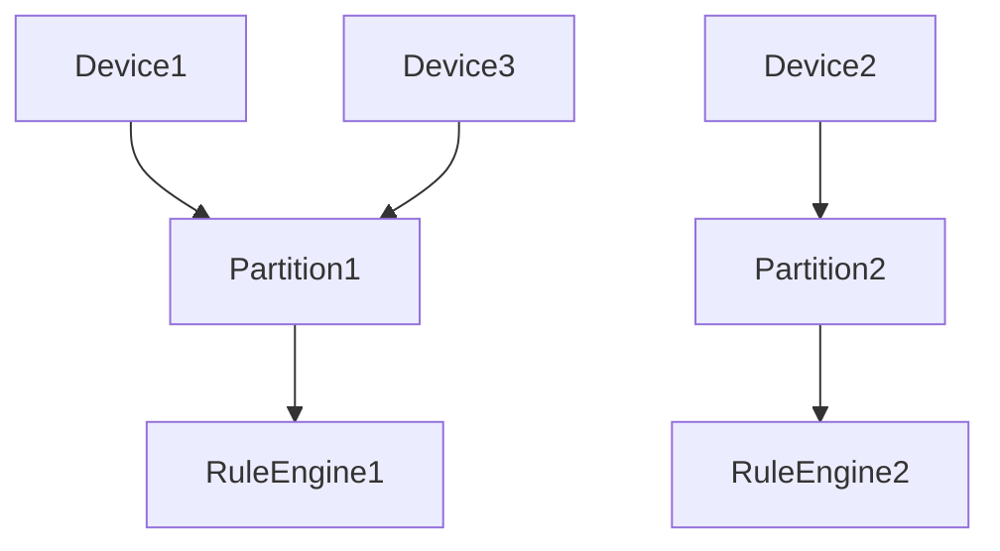
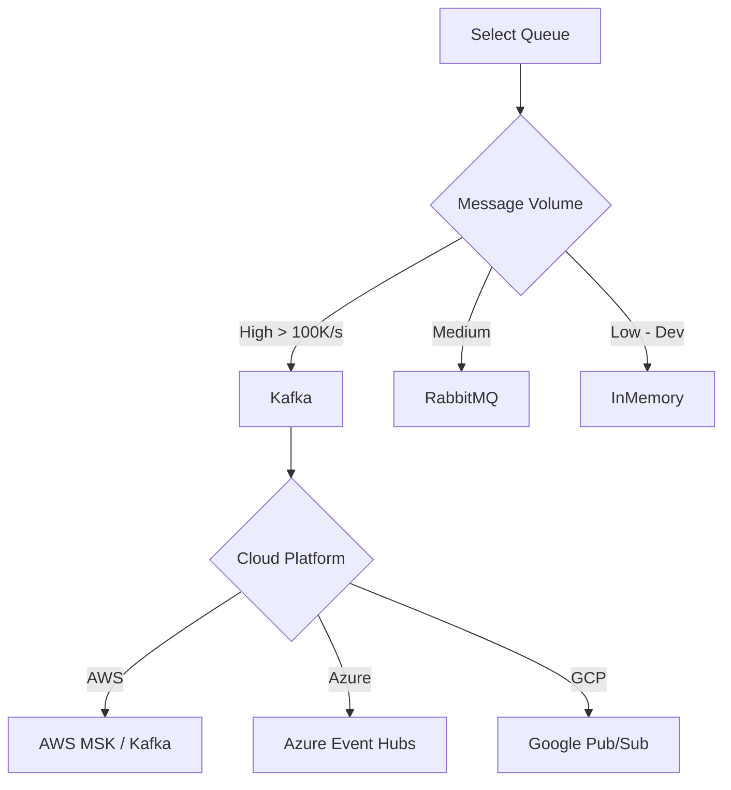
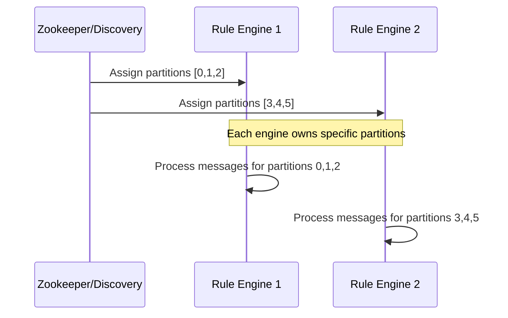
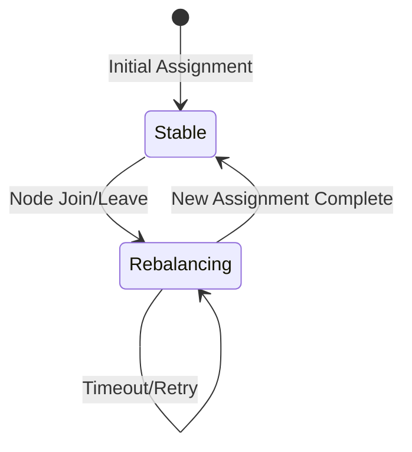
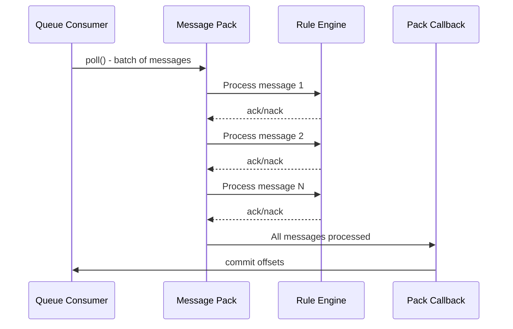
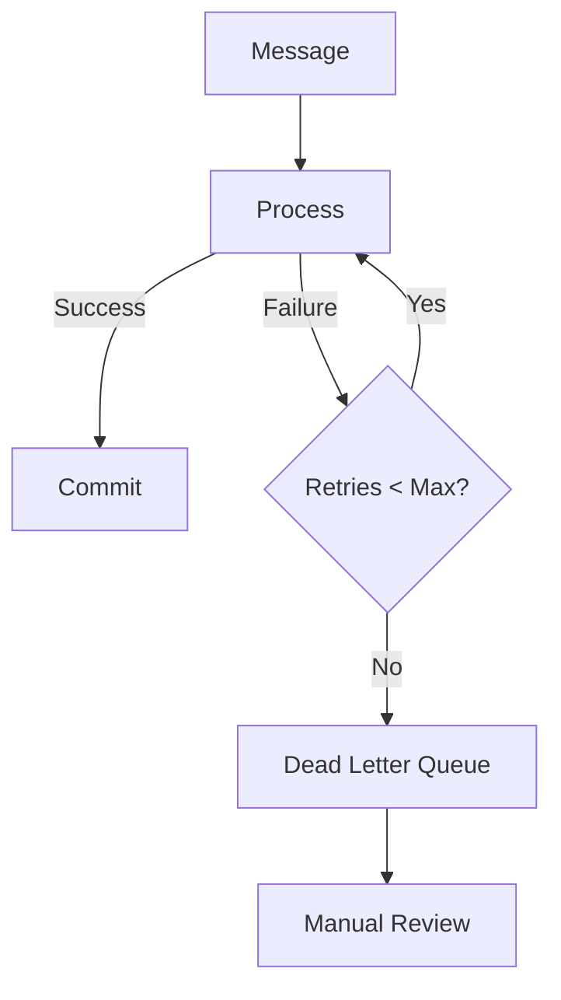
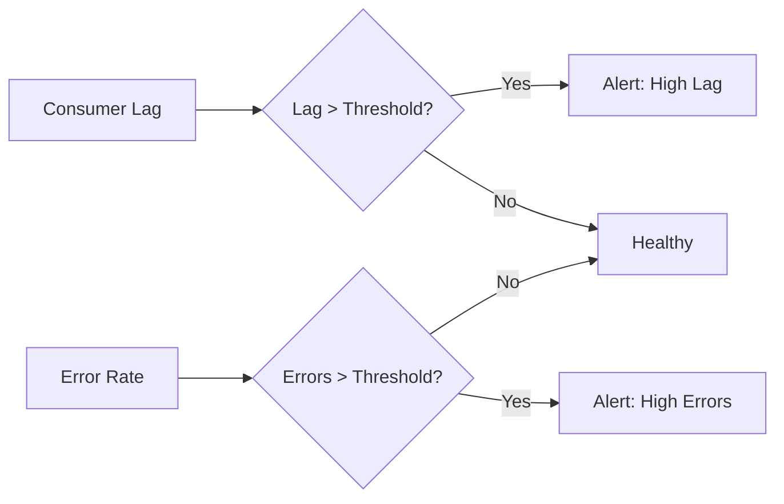
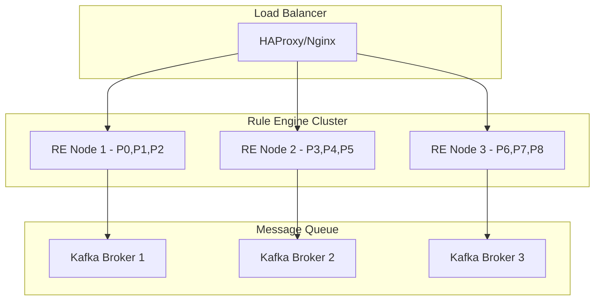

# Queue and Partitioning Specification

## Overview

This document describes the queue infrastructure and partitioning model used in ThingsBoard for message routing, load balancing, and high availability.

---

## Key Concepts

### Queue

- Internal message queues route messages between transport, rule engine, and services
- Queues support backpressure, retry, and dead-letter handling
- Configurable via application properties

### Partitioning

- Messages are partitioned by originator (device, asset, etc.)
- Ensures ordering and affinity for related messages
- Supports horizontal scaling of rule engine instances

---

## Key Interfaces

### TbQueueProducer

| Method                  | Description                                      |
|-------------------------|--------------------------------------------------|
| send(TopicPartitionInfo, TbProtoQueueMsg, callback) | Send message to queue partition |

### TbQueueConsumer

| Method                  | Description                                      |
|-------------------------|--------------------------------------------------|
| subscribe(topics)       | Subscribe to topics/partitions                   |
| poll(timeout)           | Poll for new messages                            |
| commit()                | Commit consumed offsets                          |

### PartitionService

| Method                  | Description                                      |
|-------------------------|--------------------------------------------------|
| resolve(entityId)       | Resolve partition for an entity                  |
| getPartitions(...)      | Get partitions for a queue/topic                 |

---

## Partitioning Model



- Partition assignment is consistent for a given entity
- Rebalancing occurs on cluster topology changes

---

## Queue Configuration

| Property                | Description                                      |
|-------------------------|--------------------------------------------------|
| queue.type              | Queue backend (kafka, in-memory, etc.)           |
| queue.partitions.count  | Number of partitions                             |
| queue.pack-processing-timeout | Timeout for message pack processing       |

---

## Queue Types

### Supported Queue Backends

| Backend     | Use Case                          | Persistence | Clustering |
|-------------|-----------------------------------|-------------|------------|
| In-Memory   | Development, testing              | No          | No         |
| Kafka       | Production, high throughput       | Yes         | Yes        |
| RabbitMQ    | Production, moderate throughput   | Yes         | Yes        |
| AWS SQS     | Cloud-native deployments          | Yes         | Yes        |
| Azure SB    | Azure deployments                 | Yes         | Yes        |
| Google Pub/Sub | GCP deployments                | Yes         | Yes        |

### Queue Selection Criteria



---

## Queue Topics

### Core Topics

| Topic                        | Purpose                                         |
|------------------------------|-------------------------------------------------|
| tb_core                      | Core platform messages                          |
| tb_rule_engine               | Rule engine processing                          |
| tb_transport.notifications   | Transport layer notifications                   |
| tb_core.notifications        | Core notifications                              |
| tb_edge                      | Edge synchronization                            |
| tb_ota_package               | OTA update packages                             |
| tb_version_control           | Version control operations                      |
| tb_housekeeper               | Housekeeping tasks                              |

### Topic Configuration

```yaml
queue:
  rule-engine:
    topic: "tb_rule_engine"
    partitions: 10
    replication-factor: 1
    pack-processing-timeout: 60000
    submit-strategy:
      type: "BURST"
      batch-size: 1000
    processing-strategy:
      type: "SKIP_ALL_FAILURES"
```

---

## Partition Assignment

### Consistent Hashing

Partition assignment uses consistent hashing to ensure:

- Same entity always maps to same partition
- Minimal reassignment on cluster changes
- Even distribution across partitions

```java
int partition = Math.abs(entityId.getId().hashCode() % partitionCount);
```

### Partition Ownership



### Partition Rebalancing

Triggered when:

- New node joins cluster
- Node leaves cluster (graceful or crash)
- Partition count changes



---

## Message Pack Processing

Messages are processed in packs for efficiency:

### Pack Processing Flow



### Submit Strategies

| Strategy      | Description                                      |
|---------------|--------------------------------------------------|
| BURST         | Submit all messages immediately                  |
| BATCH         | Batch messages up to batch-size                  |
| SEQUENTIAL    | Process one message at a time                    |

### Processing Strategies

| Strategy           | On Failure                                       |
|--------------------|--------------------------------------------------|
| RETRY_ALL          | Retry entire pack                                |
| SKIP_ALL_FAILURES  | Skip failed, continue with rest                  |
| RETRY_FAILED       | Retry only failed messages                       |
| RETRY_TIMED_OUT    | Retry only timed-out messages                    |

---

## Dead Letter Queue (DLQ)

Failed messages that exceed retry limits are sent to DLQ.

### DLQ Configuration

| Property                     | Description                                      |
|------------------------------|--------------------------------------------------|
| queue.rule-engine.dlq.enabled | Enable dead letter queue                        |
| queue.rule-engine.dlq.topic  | DLQ topic name                                   |
| queue.rule-engine.max-retries| Max retries before DLQ                           |

### DLQ Flow



---

## Monitoring and Metrics

### Key Metrics

| Metric                       | Description                                      |
|------------------------------|--------------------------------------------------|
| queue.producer.sent          | Messages sent to queue                           |
| queue.consumer.polled        | Messages polled from queue                       |
| queue.consumer.lag           | Consumer lag (messages behind)                   |
| queue.processing.time        | Message processing time                          |
| queue.errors                 | Processing errors                                |

### Health Indicators



---

## High Availability

### Cluster Topology



### Failover Behavior

| Scenario           | Behavior                                         |
|--------------------|--------------------------------------------------|
| Node Crash         | Partitions reassigned to surviving nodes         |
| Network Partition  | Split-brain prevention via Zookeeper/etcd        |
| Queue Unavailable  | Messages buffered, retry with backoff            |
| Overload           | Backpressure propagated to producers             |

---

## Best Practices

- Size partitions based on expected load
- Monitor queue lag and consumer health
- Use dead-letter queues for failed messages
- Tune timeouts for latency-sensitive flows

---

## See Also

- [Rule Engine Queue & Actors](rule-engine-queue-and-actors.md)
- [Transport to Rule Engine Flow](transport-to-rule-engine-flow.md)
