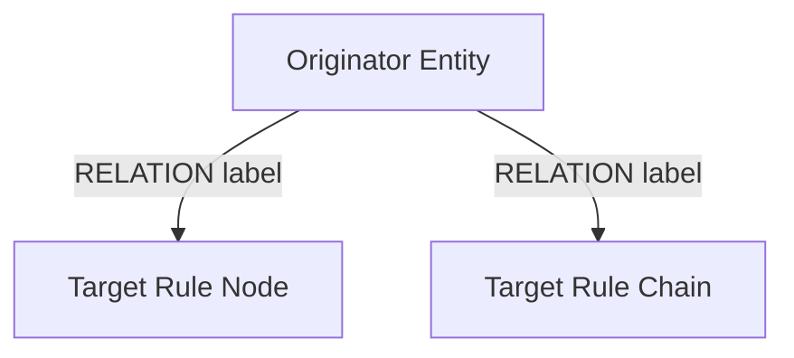
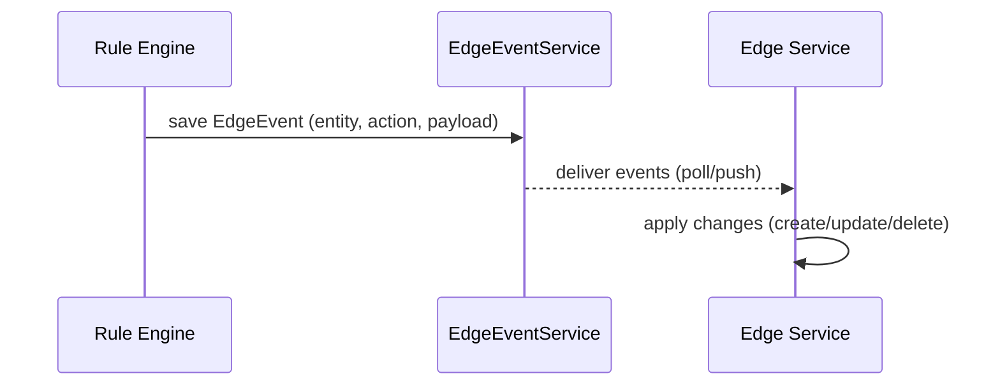

# Relations and Edge Sync

## Language & Context

- Language: Java (server-side)
- Domain: Using `RelationService` for graph routing and propagating events to Edges.

## RelationService Patterns

Common operations for nodes and services:

- Query outgoing relations from an entity (by type, direction)
- Create or delete relations between entities
- Route messages to related entities based on relation labels

Best practices:

- Use descriptive relation labels (align with decisions or `TbMsgType`).
- Prefer idempotent relation writes; check existence before creating.
- Avoid fan-out without backpressure; consider partitioning or batching.

## Edge Sync Overview

Edge synchronization propagates server-side entity and telemetry changes to Edge services.

Key concepts:

- Rule chain types: CORE vs EDGE — CORE runs in cloud; EDGE runs on edge services.
- EdgeEvent content: references entity ids and action types; payload mirrors source changes.
- Ordering and retries: delivery is resilient; monitor for duplicates and apply idempotent logic.

## Practical Node Usage

- Read relations via `RelationService` and drive `tellNext` to connected nodes/chains.
- When generating entity mutations, ensure corresponding EdgeEvents are created (via services invoked through `TbContext`).

## References

- dao/service RelationService (query/create/delete relations)
- application edge sync services (EdgeEventService and consumers)
- Rule Node metadata: `@RuleNode(relationTypes = { ... })` aligns with routing labels
