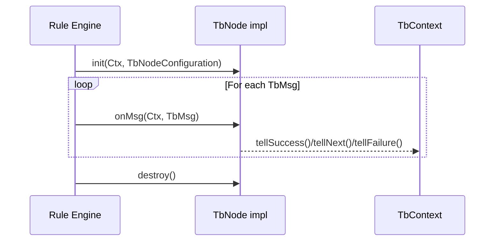
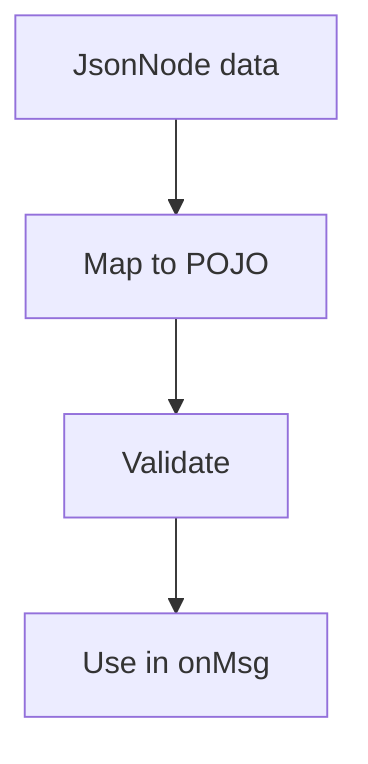
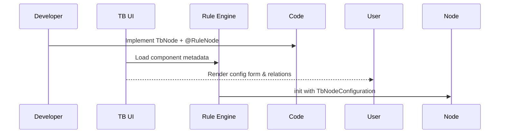

# ThingsBoard Rule Engine: Core Interfaces and Annotations

## Language & Context
- Language: Java (server-side)
- Domain: ThingsBoard Rule Engine SDK for building, wiring, and executing rule nodes within rule chains.

## Overview
This spec explains the core interfaces and annotations that define how rule nodes are written and executed in the ThingsBoard rule engine. It focuses on:
- `TbNode`: lifecycle and message handling
- `TbNodeConfiguration`: configuration wrapper
- `RuleNode` annotation: node metadata for UI/runtime

Key source files:
- org/thingsboard/rule/engine/api/TbNode.java
- org/thingsboard/rule/engine/api/TbNodeConfiguration.java
- org/thingsboard/rule/engine/api/RuleNode.java

## `TbNode`: Lifecycle and Message Handling
`TbNode` is the central interface for a rule engine node. It defines lifecycle and runtime hooks:

- `init(TbContext, TbNodeConfiguration)`: Initialize the node with platform context and configuration.
- `onMsg(TbContext, TbMsg)`: Handle a single message (telemetry, attributes, RPC, etc.). Node logic runs here.
- `destroy()`: Release resources (optional default no-op).
- `onPartitionChangeMsg(...)`: React to partition changes (optional default no-op).
- `upgrade(int fromVersion, JsonNode oldConfiguration)`: Migrate persisted configuration to the current `@RuleNode.version()`; returns a pair `(wasUpgraded, newConfig)`.

### Execution Flow

### Best Practices
- Keep `onMsg` idempotent and fast; offload I/O to executors from `TbContext`.
- Validate configuration in `init` and fail fast via `TbNodeException`.
- Use `upgrade` to preserve backward compatibility.

## `TbNodeConfiguration`: JSON-backed Config
`TbNodeConfiguration` is an immutable wrapper around a `JsonNode` that contains your node-specific configuration. Typical pattern:
- Define a POJO config class for your node.
- Map from `JsonNode` (via Jackson) to the POJO during `init`.
- Validate required fields and ranges.

## `@RuleNode`: Metadata for UI and Runtime
The `RuleNode` annotation declares node metadata consumed by the UI and engine:
- `type`, `name`, `nodeDescription`, `nodeDetails`
- `configClazz`: class for UI configuration schema
- `relationTypes`: allowed connection labels (defaults include `SUCCESS`, `FAILURE`)
- `ruleChainNode`: mark node as rule-chain wrapper
- `version`: used by `TbNode.upgrade()` for config migrations
- `scope`, `clusteringMode`, `inEnabled`, `outEnabled`, `hasQueueName`, etc.

### Example Metadata Lifecycle

## Common Pitfalls
- Throwing in `onMsg` without calling `tellFailure` can strand messages; wrap critical sections and ensure outcome routing.
- Using blocking I/O in `onMsg` stalls throughput; prefer `TbContext` executors and async callbacks.
- Forgetting `upgrade` when `@RuleNode.version` changes breaks older configs.

## Implementation Checklist
- Validate config in `init` and precompute reusable resources.
- Use `tellNext`/`tellSuccess`/`tellFailure` consistently.
- Add `upgrade` logic when releasing new versions with changed config.
- Keep CPU-bound work small; move heavy work to background via `TbContext`.

## References
- org/thingsboard/rule/engine/api/TbNode.java
- org/thingsboard/rule/engine/api/TbNodeConfiguration.java
- org/thingsboard/rule/engine/api/RuleNode.java
