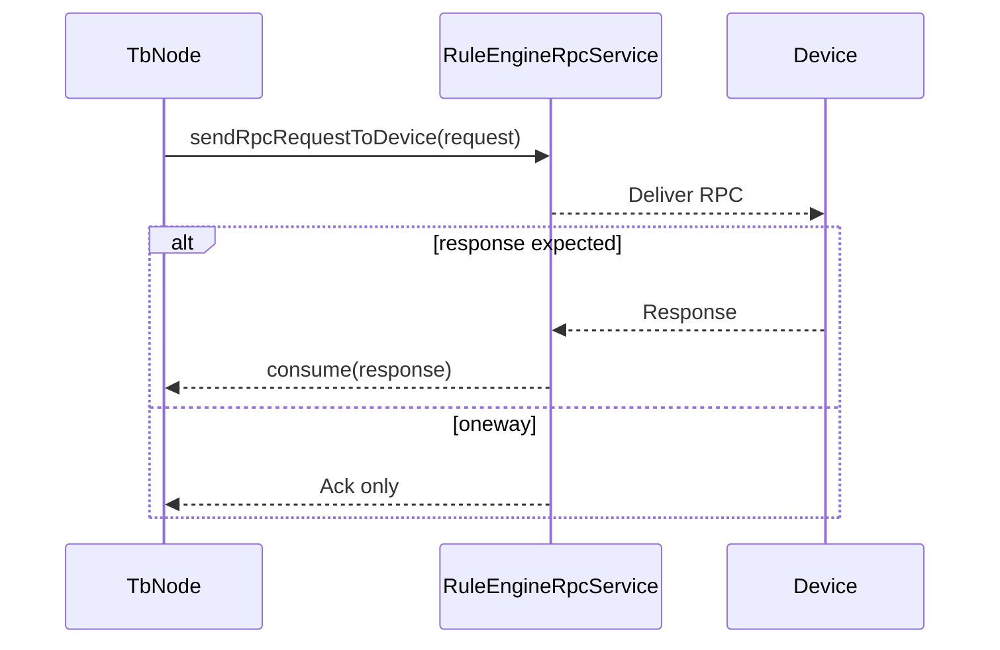
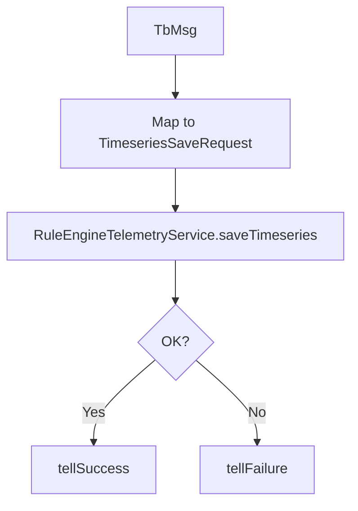
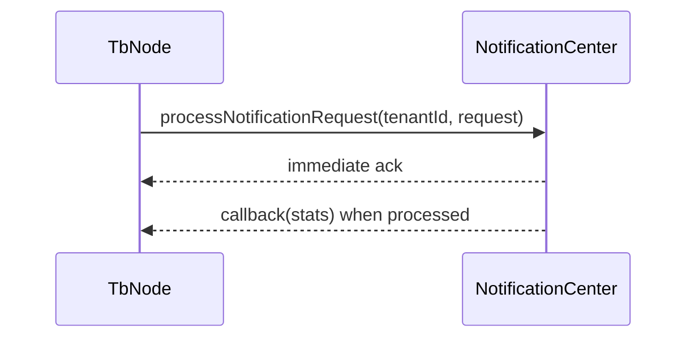
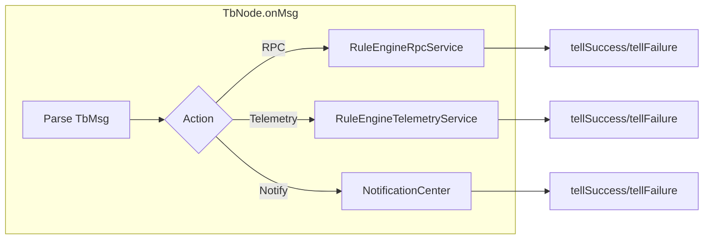

# Rule Engine Platform Services: RPC, Telemetry, Notifications

## Language & Context

- Language: Java (server-side)
- Domain: Core services that TbNodes use via `TbContext` to interact with devices and users.

Key source files:

- org/thingsboard/rule/engine/api/RuleEngineRpcService.java
- org/thingsboard/rule/engine/api/RuleEngineTelemetryService.java
- org/thingsboard/rule/engine/api/NotificationCenter.java

## RuleEngineRpcService

RPC APIs used to talk to devices and reply to REST-originated calls:

- `sendRpcReplyToDevice(serviceId, sessionId, requestId, body)`: push a server-side reply to an active device session.
- `sendRpcRequestToDevice(request, consumer)`: send an RPC to a device; the `consumer` receives `RuleEngineDeviceRpcResponse`.
- `sendRestApiCallReply(serviceId, requestId, TbMsg msg)`: reply back to REST caller using a message as body.
- `findRpcById(tenantId, rpcId)`: lookup persisted RPC metadata.

Best practices:

- Use `RuleEngineDeviceRpcRequest` with explicit `expirationTime` and `retries`.
- If replying to REST-triggered actions, correlate via `sendRestApiCallReply`.

## RuleEngineTelemetryService

Data-plane APIs for attributes and timeseries:

- `saveTimeseries(TimeseriesSaveRequest)`
- `saveAttributes(AttributesSaveRequest)`
- `deleteTimeseries(TimeseriesDeleteRequest)`
- `deleteAttributes(AttributesDeleteRequest)`

Typical node pattern:

1. Map `TbMsg` payload to a save/delete request DTO.
2. Invoke the appropriate method.
3. Route success/failure via `tellSuccess`/`tellFailure` (or `tellNext` with specific relations).

Best practices:

- Normalize payloads to clear schemas and validate required keys.
- Consider `useServerTs` vs client-provided timestamps depending on trust model.

## NotificationCenter

APIs to create and manage user notifications:

- `processNotificationRequest(tenantId, request, callback)`: submit a request and observe aggregated stats.
- `sendGeneralWebNotification(...)` and `sendSystemNotification(...)`: direct notifications (future/compatibility hooks).
- Marking and deletion APIs: `markNotificationAsRead`, `markAllNotificationsAsRead`, `deleteNotification`, `deleteNotificationRequest`.
- `getAvailableDeliveryMethods(tenantId)`: discover channels (e.g., EMAIL, SLACK, SMS, WEB).

Best practices:

- Use templates and typed info models for auditability and localization.
- Submit notifications asynchronously; avoid blocking in `onMsg`.

## Putting It Together in a Node

## Common Pitfalls

- Forgetting to guard long-running operations with timeouts; prefer async `consumer` callbacks.
- Mixing metadata/payload schemas between telemetry and attributes.
- Blocking `onMsg` on notification processing; prefer callbacks or context executors.

## References

- org/thingsboard/rule/engine/api/RuleEngineRpcService.java
- org/thingsboard/rule/engine/api/RuleEngineTelemetryService.java
- org/thingsboard/rule/engine/api/NotificationCenter.java
