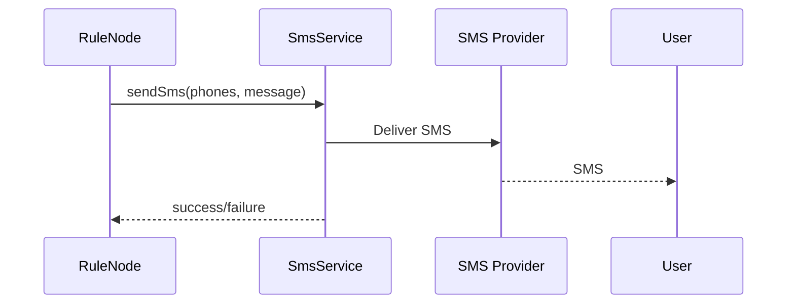

# SMS Service Specification

## Overview

This document describes the SMS service in ThingsBoard, which handles sending SMS messages for notifications and alerts.

---

## Key Interfaces

### SmsService

Located at: `org/thingsboard/rule/engine/api/SmsService.java`

| Method                        | Description                                      |
|-------------------------------|--------------------------------------------------|
| sendSms(tenantId, customerId, phones, message) | Send SMS to phone numbers   |
| sendTestSms(...)              | Send test SMS to verify configuration            |

### SmsSender

| Method                        | Description                                      |
|-------------------------------|--------------------------------------------------|
| sendSms(phones, message)      | Send SMS via provider                            |

### SmsSenderFactory

| Method                        | Description                                      |
|-------------------------------|--------------------------------------------------|
| createSmsSender(smsProviderConfiguration) | Create sender for provider     |

---

## SMS Provider Configuration

| Field         | Type      | Description                        |
|---------------|-----------|------------------------------------|
| type          | String    | Provider type (AWS_SNS, TWILIO, etc.) |
| accessKey     | String    | Provider access key                |
| secretKey     | String    | Provider secret key                |
| region        | String    | Provider region (if applicable)    |
| numberFrom    | String    | Sender phone number                |

---

## Supported Providers

| Provider      | Description                                      |
|---------------|--------------------------------------------------|
| AWS_SNS       | Amazon Simple Notification Service               |
| TWILIO        | Twilio SMS API                                   |
| SMPP          | Generic SMPP protocol                            |

---

## SMS Flow

---

## Exception Handling

| Exception            | Description                                      |
|----------------------|--------------------------------------------------|
| SmsException         | Base SMS exception                               |
| SmsSendException     | Failed to send SMS                               |
| SmsParseException    | Failed to parse SMS configuration                |

---

## Best Practices

- Validate phone numbers before sending
- Keep messages concise (SMS length limits)
- Monitor delivery status
- Use rate limiting to prevent abuse

---

## See Also

- [Notification Service](notification-service.md)
- [Mail Service](mail-service.md)
- [TbContext & Services](tb-context-and-services.md)
