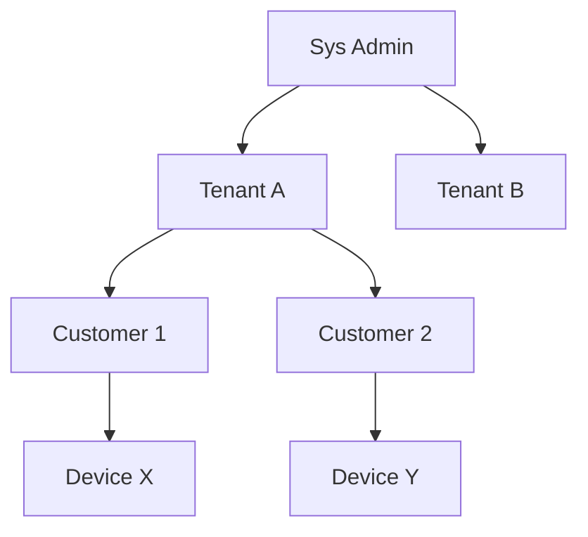
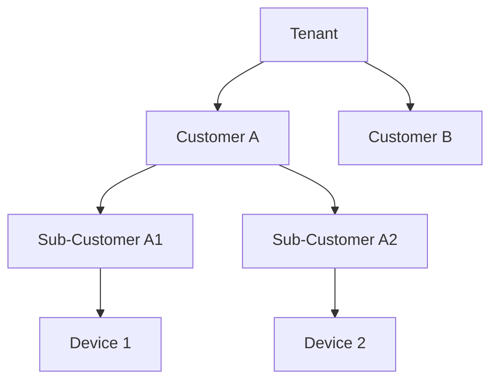
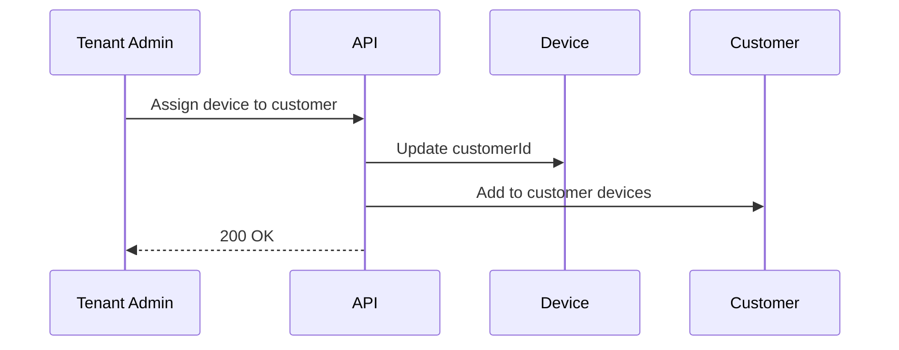
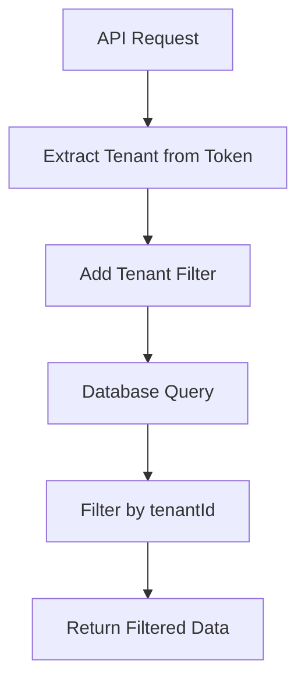
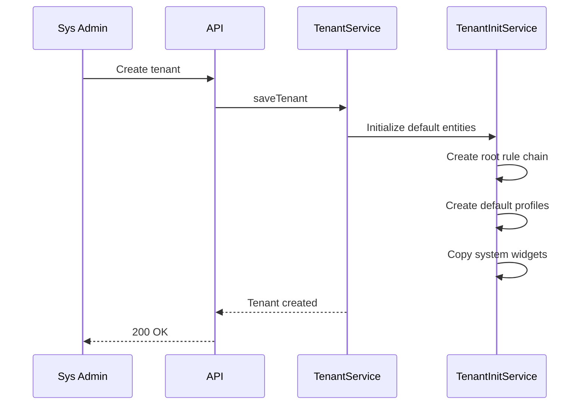
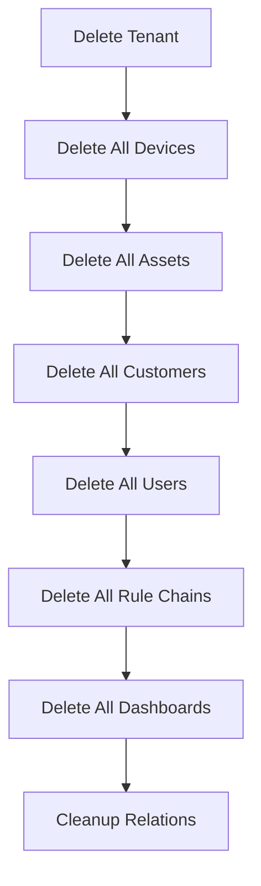
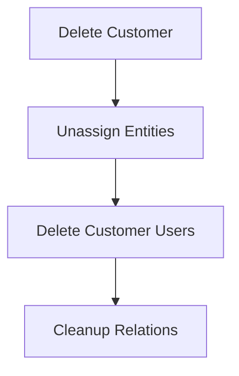

# Tenant and Customer Model Specification

## Overview

This document describes the tenant and customer hierarchy in ThingsBoard, which provides multi-tenancy and customer isolation.

---

## Key Concepts

### Tenant

- Top-level organizational unit
- Owns devices, assets, dashboards, users, rule chains, etc.
- Isolated from other tenants
- Has a tenant profile defining limits and features

### Customer

- Subdivision within a tenant
- Owns or is assigned devices, assets, dashboards
- Can have its own users
- Isolated from other customers within the same tenant

---

## Key Interfaces

### TenantService

| Method                        | Description                                      |
|-------------------------------|--------------------------------------------------|
| findTenantById(...)           | Retrieve tenant by id                            |
| saveTenant(...)               | Create or update tenant                          |
| deleteTenant(...)             | Remove tenant and all owned entities             |
| findTenants(...)              | List tenants (sys admin only)                    |

### CustomerService

| Method                        | Description                                      |
|-------------------------------|--------------------------------------------------|
| findCustomerById(...)         | Retrieve customer by id                          |
| saveCustomer(...)             | Create or update customer                        |
| deleteCustomer(...)           | Remove customer and unassign entities            |
| findCustomersByTenantId(...)  | List customers for tenant                        |

---

## Entity Hierarchy

---

## Tenant Profile

| Field         | Type      | Description                        |
|---------------|-----------|------------------------------------|
| id            | TenantProfileId | Unique identifier            |
| name          | String    | Profile name                       |
| isolatedTbRuleEngine | Boolean | Dedicated rule engine        |
| maxDevices    | Integer   | Max devices allowed                |
| maxAssets     | Integer   | Max assets allowed                 |
| maxCustomers  | Integer   | Max customers allowed              |
| maxUsers      | Integer   | Max users allowed                  |
| maxDashboards | Integer   | Max dashboards allowed             |
| maxRuleChains | Integer   | Max rule chains allowed            |

---

## Customer Assignment

- Devices, assets, dashboards can be assigned to customers
- Customer users see only assigned entities
- Assignment tracked via entity relations

---

## Best Practices

- Use tenant profiles to enforce limits
- Assign entities to customers for isolation
- Avoid mixing tenant-level and customer-level access
- Clean up orphaned entities when deleting customers

---

## User Roles

### System Administrator

| Permission           | Description                          |
|----------------------|--------------------------------------|
| Tenant management    | Create, update, delete tenants       |
| Tenant profile mgmt  | Define tenant profiles and limits    |
| System settings      | Configure platform settings          |

### Tenant Administrator

| Permission           | Description                          |
|----------------------|--------------------------------------|
| Entity management    | Manage all tenant entities           |
| Customer management  | Create and manage customers          |
| User management      | Create tenant and customer users     |
| Rule chain mgmt      | Create and configure rule chains     |
| Dashboard mgmt       | Create and share dashboards          |

### Customer User

| Permission           | Description                          |
|----------------------|--------------------------------------|
| View assigned entities | View devices, assets assigned      |
| Dashboard access     | View assigned dashboards             |
| Limited updates      | Update based on permissions          |

---

## Tenant Profile Configuration

### Entity Limits

| Field              | Type    | Description                    |
|--------------------|---------|--------------------------------|
| maxDevices         | Integer | Maximum devices per tenant     |
| maxAssets          | Integer | Maximum assets per tenant      |
| maxCustomers       | Integer | Maximum customers per tenant   |
| maxUsers           | Integer | Maximum users per tenant       |
| maxDashboards      | Integer | Maximum dashboards             |
| maxRuleChains      | Integer | Maximum rule chains            |
| maxIntegrations    | Integer | Maximum integrations (PE)      |
| maxConverters      | Integer | Maximum converters (PE)        |
| maxSchedulerEvents | Integer | Maximum scheduler events (PE)  |

### Rate Limits

| Field                     | Type   | Description                    |
|---------------------------|--------|--------------------------------|
| transportDeviceMsgRateLimit | String | Device message rate limit    |
| transportTenantMsgRateLimit | String | Tenant message rate limit    |
| tenantEntityExportRateLimit | String | Export rate limit            |
| tenantEntityImportRateLimit | String | Import rate limit            |
| tenantNotificationRequestsRateLimit | String | Notification rate limit |
| tenantNotificationRequestsPerRuleRateLimit | String | Per-rule notification limit |
| transportDeviceTelemetryMsgRateLimit | String | Telemetry message limit |
| transportDeviceTelemetryDataPointsRateLimit | String | Data points limit |

### Resource Limits

| Field              | Type   | Description                    |
|--------------------|--------|--------------------------------|
| maxResourcesInBytes | Long  | Max storage for resources      |
| maxOtaPackagesInBytes | Long | Max storage for OTA packages  |
| maxTransportMessages | Long | Max transport messages/month   |
| maxExecutions      | Long   | Max JS executions/month        |
| maxJs              | Long   | Max JS engine time (ms)        |
| maxRe              | Long   | Max rule engine messages       |

---

## Customer Hierarchy

### Nested Customers

### Customer Entity Assignment

---

## Entity Ownership

### Tenant-Level Entities

| Entity Type        | Description                          |
|--------------------|--------------------------------------|
| Device             | Can be tenant or customer owned      |
| Asset              | Can be tenant or customer owned      |
| Dashboard          | Can be tenant or customer owned      |
| Rule Chain         | Always tenant owned                  |
| Device Profile     | Always tenant owned                  |
| Asset Profile      | Always tenant owned                  |
| Edge               | Can be tenant or customer owned      |

### Entity Visibility

| Owner         | Tenant Admin | Customer User |
|---------------|--------------|---------------|
| Tenant        | ✓            | ✗             |
| Customer      | ✓            | ✓ (own only)  |

---

## API Endpoints

### Tenant Management

| Endpoint                                    | Method | Description                    |
|---------------------------------------------|--------|--------------------------------|
| /api/tenant                                 | POST   | Create/update tenant           |
| /api/tenant/{tenantId}                      | GET    | Get tenant by ID               |
| /api/tenant/{tenantId}                      | DELETE | Delete tenant                  |
| /api/tenants                                | GET    | List tenants (sys admin)       |
| /api/tenantInfos                            | GET    | List tenant infos              |

### Customer Management

| Endpoint                                    | Method | Description                    |
|---------------------------------------------|--------|--------------------------------|
| /api/customer                               | POST   | Create/update customer         |
| /api/customer/{customerId}                  | GET    | Get customer by ID             |
| /api/customer/{customerId}                  | DELETE | Delete customer                |
| /api/customers                              | GET    | List tenant customers          |

### Entity Assignment

| Endpoint                                    | Method | Description                    |
|---------------------------------------------|--------|--------------------------------|
| /api/customer/{customerId}/device/{deviceId}| POST  | Assign device to customer      |
| /api/customer/device/{deviceId}             | DELETE | Unassign device from customer  |
| /api/customer/{customerId}/asset/{assetId}  | POST   | Assign asset to customer       |
| /api/customer/asset/{assetId}               | DELETE | Unassign asset from customer   |

---

## Tenant Isolation

### Data Isolation

### Queue Isolation

| Queue Type         | Isolation Method                     |
|--------------------|--------------------------------------|
| Rule Engine Queue  | Per-tenant partition                 |
| Transport Queue    | Per-tenant topic                     |
| Notification Queue | Per-tenant partition                 |

---

## Tenant Provisioning

### Default Entities

When creating a new tenant:

| Entity                | Description                          |
|-----------------------|--------------------------------------|
| Root Rule Chain       | Default rule chain                   |
| Default Device Profile| Default device profile               |
| Default Asset Profile | Default asset profile                |
| System Widgets        | Copy of system widget bundles        |

### Provisioning Flow

---

## Customer Data Sharing

### Dashboard Sharing

| Share Type          | Description                          |
|---------------------|--------------------------------------|
| Public              | Anyone with link can view            |
| Customer Assignment | Only assigned customer users         |
| Tenant Only         | Only tenant administrators           |

### Entity Group (PE)

| Feature             | Description                          |
|---------------------|--------------------------------------|
| Group Hierarchy     | Organize entities in groups          |
| Permission Inheritance | Inherit permissions from groups   |
| Customer Groups     | Group customers for bulk operations  |

---

## Cleanup on Delete

### Tenant Deletion

### Customer Deletion

---

## See Also

- [Security and Authentication](security-auth.md)
- [DAO & Entity Services Overview](dao-entity-services-overview.md)
- [Audit Logging](audit-logging.md)
- [API Usage State](api-usage-state.md)
